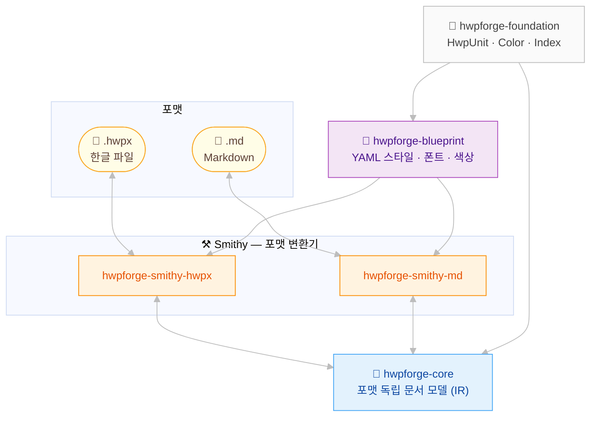

# HwpForge 🔥

> **Rust로 한글(HWP/HWPX) 문서를 프로그래밍 방식으로 제어**
>
> [Hancom](https://www.hancom.com/) 한글 파일 읽기, 쓰기, 변환

[](https://github.com/ai-screams/HwpForge/actions/workflows/ci.yml)
[](https://crates.io/crates/hwpforge)
[](https://docs.rs/hwpforge)
[](LICENSE-MIT)
[](Cargo.toml)
[](https://github.com/ai-screams/HwpForge)
[](https://github.com/ai-screams/HwpForge)
[](https://github.com/ai-screams/HwpForge)
[](https://github.com/ai-screams/HwpForge)

<div align="center">

</div>

---

## HwpForge란?

HwpForge는 HWPX 문서(ZIP + XML, KS X 6101)를 다루기 위한 **오픈소스** 순수 Rust 라이브러리입니다. 한국에서 가장 많이 사용되는 워드프로세서인 [Hancom 한글](https://www.hancom.com)의 최신 포맷을 지원합니다.

**LLM-first 설계** 🔥 — AI 친화적인 Markdown과 공식 한글 문서 포맷(HWPX), 두 세계를 자연스럽게 잇습니다. LLM이 Markdown으로 작성한 내용은 공문서 규격의 HWPX로 컴파일되고 📜, 반대로 기존 HWPX 문서는 AI가 쉽게 읽을 수 있는 구조로 꺼낼 수 있습니다 ⚒️.

- **Full HWPX codec** — HWPX 파일을 손실 없이 디코딩/인코딩 (lossless roundtrip)
- **Markdown bridge** — GFM Markdown과 HWPX 간 상호 변환
- **YAML style template** — Figma Design Token처럼 재사용 가능한 스타일 정의 (폰트, 크기, 색상)
- **Type-safe API** — branded index, typestate validation, zero unsafe code

## 빠른 시작

`Cargo.toml`에 추가:

```toml
[dependencies]
hwpforge = "0.1"
```

### 🔨 문서 생성

```rust
use hwpforge::core::{Document, Draft, Paragraph, Run, Section, PageSettings};
use hwpforge::foundation::{CharShapeIndex, ParaShapeIndex};

let mut doc = Document::<Draft>::new();
doc.add_section(Section::with_paragraphs(
    vec![Paragraph::with_runs(
        vec![Run::text("Hello, 한글!", CharShapeIndex::new(0))],
        ParaShapeIndex::new(0),
    )],
    PageSettings::a4(),
));
```

### ⚒️ HWPX로 인코딩

```rust
use hwpforge::hwpx::{HwpxEncoder, HwpxStyleStore};
use hwpforge::core::ImageStore;

let validated = doc.validate().unwrap();
let style_store = HwpxStyleStore::with_default_fonts("함초롬바탕");
let image_store = ImageStore::new();
let bytes = HwpxEncoder::encode(&validated, &style_store, &image_store).unwrap();
std::fs::write("output.hwpx", &bytes).unwrap();
```

### ⚒️ HWPX 디코딩

```rust
use hwpforge::hwpx::HwpxDecoder;

let result = HwpxDecoder::decode_file("input.hwpx").unwrap();
println!("섹션 수: {}", result.document.sections().len());
```

### ⚒️ Markdown → HWPX 변환

```rust
use hwpforge::md::MdDecoder;
use hwpforge::hwpx::{HwpxEncoder, HwpxStyleStore};

let md_doc = MdDecoder::decode_with_default("# 제목\n\nMarkdown에서 변환!").unwrap();
let validated = md_doc.document.validate().unwrap();
let style_store = HwpxStyleStore::from_registry(&md_doc.style_registry);
let image_store = hwpforge::core::ImageStore::new();
let bytes = HwpxEncoder::encode(&validated, &style_store, &image_store).unwrap();
```

## Feature Flags

| Feature | 기본값 | 설명                 |
| ------- | ------ | -------------------- |
| `hwpx`  | Yes    | HWPX encoder/decoder |
| `md`    | —      | Markdown ↔ Core 변환 |
| `full`  | —      | 모든 기능 포함       |

```toml
# Markdown 지원 포함
hwpforge = { version = "0.1", features = ["full"] }
```

## 📜 지원 콘텐츠

| 카테고리      | 요소                                                                 |
| ------------- | -------------------------------------------------------------------- |
| 텍스트        | Run, character shape, paragraph shape, style (22개 한컴 기본 스타일) |
| 구조          | Table (중첩), Image (바이너리 + 경로), TextBox, Caption              |
| 레이아웃      | 다단, 페이지 설정, 가로/세로 방향, 제본 여백, master page            |
| 머리글/바닥글 | Header, Footer, 쪽번호 (autoNum)                                     |
| 각주/미주     | 각주, 미주                                                           |
| 도형          | 선, 타원, 다각형, 호, 곡선, 연결선 (채움, 회전, 화살표 지원)         |
| 수식          | HancomEQN script 형식                                                |
| 차트          | 18종 chart type (OOXML 호환)                                         |
| 참조          | 책갈피, 상호 참조, 필드 (날짜/시간/요약), 메모, 색인                 |
| 덧말/겹침     | 덧말 (dutmal), 글자 겹침                                             |
| Markdown      | GFM decode, lossy + lossless encode, YAML frontmatter                |

## 아키텍처



**핵심 원칙**: 구조(Structure)와 스타일(Style)의 분리 — HTML + CSS와 같은 패턴입니다.
Core는 스타일 _참조_(index)만 가지고, Blueprint는 스타일 _정의_(폰트, 크기, 색상)를 관리합니다.
Smithy compiler가 Core + Blueprint를 합쳐 최종 포맷을 생성합니다.

## 프로젝트 현황

| 지표        | 값                      |
| ----------- | ----------------------- |
| 총 LOC      | ~49,200                 |
| 테스트      | 1,510개 (cargo-nextest) |
| 소스 파일   | 92 .rs                  |
| Crate 수    | 9개 (6개 배포)          |
| 커버리지    | 92.65%                  |
| Clippy 경고 | 0                       |
| Unsafe 코드 | 0                       |

## 개발

### 필수 요구사항

- Rust 1.88+ (MSRV)
- (권장) [cargo-nextest](https://nexte.st/) — 병렬 테스트 실행
- (선택) [pre-commit](https://pre-commit.com/) — git hook 자동화

### ⚒️ 명령어

```bash
make ci          # fmt + clippy + test + deny + lint (CI와 동일)
make test        # cargo nextest run
make clippy      # cargo clippy (모든 target, 모든 feature, -D warnings)
make fmt-fix     # rustfmt 자동 포맷
make doc         # rustdoc 생성 (브라우저에서 열림)
make cov         # coverage 리포트 (90% gate)
```

### 프로젝트 구조

```
HwpForge/
├── crates/
│   ├── hwpforge/                 # Umbrella crate (re-exports)
│   ├── hwpforge-foundation/      # 기본 타입 (HwpUnit, Color, Index<T>)
│   ├── hwpforge-core/            # 문서 모델 (스타일 참조만)
│   ├── hwpforge-blueprint/       # YAML 템플릿 (Figma 패턴)
│   ├── hwpforge-smithy-hwpx/     # HWPX codec (ZIP+XML ↔ Core)
│   ├── hwpforge-smithy-md/       # Markdown codec (MD ↔ Core)
│   ├── hwpforge-smithy-hwp5/     # HWP5 decoder (예정)
│   ├── hwpforge-bindings-py/     # Python bindings (예정)
│   └── hwpforge-bindings-cli/    # CLI 도구 (예정)
├── tests/                        # 통합 테스트 + golden fixture
└── examples/                     # 📜 사용 예제 + 생성된 HWPX 파일
```

## 로드맵

### 출시 예정

- [ ] HWP5 읽기 — 구형 바이너리 포맷(`.hwp`) 디코더
- [ ] MCP 서버 — Claude, GPT 등 LLM이 tool로 직접 HWPX 생성
- [ ] CLI 도구 — `hwpforge convert doc.md doc.hwpx` 한 줄 변환

- [ ] HWPX 완전 지원 — 양식 컨트롤, 변경 추적, OLE 객체
- [ ] Python 바인딩 — `pip install hwpforge`로 설치, PyPI 배포

## 라이선스

다음 중 하나를 선택할 수 있습니다:

- Apache License, Version 2.0 ([LICENSE-APACHE](LICENSE-APACHE))
- MIT license ([LICENSE-MIT](LICENSE-MIT))

## Acknowledgements

HwpForge는 거인들의 어깨 위에 서 있습니다.

- **[Hancom](https://www.hancom.com)** — HWPX 포맷의 공개 문서와 [KS X 6101 (OWPML)](https://www.kssn.net/) 국가 표준이 없었다면 이 프로젝트는 시작조차 할 수 없었습니다. 포맷을 공개해 주신 Hancom에 감사드립니다.

- **[openhwp](https://github.com/openhwp/openhwp)** — Rust로 HWP/HWPX를 다루는 IR 기반 아키텍처 설계에서 큰 영감을 받았습니다. HwpForge의 Core 레이어가 존재할 수 있었던 것은 openhwp이 먼저 그 길을 걸었기 때문입니다.

- **[hwpxlib](https://github.com/neolord0/hwpxlib)** — Java로 작성된 가장 성숙한 HWPX 구현체입니다. 스펙과 실제 동작의 차이를 파악하는 데 결정적인 참고가 되었습니다.

- **[hwp.js](https://github.com/hahnlee/hwp.js)** — HWP5 포맷의 quirks와 edge case를 꼼꼼히 문서화한 프로젝트입니다. 바이너리 포맷의 어두운 구석을 밝혀 준 덕분에 시행착오를 크게 줄일 수 있었습니다.

- **[hwpx-owpml-model](https://github.com/hancom-io/hwpx-owpml-model)** — Hancom이 직접 공개한 C++ OWPML 모델 구현체로, 스키마 해석의 최종 기준으로 삼았습니다.

- **Rust 생태계** — [serde](https://serde.rs), [quick-xml](https://github.com/tafia/quick-xml), [pulldown-cmark](https://github.com/pulldown-cmark/pulldown-cmark), [zip](https://github.com/zip-rs/zip2) 등 뛰어난 라이브러리들 덕분에 HwpForge 전체를 zero unsafe 순수 Rust로 구현할 수 있었습니다. Rust 커뮤니티와 Ferris 🦀에게 감사드립니다.

- **[Claude](https://claude.ai) by [Anthropic](https://www.anthropic.com)** — HwpForge의 설계, 구현, 테스트, 문서화 전 과정에서 Claude Code가 개발 파트너로 함께했습니다. LLM-first를 표방하는 프로젝트답게, AI와 사람이 협업하여 만들어낸 결과물입니다.

---

<div align="center">


<br/><br/>

<strong>쇠부리 (SoeBuri)</strong><br/>
<em>한컴 문서를 불에 달구어 단단하게 벼려내는 대장장이 오리너구리 🔥</em>

</div>
