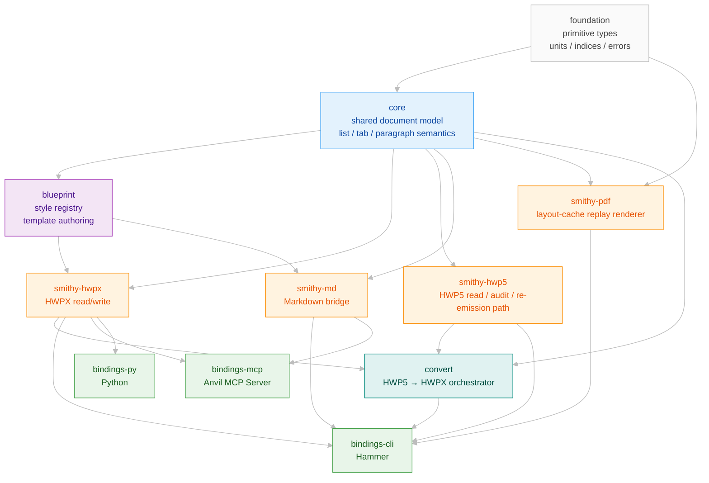
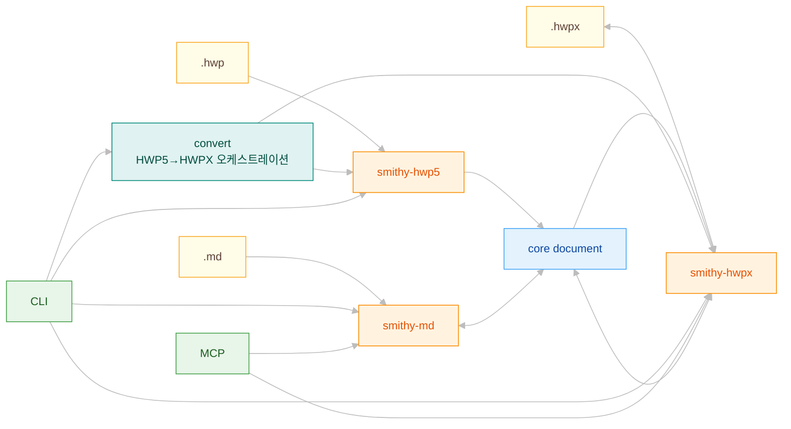

# HwpForge 🔥

> **Rust로 한글(HWP/HWPX) 문서를 프로그래밍 방식으로 제어**
>
> [Hancom](https://www.hancom.com/) 한글 파일 읽기, 쓰기, 변환

<div align="center">


</div>

<div align="center">

</div>

---

## HwpForge란?

HwpForge는 HWPX 문서(ZIP + XML, KS X 6101)를 다루기 위한 **오픈소스** 순수 Rust 라이브러리입니다. 한국에서 가장 많이 사용되는 워드프로세서인 [Hancom 한글](https://www.hancom.com)의 최신 포맷을 지원합니다.

### 지원 버전

| 한글 버전         | 포맷         | 읽기 | 쓰기 | 스타일 세트                    |
| ----------------- | ------------ | ---- | ---- | ------------------------------ |
| 한글 2014 \~ 2020 | HWPX (.hwpx) | ✅   | ✅   | Classic (18 styles)            |
| 한글 2022 \~ 2024 | HWPX (.hwpx) | ✅   | ✅   | Modern (22 styles, **기본값**) |
| 한글 2025+        | HWPX (.hwpx) | ✅   | ✅   | Latest (23 styles)             |
| 한글 97 \~ 2010   | HWP5 (.hwp)  | ✅   | —    | —                              |

- **HWPX**: OWPML 국가표준 (KS X 6101) 기반, ZIP + XML 컨테이너
- **HWP5**: 구형 바이너리 포맷. 현재는 CLI 중심의 읽기/점검/재출력 경로를 제공합니다 (`convert-hwp5`, `audit-hwp5`, `census-hwp5`)
- 스타일 세트는 `HancomStyleSet` enum으로 선택 가능 (기본: Modern)

**LLM-first 설계** 🔥 — AI 친화적인 Markdown과 공식 한글 문서 포맷(HWPX), 두 세계를 자연스럽게 잇습니다. LLM이 Markdown으로 작성한 내용은 공문서 규격의 HWPX로 컴파일되고 📜, 반대로 기존 HWPX 문서는 AI가 쉽게 읽을 수 있는 구조로 꺼낼 수 있습니다 ⚒️.

- **📄&#x20;**&#x20;[**HWPX 완전 가이드 다운로드**](examples/showcase/guides/hwpx_complete_guide/hwpx_complete_guide.hwpx) — HwpForge API로 생성한 4섹션 데모 문서 (한글에서 열어보세요)
- **HWPX Reader for AI** — 기존 한글 문서(.hwpx)를 Markdown으로 변환하여 LLM이 즉시 이해 가능
- **Full HWPX codec** — HWPX 파일을 손실 없이 디코딩/인코딩 (lossless roundtrip)
- **Markdown bridge** — GFM Markdown과 HWPX 간 양방향 변환 (읽기 + 쓰기)
- **YAML style template** — Figma Design Token처럼 재사용 가능한 스타일 정의 (폰트, 크기, 색상)
- **Type-safe API** — branded index, typestate validation, zero unsafe code

## 빠른 시작

### 설치

```
# Cargo.toml에 추가
cargo add hwpforge

# Markdown 지원 포함
cargo add hwpforge --features full
```

또는 `Cargo.toml`에 직접 추가:

```cpp
[dependencies]
hwpforge = "0.16"
```

### 🔨 Hammer — CLI로 시작하기

CLI 도구 `hwpforge`(Hammer)를 설치하면 터미널에서 바로 문서를 생성하고 편집할 수 있습니다. `hwpforge-bindings-cli`는 crates.io에 배포되지 않으므로(`publish = false`), git 또는 로컬 경로에서 설치합니다. `hwpforge-smithy-pdf`(krilla) 의존으로 워크스페이스 MSRV(1.88)보다 높은 **Rust 1.92+가** 필요합니다.

```cpp
cargo install --git https://github.com/ai-screams/HwpForge hwpforge-bindings-cli

# 또는 clone 후 로컬 경로에서
git clone https://github.com/ai-screams/HwpForge && cd HwpForge
cargo install --path crates/hwpforge-bindings-cli
```

```bash
# Markdown → HWPX 변환
hwpforge convert report.md -o report.hwpx

# HWPX 구조 확인
hwpforge inspect report.hwpx

# 문서 내비게이션 맵 확인 (제목·표·필드·책갈피)
hwpforge outline report.hwpx

# HWPX → Markdown 변환 (AI가 한글 문서 읽기)
hwpforge to-md report.hwpx -o report.out.md

# HWPX → JSON 추출 (AI 편집용) — -o 는 필수, stdout 내보내기는 없습니다
hwpforge to-json report.hwpx --section 0 -o section0.json   # 섹션 하나 (patch 용)
hwpforge to-json report.hwpx -o full.json                   # 문서 전체 (from-json 용)

# 섹션 JSON을 원본에 되쓰기 (텍스트만 바뀜, 원본이 base)
hwpforge patch report.hwpx --section 0 section0.json -o updated.hwpx

# 문서 전체 JSON으로 새 문서 만들기 (구조 변경까지 가능)
hwpforge from-json full.json -o new.hwpx

# 문서 구조 검증 (Core 불변조건 통과 여부)
hwpforge validate report.hwpx

# JSON Schema 출력 (AI agent용)
hwpforge schema document
```

두 JSON은 서로 다른 형식입니다. `--section` 없이 뽑은 **문서 전체 JSON**은 `from-json`이 읽고, `--section N`으로 뽑은 **섹션 JSON**은 `patch`가 원본 문서를 base로 삼아 되씁니다. 서로 바꿔 넣으면 스키마 불일치로 거부됩니다.

**누름틀 채우기**는 누름틀(click-here field)이 들어 있는 서식 문서에서만 동작합니다. 방금 `convert`로 만든 문서에는 누름틀이 없어 `FIELD_NOT_FOUND`가 납니다 — `fields`로 이름을 먼저 확인하세요.

```bash
hwpforge fields form.hwpx                                    # 채울 수 있는 필드 이름
hwpforge fill form.hwpx --set 회사명=HwpForge -o filled.hwpx   # 나머지 패키지는 바이트 그대로
```

**PDF 내보내기**는 문서에 들어 있는 조판 캐시를 재생하는 방식이라, 캐시가 있는 문서만 렌더할 수 있습니다. 캐시의 출처는 둘입니다 — 한컴이 저장한 HWPX, 그리고 HWP5에서 캐시를 실어 변환한 HWPX(`convert-hwp5 --carry-layout-cache`). `to-pdf`는 `.hwp`를 직접 받아 그 변환을 대신해 주기도 합니다. 반면 `convert`나 `from-json`이 새로 만든 문서에는 캐시가 없어 `PDF_RENDER_FAILED`로 거부됩니다. 문서가 쓰는 폰트도 호스트에 있어야 합니다(`--font-dir`·`--discovery`로 지정, 없는 폰트를 대체 글꼴로 렌더하려면 `--degraded`).

```bash
hwpforge to-pdf hancom-saved.hwpx -o report.pdf     # 한컴이 저장한 문서
hwpforge to-pdf legacy.hwp -o legacy.pdf            # HWP5 — 캐시를 실어 변환한 뒤 렌더
```

HWP5에서 실어 온 캐시는 **PDF 재생·대조 전용**입니다. 그렇게 만든 `.hwpx`를 한컴에서 다시 열 용도로 쓰지 마세요.

> **AI-first 설계**: CLI는 AI agent(Claude Code 등)가 주 사용자입니다.
> Markdown으로 문서를 생성한 뒤, JSON round-trip으로 기존 스타일을 보존하면서
> section 단위로 정밀하게 편집할 수 있습니다. `--json` 플래그로 모든 명령어가
> machine-readable 출력을 지원합니다.

### ⚙️ Anvil — MCP Server (Beta)로 AI가 직접 한글 문서를 다루다

Claude Code, Codex CLI, Claude, ChatGPT, Cursor, Antigravity 등 [MCP](https://modelcontextprotocol.io/) 지원 AI 도구에서 **한글 문서를 직접 생성하고 편집할** 수 있습니다. 현재 MCP surface는 **베타이며**, HWP5 경로는 MCP가 아니라 CLI workflow를 우선합니다. "보고서 만들어줘"라고 말하면, AI가 알아서 `.hwpx` 파일을 뚝딱 만들어냅니다.

#### AI 도구에 등록

한 줄이면 설치 + 등록이 끝납니다. npm은 `npx -y`가 자동으로 바이너리를 다운로드합니다.

<details>
<summary><strong>Claude Code</strong> (터미널)</summary>

```
# npm (권장 — Rust 툴체인 불필요)
claude mcp add hwpforge -- npx -y @hwpforge/mcp

# Cargo (Rust 개발자용)
cargo install hwpforge-bindings-mcp && claude mcp add hwpforge hwpforge-mcp

# 모든 프로젝트에서 사용 (글로벌)
claude mcp add --global hwpforge -- npx -y @hwpforge/mcp
```

</details>

<details>
<summary><strong>Codex CLI</strong> (터미널)</summary>

`~/.codex/config.toml`에 추가:

```
[mcp_servers.hwpforge]
command = "npx"
args = ["-y", "@hwpforge/mcp"]
```

또는 CLI로:

```
codex mcp add hwpforge -- npx -y @hwpforge/mcp
```

</details>

<details>
<summary><strong>Claude Desktop</strong> (앱)</summary>

설정 파일을 편집합니다:

- macOS: `~/Library/Application Support/Claude/claude_desktop_config.json`
- Windows: `%APPDATA%\Claude\claude_desktop_config.json`

```json
{
  "mcpServers": {
    "hwpforge": {
      "command": "npx",
      "args": ["-y", "@hwpforge/mcp"]
    }
  }
}
```

</details>

<details>
<summary><strong>ChatGPT Desktop</strong> (앱)</summary>

Settings → Tools → Add MCP Server에서:

- Name: `hwpforge`
- Command: `npx -y @hwpforge/mcp`

또는 설정 파일을 직접 편집:

```json
{
  "mcpServers": {
    "hwpforge": {
      "command": "npx",
      "args": ["-y", "@hwpforge/mcp"]
    }
  }
}
```

</details>

<details>
<summary><strong>Cursor</strong> (에디터)</summary>

프로젝트 루트에 `.cursor/mcp.json` 생성:

```json
{
  "mcpServers": {
    "hwpforge": {
      "command": "npx",
      "args": ["-y", "@hwpforge/mcp"]
    }
  }
}
```

</details>

<details>
<summary><strong>Antigravity</strong> (에디터)</summary>

`...` 드롭다운 → MCP Store → Manage MCP Servers → View raw config (`mcp_config.json`)에 추가:

```json
{
  "mcpServers": {
    "hwpforge": {
      "command": "npx",
      "args": ["-y", "@hwpforge/mcp"]
    }
  }
}
```

</details>

#### 등록하면 19개 도구를 사용할 수 있습니다

| 도구                   | 하는 일                                      | 한마디                               |
| ---------------------- | -------------------------------------------- | ------------------------------------ |
| `hwpforge_convert`     | Markdown → HWPX 변환                         | "이 마크다운을 한글 파일로!"         |
| `hwpforge_inspect`     | HWPX 구조 확인                               | "이 문서 뭐가 들어있어?"             |
| `hwpforge_to_json`     | HWPX → JSON 추출                             | "이 섹션 내용 좀 꺼내봐"             |
| `hwpforge_patch`       | JSON으로 섹션 교체                           | "이 부분만 바꿔서 다시 저장해"       |
| `hwpforge_templates`   | 스타일 프리셋 조회                           | "어떤 템플릿 쓸 수 있어?"            |
| `hwpforge_validate`    | HWPX 구조/무결성 검증                        | "이 파일 문제 없는지 확인해"         |
| `hwpforge_restyle`     | 스타일 프리셋 일괄 적용                      | "이 문서 폰트 바꿔줘"                |
| `hwpforge_from_json`   | JSON → HWPX 직접 생성                        | "이 JSON으로 한글 파일 만들어"       |
| `hwpforge_to_md`       | HWPX → Markdown 변환                         | "이 한글 문서를 Markdown으로 꺼내줘" |
| `hwpforge_outline`     | 문서 내비게이션 맵(제목·표·필드·책갈피) 조회 | "이 문서 구조가 어떻게 생겼어?"      |
| `hwpforge_diff`        | 두 HWPX 파일을 semantic/package 채널로 비교  | "이 편집이 뭘 바꿨는지 확인해줘"     |
| `hwpforge_delete_para` | 최상위 문단 삭제 (구조 편집)                 | "이 문단 지워줘"                     |
| `hwpforge_insert_para` | 앵커 문단 기준 새 문단 삽입                  | "이 문단 다음에 내용 추가해줘"       |
| `hwpforge_read`        | 문단/표/필드 중 하나를 타겟 읽기             | "이 부분만 딱 읽어줘"                |
| `hwpforge_fields`      | 누름틀 필드 목록 조회                        | "채울 수 있는 칸이 뭐가 있어?"       |
| `hwpforge_fill`        | 누름틀 필드에 값 채우기                      | "이 필드들 채워줘"                   |
| `hwpforge_stamp_plan`  | 문장 속 빈칸 스탬핑 후보 탐색                | "채울 수 있는 빈칸 후보 찾아줘"      |
| `hwpforge_stamp`       | 후보를 누름틀 필드로 승격                    | "이 빈칸들을 필드로 만들어줘"        |
| `hwpforge_set_cell`    | 표 셀을 그리드 주소로 편집                   | "이 표 칸 값 바꿔줘"                 |

#### 업데이트 / 삭제

npm은 `npx -y`가 항상 최신 버전을 가져오므로 별도 업데이트가 필요 없습니다.

```bash
# Cargo 사용자만 해당
cargo install hwpforge-bindings-mcp --force   # 업데이트
cargo uninstall hwpforge-bindings-mcp          # 삭제
```

> **왜 MCP?** CLI(Hammer)는 AI가 `bash` 명령을 실행해야 하지만, MCP(Anvil)는 AI가 **네이티브 도구로**
> 직접 호출합니다. 파일 경로 파싱도, stdout 해석도 필요 없습니다.
> JSON-RPC로 요청하면 구조화된 JSON으로 응답 — 깔끔합니다.

### 🐍 Python으로 시작하기

```console
pip install hwpforge
```

CPython 3.9+ 전용 `abi3` wheel을 Linux(manylinux_2_28 x86_64/aarch64)·macOS(11+ arm64, 10.12+ x86_64)·Windows(x64)에 배포하며, 런타임 의존성은 0개입니다. `pyproject.toml`에 직접 핀할 때는 정확 핀(`==`)보다 `~=`를 권장합니다 — Python 전용 패치(`X.Y.Z.N`)는 정확 핀으로는 받을 수 없습니다.

```python
import hwpforge

doc = hwpforge.Document.open("proposal.hwpx")
print(doc.outline()["outline"]["title"])
doc = doc.fill({"applicant": "홍길동", "date": "2026-09-17"}).document
doc.save("proposal-filled.hwpx")
```

`Document`는 불변 값입니다 — 모든 편집 메서드는 원본을 그대로 둔 채 새 문서와 보고서를 담은 `DocumentResult`를 반환합니다. 공유 연산 계층을 쓰는 18개 document 메서드 + 5개 모듈 함수를 제공하며, 호출 이름·옵션 표기·호환 에러 코드는 바인딩마다 다를 수 있습니다. 자세한 내용은 [`hwpforge` 패키지 README](crates/hwpforge-bindings-py/README.md)를 참고하세요.

### 🔨 문서 생성

```rust
use hwpforge::core::{Document, Draft, Paragraph, Run, Section, PageSettings};
use hwpforge::foundation::{CharShapeIndex, ParaShapeIndex};

let mut doc = Document::<Draft>::new();
doc.add_section(Section::with_paragraphs(
    vec![Paragraph::with_runs(
        vec![Run::text("Hello, 한글!", CharShapeIndex::new(0))],
        ParaShapeIndex::new(0),
    )],
    PageSettings::a4(),
));
```

### ⚒️ HWPX로 인코딩

```rust
use hwpforge::hwpx::{HwpxEncoder, HwpxStyleStore};
use hwpforge::core::ImageStore;

let validated = doc.validate().unwrap();
let style_store = HwpxStyleStore::with_default_fonts("함초롬바탕");
let image_store = ImageStore::new();
let bytes = HwpxEncoder::encode(&validated, &style_store, &image_store).unwrap();
std::fs::write("output.hwpx", &bytes).unwrap();
```

### ⚒️ HWPX 디코딩

```rust
use hwpforge::hwpx::HwpxDecoder;

let result = HwpxDecoder::decode_file("input.hwpx").unwrap();
println!("섹션 수: {}", result.document.sections().len());
```

### ⚒️ HWPX → Markdown 변환 (AI가 한글 문서 읽기)

<div align="center">
<table>
<tr>
<td align="center"><strong>📄 한글 원본 (.hwpx)</strong></td>
<td align="center"><strong>📝 Markdown 변환 결과</strong></td>
</tr>
<tr>
<td></td>
<td></td>
</tr>
</table>
</div>

```rust
use hwpforge::hwpx::HwpxDecoder;
use hwpforge::md::MdEncoder;

let decoded = HwpxDecoder::decode_file("government_report.hwpx").unwrap();
let validated = decoded.document.validate().unwrap();
let markdown = MdEncoder::encode_lossy(&validated).unwrap();
println!("{}", markdown); // LLM이 바로 이해할 수 있는 Markdown
```

기존 .hwpx 파일을 Markdown으로 변환하면 Claude, GPT 등 어떤 LLM이든 한글 공문서를 즉시 읽고 분석할 수 있습니다.

### ⚒️ Markdown → HWPX 변환

```rust
use hwpforge::md::MdDecoder;
use hwpforge::hwpx::{HwpxEncoder, HwpxRegistryBridge};

let md_doc = MdDecoder::decode_with_default("# 제목\n\nMarkdown에서 변환!").unwrap();
let bridge = HwpxRegistryBridge::from_registry(&md_doc.style_registry).unwrap();
let rebound = bridge.rebind_draft_document(md_doc.document).unwrap();
let validated = rebound.validate().unwrap();
let image_store = hwpforge::core::ImageStore::new();
let bytes = HwpxEncoder::encode(&validated, bridge.style_store(), &image_store).unwrap();
```

## Feature Flags

| Feature | 기본값 | 설명                 |
| ------- | ------ | -------------------- |
| `hwpx`  | Yes    | HWPX encoder/decoder |
| `md`    | —      | Markdown ↔ Core 변환 |
| `full`  | —      | 모든 기능 포함       |

```toml
# Markdown 지원 포함
hwpforge = { version = "0.16", features = ["full"] }
```

## 📜 지원 콘텐츠

| 카테고리      | 요소                                                                          |
| ------------- | ----------------------------------------------------------------------------- |
| 텍스트        | Run, character shape, paragraph shape, style (22개 한컴 기본 스타일)          |
| 구조          | Table (중첩), Image (바이너리 + 경로), TextBox, Caption                       |
| 레이아웃      | 다단, 페이지 설정, 가로/세로 방향, 제본 여백, master page                     |
| 머리글/바닥글 | Header, Footer, 쪽번호 (autoNum)                                              |
| 각주/미주     | 각주, 미주                                                                    |
| 도형          | 선, 타원, 다각형, 호, 곡선, 연결선 (채움, 회전, 화살표 지원)                  |
| 수식          | HancomEQN script 형식                                                         |
| 차트          | 18종 chart type (OOXML 호환)                                                  |
| 참조          | 책갈피, 상호 참조, 필드 (날짜/시간/요약), 메모, 색인                          |
| 덧말/겹침     | 덧말 (dutmal), 글자 겹침                                                      |
| Markdown      | GFM decode, lossy + lossless encode, YAML frontmatter                         |
| PDF 내보내기  | 한컴 조판 캐시 재생(계산 아님) 렌더 — 표·머리글/바닥글·쪽번호·폰트 파이프라인 |

## 아키텍처

HwpForge는 레이어를 나눠서 생각하는 프로젝트입니다.

- `foundation`: 공통 primitive, unit, index, error
- `core`: 포맷 독립 문서 모델과 shared semantics
- `blueprint`: 스타일 정의와 템플릿 계층
- `smithy-*`: 포맷별 codec과 bridge (각 크레이트는 단일 포맷만 담당)
- `convert`: 포맷 간 변환 오케스트레이터 (HWP5 → HWPX, smithy 위에서 두 포맷을 엮음)
- `bindings-*`: CLI / MCP / Python 진입점

`hwpforge`(umbrella crate)의 `ops` 모듈과 `hwpforge-convert`의 `ops` 모듈은 세 바인딩이 공유하는 연산 계층입니다 — CLI·MCP·Python 모두 이 계층을 거쳐 호출합니다.

### 레이어 구조


```mermaid
%%{init: {'theme': 'base', 'themeVariables': {'fontSize': '14px', 'lineColor': '#BDBDBD'}}}%%
flowchart TB
    F["foundation<br/>primitive types<br/>units / indices / errors"]:::foundation
    C["core<br/>shared document model<br/>list / tab / paragraph semantics"]:::core
    B["blueprint<br/>style registry<br/>template authoring"]:::blueprint

    SHX["smithy-hwpx<br/>HWPX read/write"]:::smithy
    SH5["smithy-hwp5<br/>HWP5 read / audit / re-emission path"]:::smithy
    SMD["smithy-md<br/>Markdown bridge"]:::smithy
    SPDF["smithy-pdf<br/>layout-cache replay renderer"]:::smithy

    CONV["convert<br/>HWP5 → HWPX orchestrator"]:::convert

    CLI["bindings-cli<br/>Hammer"]:::binding
    MCP["bindings-mcp<br/>Anvil MCP Server"]:::binding
    PY["bindings-py<br/>Python"]:::binding

    F --> C
    C --> B
    C --> SHX
    C --> SH5
    C --> SMD
    F --> SPDF
    C --> SPDF
    B --> SHX
    B --> SMD
    C --> CONV
    SHX --> CONV
    SH5 --> CONV
    SHX --> CLI
    SH5 --> CLI
    SMD --> CLI
    SPDF --> CLI
    CONV --> CLI
    SHX --> MCP
    SMD --> MCP
    SHX --> PY

    classDef file fill:#FFFDE7,stroke:#F9A825,color:#5D4037
    classDef smithy fill:#FFF3E0,stroke:#FB8C00,color:#E65100
    classDef convert fill:#E0F2F1,stroke:#00897B,color:#004D40
    classDef core fill:#E3F2FD,stroke:#42A5F5,color:#0D47A1
    classDef blueprint fill:#F3E5F5,stroke:#AB47BC,color:#4A148C
    classDef foundation fill:#FAFAFA,stroke:#BDBDBD,color:#424242
    classDef binding fill:#E8F5E9,stroke:#43A047,color:#1B5E20
```

### 데이터 흐름


```mermaid
%%{init: {'theme': 'base', 'themeVariables': {'fontSize': '14px', 'lineColor': '#BDBDBD'}}}%%
flowchart LR
    HWP5[".hwp"]:::file --> SH5["smithy-hwp5"]:::smithy
    MD[".md"]:::file --> SMD["smithy-md"]:::smithy
    HWPX[".hwpx"]:::file <--> SHX["smithy-hwpx"]:::smithy

    SH5 --> CORE["core document"]:::core
    SHX <--> CORE
    SMD <--> CORE
    CORE --> SHX

    CONV["convert<br/>HWP5→HWPX 오케스트레이션"]:::convert --> SH5
    CONV --> SHX

    CLI["CLI"]:::binding --> CONV
    CLI --> SH5
    CLI --> SHX
    CLI --> SMD
    MCP["MCP"]:::binding --> SHX
    MCP --> SMD

    classDef file fill:#FFFDE7,stroke:#F9A825,color:#5D4037
    classDef smithy fill:#FFF3E0,stroke:#FB8C00,color:#E65100
    classDef convert fill:#E0F2F1,stroke:#00897B,color:#004D40
    classDef core fill:#E3F2FD,stroke:#42A5F5,color:#0D47A1
    classDef binding fill:#E8F5E9,stroke:#43A047,color:#1B5E20
```

**핵심 원칙**: 구조(Structure)와 스타일(Style)을 분리합니다. `core`는 shared semantics와 스타일 참조를 들고, `blueprint`는 스타일 정의를 관리합니다. `smithy-*` 계층이 포맷 surface를 연결합니다.

실전에서 가장 자주 쓰는 경로는 다음 셋입니다.

1. Markdown → HWPX
2. HWPX → Markdown / JSON
3. HWP5 → HWPX → audit / inspect

## 프로젝트 현황

| 지표                   | 값                                                                  |
| ---------------------- | ------------------------------------------------------------------- |
| Tracked Rust `src` LOC | ~114,421                                                            |
| 테스트                 | ~3,476 passed + 14 skipped (cargo-nextest, 2026-08-28 make ci 기준) |
| 소스 파일              | 228 .rs                                                             |
| Crate 수               | 12개                                                                |
| 커버리지               | 90%+                                                                |
| Clippy 경고            | 0                                                                   |
| Unsafe 코드            | 0                                                                   |

## 개발

### 필수 요구사항

- Rust 1.88+ (워크스페이스 MSRV) — `hwpforge-bindings-cli` CLI를 직접 빌드/설치하려면 krilla 의존으로 1.92+ 필요
- (권장) [cargo-nextest](https://nexte.st/) — 병렬 테스트 실행
- (선택) [pre-commit](https://pre-commit.com/) — git hook 자동화

### MSRV 정책

- 워크스페이스 기본 MSRV는 **Rust 1.88이며**, **stable에서 4 릴리스 뒤처진 버전을** 기본 정책으로 유지합니다.
- krilla 의존 경로에 있는 네 크레이트(`hwpforge-smithy-pdf`·`hwpforge-convert`·`hwpforge-bindings-cli`·`hwpforge-bindings-py`)는 **Rust 1.92+가** 필요합니다(`rust-version`을 크레이트별로 상향 지정). CI의 `Verify › MSRV (1.88)` job은 이 넷을 1.88 검증 패스에서는 제외하지만, 같은 job 안에서 `cargo +1.92 check`로 따로 검증합니다 — 검증 대상에서 빠지는 것이 아닙니다.
- 각 크레이트의 `Cargo.toml`의 `rust-version`이 그 크레이트의 실제 MSRV이며, CI의 `Verify › MSRV` job이 워크스페이스 기본값(1.88)을 검증합니다.
- MSRV 상향이 필요하면 PR에서 이유를 명시하고, `Cargo.toml`, CI, CHANGELOG를 함께 갱신합니다.
- 개발용 기본 툴체인은 더 최신일 수 있습니다. 호환성 판단 기준은 최신 stable이 아니라 **MSRV + CI 통과 여부입니다**.

### ⚒️ 명령어

```bash
make ci          # 빠른 로컬 검증 — fmt + clippy + test + deny + lint-md (ci-fast 별칭)
make ci-full     # 위에 coverage + MSRV 추가 (릴리스·큰 변경 전)
make py-all      # Python 바인딩 검사 (lint + 타입 + Rust/Python 테스트 + coverage)
make test        # cargo nextest run
make clippy      # cargo clippy (모든 target, 모든 feature, -D warnings)
make fmt-fix     # rustfmt 자동 포맷
make doc         # rustdoc 생성 (브라우저에서 열림)
make cov         # coverage 리포트 (90% gate)
```

`make ci`는 CI 전체가 아니라 그중 빠른 다섯 레인입니다. CI는 여기에 Coverage·MSRV·HWP5 Audit Gate·Docs Build·Python·Workflow Lint를 더 돌립니다. 릴리스나 큰 변경 전에는 `make ci-full`과 `make py-all`을, 문서를 고쳤다면 `mdbook build`를 함께 돌리세요.

> **빌드 가속 (선택)**: `sccache`가 PATH에 있으면 `make` 타깃이 자동으로 컴파일
> 캐시로 사용합니다(없으면 그대로 동작 — 아무것도 깨지지 않음). 반복 `make ci`가
> 크게 빨라집니다. 설치: `cargo install sccache` 또는 `brew install sccache`.
> (릴리스 파이프라인 release-plz 는 영향받지 않습니다.)

### 프로젝트 구조

```
HwpForge/
├── crates/
│   ├── hwpforge/                 # Umbrella crate (re-exports)
│   ├── hwpforge-foundation/      # 기본 타입 (HwpUnit, Color, Index<T>)
│   ├── hwpforge-core/            # 문서 모델 (스타일 참조만)
│   ├── hwpforge-blueprint/       # YAML 템플릿 (Figma 패턴)
│   ├── hwpforge-smithy-hwpx/     # HWPX codec (ZIP+XML ↔ Core)
│   ├── hwpforge-smithy-md/       # Markdown codec (MD ↔ Core)
│   ├── hwpforge-smithy-hwp5/     # HWP5 decode/projection + inspect helpers
│   ├── hwpforge-smithy-pdf/      # PDF 렌더러 (조판 캐시 재생 렌더러, to-pdf 가 사용)
│   ├── hwpforge-convert/         # 포맷 간 변환 오케스트레이터 (HWP5 → HWPX)
│   ├── hwpforge-bindings-py/     # Python bindings (shipped, PyPI)
│   ├── hwpforge-bindings-cli/    # CLI 도구 (hwpforge, shipped)
│   └── hwpforge-bindings-mcp/    # MCP Server (hwpforge-mcp)
├── tests/                        # 통합 테스트 + golden fixture
└── examples/                     # curated showcase + interop artifacts
    ├── showcase/
    └── interop/
```

## 기여

버그 수정, 포맷 리서치, 테스트 보강, 문서 개선 모두 환영합니다.

- 시작 전 가이드: [CONTRIBUTING.md](CONTRIBUTING.md)
- 특히 확인할 것: release-plz가 쓰는 커밋 prefix (`feat`, `fix`, `perf`, `refactor`)
- 특히 확인할 것: MSRV 정책과 dependency/MSRV 상승 기준
- 특히 확인할 것: 문서 변경 시 `mdbook build`와 markdown lint 검증
- 특히 확인할 것: 로컬 docs toolchain은 CI와 같은 pinned 버전(`mdbook 0.4.52`, `mdbook-admonish 1.20.0`, `mdbook-mermaid 0.16.2`)을 쓰는 편이 낫습니다. 가장 쉬운 방법은 `make install-tools`
- 특히 확인할 것: CI required checks를 깨지 않는 범위에서의 변경 분리

## 로드맵

### 현재 상태와 다음 단계

- [x] HWP5 읽기/점검/재출력 경로 — `convert-hwp5`, `audit-hwp5`, `census-hwp5`
- [ ] HWP5 public API 확대 — umbrella crate surface와 broader parity 정리
- [x] MCP 서버 — Claude, Cursor 등 AI 도구가 tool로 직접 HWPX 생성·검증·편집 (19개 도구 + 4 리소스 + 3 프롬프트)
- [x] CLI 도구 — `hwpforge convert doc.md -o doc.hwpx` 한 줄 변환 (23개 명령어: 20 core + 3 HWP5)
- [ ] HWPX 완전 지원 — 양식 컨트롤, 변경 추적, OLE 객체
- [x] Python 바인딩 — `pip install hwpforge`로 설치 (PyPI, 0.16.5부터 wheel 배포)

## 라이선스

다음 중 하나를 선택할 수 있습니다:

- Apache License, Version 2.0 ([LICENSE-APACHE](LICENSE-APACHE))
- MIT license ([LICENSE-MIT](LICENSE-MIT))

## Acknowledgements

HwpForge는 거인들의 어깨 위에 서 있습니다.

- [**Hancom**](https://www.hancom.com) — HWPX 포맷의 공개 문서와 [KS X 6101 (OWPML)](https://www.kssn.net/) 국가 표준이 없었다면 이 프로젝트는 시작조차 할 수 없었습니다. 포맷을 공개해 주신 Hancom에 감사드립니다.
- [**openhwp**](https://github.com/openhwp/openhwp) — Rust로 HWP/HWPX를 다루는 IR 기반 아키텍처 설계에서 큰 영감을 받았습니다. HwpForge의 Core 레이어가 존재할 수 있었던 것은 openhwp이 먼저 그 길을 걸었기 때문입니다.
- [**hwpxlib**](https://github.com/neolord0/hwpxlib) — Java로 작성된 가장 성숙한 HWPX 구현체입니다. 스펙과 실제 동작의 차이를 파악하는 데 결정적인 참고가 되었습니다.
- [**hwp.js**](https://github.com/hahnlee/hwp.js) — HWP5 포맷의 quirks와 edge case를 꼼꼼히 문서화한 프로젝트입니다. 바이너리 포맷의 어두운 구석을 밝혀 준 덕분에 시행착오를 크게 줄일 수 있었습니다.
- [**hwpx-owpml-model**](https://github.com/hancom-io/hwpx-owpml-model) — Hancom이 직접 공개한 C++ OWPML 모델 구현체로, 스키마 해석의 최종 기준으로 삼았습니다.
- **Rust 생태계** — [serde](https://serde.rs), [quick-xml](https://github.com/tafia/quick-xml), [pulldown-cmark](https://github.com/pulldown-cmark/pulldown-cmark), [zip](https://github.com/zip-rs/zip2) 등 뛰어난 라이브러리들 덕분에 HwpForge 전체를 zero unsafe 순수 Rust로 구현할 수 있었습니다. Rust 커뮤니티와 Ferris 🦀에게 감사드립니다.
- [**Claude**](https://claude.ai)&#x20;**&#x20;by&#x20;**&#x20;[**Anthropic**](https://www.anthropic.com) — HwpForge의 설계, 구현, 테스트, 문서화 전 과정에서 Claude Code가 개발 파트너로 함께했습니다. LLM-first를 표방하는 프로젝트답게, AI와 사람이 협업하여 만들어낸 결과물입니다.
- [**Codex**](https://openai.com/codex) **by** [**OpenAI**](https://openai.com) — HwpForge의 구현 검토, 리팩터링, 회귀 점검, 작업 흐름 정리 과정에서 실질적인 개발 파트너로 기여했습니다.

---

<div align="center">


쇠부리 Anvilscribe (SoeBuri Anvilscribe)
한컴 문서를 불에 달구어 단단하게 벼려내는 대장장이 오리너구리 🔥

<a href="https://buymeacoffee.com/pignuante">

</a>

</div>
