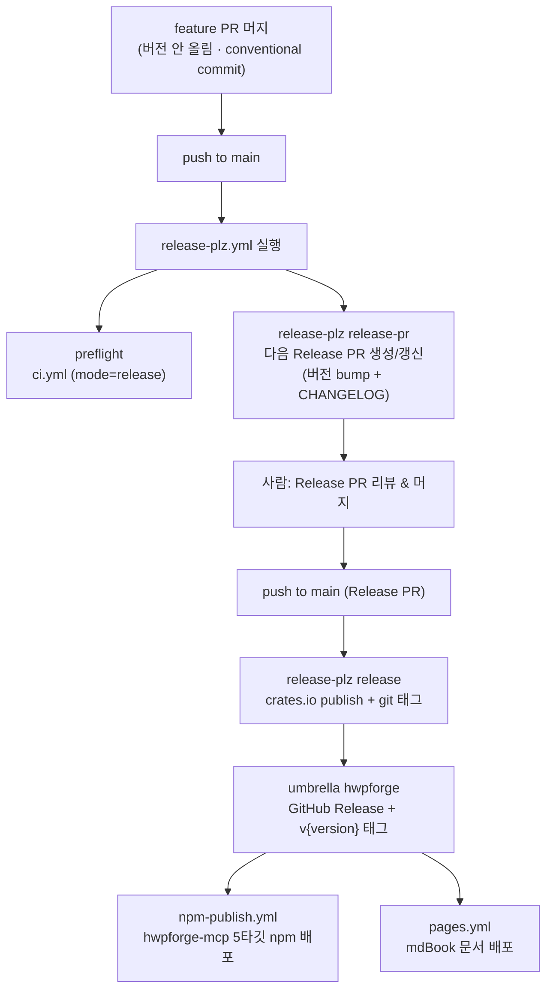

# Releasing HwpForge

릴리스는 **[release-plz](https://release-plz.dev/)** 가 소유한다. 사람이 직접 버전을
올리거나 태그를 찍거나 `cargo publish` 하지 **않는다**. 사람이 하는 일은 단 하나:
**release-plz가 만든 "Release PR"을 리뷰하고 머지**하는 것.

> 설정 위치: `.github/workflows/release-plz.yml` (자동화) · `release-plz.toml` (정책) ·
> `.github/workflows/npm-publish.yml` (MCP npm 배포) · `.github/workflows/pages.yml` (문서 배포).

---

## 1. 전체 흐름

**두 단계로 나뉘는 게 핵심이다.** 평소 feature PR을 머지하면 release-plz가 _Release PR을
열어두기만_ 한다(아직 릴리스 아님). 그 **Release PR을 머지하는 순간**에야 실제 publish·태그·
GitHub Release가 일어난다.

---

## 2. 개발자가 할 일

1. **conventional commit** 으로 작업한다 (아래 §3). feature PR에서는 **버전을 만지지 않는다.**
2. PR을 main에 머지한다.
3. release-plz가 자동으로 **Release PR**(라벨 `release`)을 열거나 갱신한다.
   - 누적된 커밋으로 다음 버전을 계산하고 (`semver_check = true` → cargo-semver-checks로
     breaking 여부 판정), `CHANGELOG.md` 를 갱신한다.
4. 릴리스할 준비가 되면 **Release PR을 리뷰하고 머지**한다.
5. 나머지(crates.io publish, 태그, GitHub Release, npm, 문서 배포)는 전부 자동.

> ⚠️ **버전·태그를 손으로 만들지 말 것.** `0.6.0`/per-crate 태그는 모두 release-plz 산출물이다.
> 손으로 찍으면 release-plz 상태와 어긋나 자기비교·중복 publish 등 사고가 난다.

---

## 3. 커밋 규칙 (릴리스·CHANGELOG를 결정)

릴리스를 트리거하는 타입 (`release-plz.toml` `release_commits`):
`feat` · `fix` · `perf` · `refactor` (+ 임의의 `type!:` breaking).

CHANGELOG 그룹 매핑 (`commit_parsers`):

| 타입                                | CHANGELOG 섹션 | 릴리스 트리거 |
| ----------------------------------- | -------------- | ------------- |
| `feat`                              | Added          | ✅            |
| `fix`                               | Fixed          | ✅            |
| `perf`                              | Performance    | ✅            |
| `refactor`                          | Changed        | ✅            |
| `doc`                               | Documentation  | ❌ (그룹만)   |
| `style`·`test`·`chore`·`ci`·`build` | (skip)         | ❌            |

**Breaking change 표기** — 둘 중 하나로 _명시_ 해야 release-plz가 메이저급 bump를 잡는다:

- 제목에 `!`: `feat(core)!: ...`, `refactor(foundation)!: ...`
- 또는 footer: `BREAKING CHANGE: ...`

> 비표준 타입으로 breaking을 낼 때(예: `docs!:`)도 **`type!:` 형태를 쓰는 게 안전**하다
> (`release-plz.toml` 주석 참고). breaking을 안 적으면 0.x에서 patch로 잘못 bump될 수 있다.

---

## 4. 무엇이 어디로 배포되나

| 크레이트                | crates.io | git 태그       | 비고                                                       |
| ----------------------- | --------- | -------------- | ---------------------------------------------------------- |
| `hwpforge` (umbrella)   | ✅        | `v{version}`   | **유일하게 GitHub Release 생성** → npm/pages 트리거        |
| `hwpforge-foundation`   | ✅        | `…-v{version}` |                                                            |
| `hwpforge-core`         | ✅        | `…-v{version}` |                                                            |
| `hwpforge-blueprint`    | ✅        | `…-v{version}` |                                                            |
| `hwpforge-smithy-hwpx`  | ✅        | `…-v{version}` |                                                            |
| `hwpforge-smithy-md`    | ✅        | `…-v{version}` |                                                            |
| `hwpforge-bindings-mcp` | ✅        | `…-v{version}` | npm `@hwpforge/mcp` 바이너리는 npm-publish.yml가 별도 배포 |
| `hwpforge-smithy-hwp5`  | ❌        | ❌             | `release=false, publish=false`                             |
| `hwpforge-bindings-cli` | ❌        | ❌             | `release=false, publish=false`                             |
| `hwpforge-bindings-py`  | ❌        | ❌             | `release=false, publish=false` (stub)                      |

- **npm**: umbrella의 GitHub Release `published` → `npm-publish.yml` 가 `hwpforge-mcp` 5타깃
  바이너리 + 플랫폼 패키지 + base `@hwpforge/mcp`(optionalDependencies) 배포.
- **문서**: 실제 릴리스가 생겼을 때만(`releases_created == true`) `pages.yml` 가 mdBook 배포.

---

## 5. 0.x SemVer 규칙

`1.0.0` 이전에는 **마이너 자리가 메이저 역할**이다.

- breaking change → **마이너** bump (`0.6.x → 0.7.0`)
- 호환 추가/수정 → **패치** bump (`0.6.0 → 0.6.1`)

release-plz가 cargo-semver-checks로 이를 자동 판정하므로, breaking을 커밋에 제대로
표기(§3)하기만 하면 버전은 알아서 맞춰진다.

> **SemVer 검사를 ci.yml에 standalone 게이트로 다시 넣지 말 것.** release-plz가 이미
> 소유한다. feature PR은 버전을 안 올리는 모델이라, "HEAD vs 최신 태그" 게이트는 breaking
> feature PR마다 영원히 빨강이 된다 (PR #78에서 이 이유로 제거함).

---

## 6. 사전 조건 (시크릿)

| 시크릿                       | 용도                                              |
| ---------------------------- | ------------------------------------------------- |
| `APP_ID` + `APP_PRIVATE_KEY` | release-plz용 GitHub App 토큰 (PR 생성·태그 push) |
| `CARGO_REGISTRY_TOKEN`       | crates.io publish                                 |
| npm 토큰 (`npm-publish.yml`) | `@hwpforge/*` npm 배포                            |

---

## 7. 다음 릴리스 때 알아둘 것 (체크리스트)

- [ ] **버전/태그를 손대지 않는다.** Release PR 머지만 한다.
- [ ] **first crates.io publish 주의.** 현재 crates.io 발행 이력이 없을 수 있다. 첫 publish는
      의존 순서(foundation → core → blueprint → smithy-* → bindings-mcp → umbrella)와
      `publish=false` 크레이트에 대한 의존이 막히지 않는지 한 번 검증이 필요하다.
- [ ] **CHANGELOG의 한글(CJK) 표.** 편집 후 dprint pre-commit이 거부하면
      `dprint fmt CHANGELOG.md` 수동 실행 → 재-stage (CLAUDE.md Tooling Gotchas).
- [ ] **breaking은 반드시 `type!:` 로 표기.** 안 하면 0.x에서 patch로 잘못 bump.
- [ ] **로컬에서 태그 기반 검증 시 `git fetch --tags` 먼저.** 로컬 클론에 최신 태그가
      없으면 잘못된 baseline으로 거짓 통과한다 (PR #78에서 겪은 함정).
- [ ] **release 전 `make ci` 통과 확인** (preflight가 ci.yml mode=release로 다시 돌지만
      로컬에서 먼저 막는 게 빠르다).
- [ ] umbrella만 GitHub Release를 만든다 — npm/pages는 거기에 매달려 있다. umbrella가
      bump되지 않으면 npm·문서 배포도 안 일어난다는 점을 기억.

---

## 8. 운영 함정 (실사고 기반 — CLAUDE.md 에서 이관)

- **Merge queue 활성** — `gh pr merge --squash`(특히 `--delete-branch`) 거부됨. GraphQL `enqueuePullRequest(input:{pullRequestId})` mutation 으로 큐에 넣을 것 (`mergeStateStatus=CLEAN` 이후에만 성공 — BLOCKED/UNSTABLE 중엔 대기). 큐가 PR당 CI 재실행 후 자동 머지(머지 방식은 큐 설정 소유). 큐 상태 = `repository.mergeQueue(branch:"main").entries`.
- **inter-crate 의존성은 `version = "0"` 유지 — 정확 핀으로 "고치지" 말 것.** 통합버전(`version.workspace = true`) 워크스페이스에서 release-plz 는 커밋 없는 베이스 crate 를 못 올려, 정확 핀이면 breaking bump 시 `failed to select a version` 으로 Release PR 생성이 죽음 (PR #94; `version_group`·`release_always` 는 무효 — memory `release-plz-unified-version-workspace.md`).
- **breaking/릴리스 트리거 커밋의 2대 필수 조건** (0.16.0 3막 사고): ① subject 는 `type(scope)!:` (**`type!(scope):` 는 release_commits regex 불일치로 통째 무시**) ② **대상 크레이트의 파일을 실제로 변경**해야 함 — 커밋→패키지 귀속은 변경 파일 경로 기반이라 빈 커밋·publish=false 크레이트만 건드린 PR 은 발화하지 않는다.
- **릴리스 완주 판정**: GitHub Release 는 release-plz 실행 **도중** 먼저 게시되고 그 이벤트가 npm-publish 를 트리거 → release-plz·npm-publish **둘 다 success** + npm 레지스트리(`npm view @hwpforge/mcp version`)·sparse index 실측까지 확인해야 완료. **Release PR 생성 여부도 실측**: release-plz 로그의 `release_pr_output` 이 `{"prs":[]}` 면 미발화 (0.16.0 사고 — 2회 미발화 후 발견).
- **publish 검증**: crates.io API 는 샌드박스에서 막힐 수 있음 → sparse index `index.crates.io/hw/pf/<crate>` 로 확인.
- **release-plz 디버깅은 로컬 프리빌트로 재현** (CI 머지 사이클로 추측 금지): `gh release download release-plz-v0.3.159 --repo release-plz/release-plz` + 깨끗한 clone 에서 `release-plz update`. `{{ release_link }}` 는 로컬 렌더 실패 → 임시 제거 후 실험.
- **npm 토큰**: granular 토큰 90일 만료(npm 은 인증 실패를 **E404 로 위장**), 재발급 시 **"Bypass 2FA" 필수**(없으면 E403). ⚠️ 현 토큰 **~2026-10-10 재만료** — 영구 해결은 npm Trusted Publishing(OIDC) 전환.
