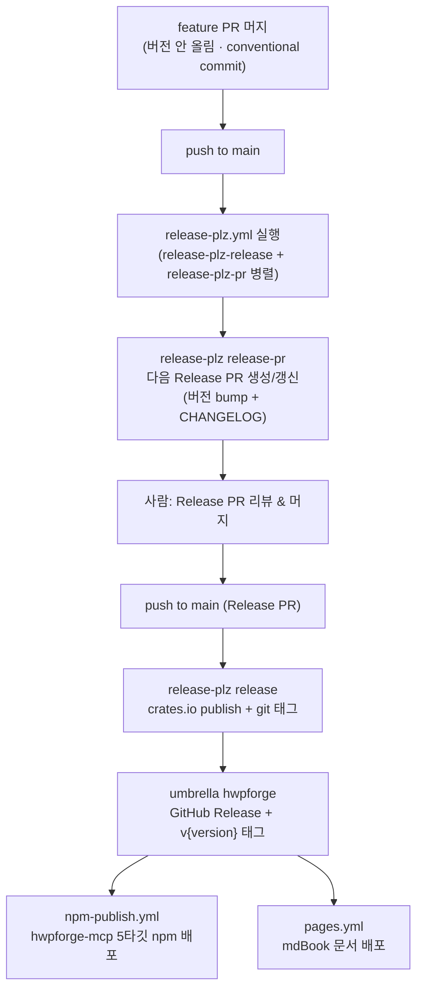

# Releasing HwpForge

**워크스페이스 릴리스**는 **[release-plz](https://release-plz.dev/)** 가 소유한다. 사람이 직접 버전을
올리거나 `v*` 태그를 찍거나 `cargo publish` 하지 **않는다**. 사람이 하는 일은 단 하나:
**release-plz가 만든 "Release PR"을 리뷰하고 머지**하는 것.

**예외는 하나뿐이다.** Python 전용 긴급 수정에 붙이는 `py-v*` 태그는 사람이 직접 만든다 (§9.3). 접두사가 다르고 Rust 크레이트 버전을 건드리지 않으므로 release-plz 와 충돌하지 않는다. 이 예외를 워크스페이스 `v*` 태그로 일반화하지 말 것 — `v*` 는 여전히 release-plz 만 찍는다.

> 설정 위치: `.github/workflows/release-plz.yml` (자동화) · `release-plz.toml` (정책) ·
> `.github/workflows/npm-publish.yml` (MCP npm 배포) · `.github/workflows/pages.yml` (문서 배포).

---

## 1. 전체 흐름



**두 단계로 나뉘는 게 핵심이다.** 평소 feature PR을 머지하면 release-plz가 _Release PR을
열어두기만_ 한다(아직 릴리스 아님). 그 **Release PR을 머지하는 순간**에야 실제 publish·태그·
GitHub Release가 일어난다.

---

## 2. 개발자가 할 일

1. **conventional commit** 으로 작업한다 (아래 §3). feature PR에서는 **버전을 만지지 않는다.**
2. PR을 main에 머지한다.
3. release-plz가 자동으로 **Release PR**(라벨 `release`)을 열거나 갱신한다.
   - 누적된 커밋으로 다음 버전을 계산하고 (`semver_check = true` → cargo-semver-checks로
     breaking 여부 판정), `CHANGELOG.md` 를 갱신한다.
4. 릴리스할 준비가 되면 **Release PR을 리뷰하고 머지**한다.
5. 나머지(crates.io publish, 태그, GitHub Release, npm, 문서 배포)는 전부 자동.

> ⚠️ **버전·태그를 손으로 만들지 말 것.** `0.6.0`/per-crate 태그는 모두 release-plz 산출물이다.
> 손으로 찍으면 release-plz 상태와 어긋나 자기비교·중복 publish 등 사고가 난다.

---

## 3. 커밋 규칙 (릴리스·CHANGELOG를 결정)

릴리스를 트리거하는 타입 (`release-plz.toml` `release_commits`):
`feat` · `fix` · `perf` · `refactor` (+ 임의의 `type!:` breaking).

CHANGELOG 그룹 매핑 (`commit_parsers`):

| 타입                                | CHANGELOG 섹션 | 릴리스 트리거 |
| ----------------------------------- | -------------- | ------------- |
| `feat`                              | Added          | ✅            |
| `fix`                               | Fixed          | ✅            |
| `perf`                              | Performance    | ✅            |
| `refactor`                          | Changed        | ✅            |
| `doc`                               | Documentation  | ❌ (그룹만)   |
| `style`·`test`·`chore`·`ci`·`build` | (skip)         | ❌            |

**Breaking change 표기** — 둘 중 하나로 _명시_ 해야 release-plz가 메이저급 bump를 잡는다:

- 제목에 `!`: `feat(core)!: ...`, `refactor(foundation)!: ...`
- 또는 footer: `BREAKING CHANGE: ...`

> 비표준 타입으로 breaking을 낼 때(예: `docs!:`)도 **`type!:` 형태를 쓰는 게 안전**하다
> (`release-plz.toml` 주석 참고). breaking을 안 적으면 0.x에서 patch로 잘못 bump될 수 있다.

---

## 4. 무엇이 어디로 배포되나

| 크레이트                | crates.io | git 태그       | 비고                                                       |
| ----------------------- | --------- | -------------- | ---------------------------------------------------------- |
| `hwpforge` (umbrella)   | ✅        | `v{version}`   | **유일하게 GitHub Release 생성** → npm/pages 트리거        |
| `hwpforge-foundation`   | ✅        | `…-v{version}` |                                                            |
| `hwpforge-core`         | ✅        | `…-v{version}` |                                                            |
| `hwpforge-blueprint`    | ✅        | `…-v{version}` |                                                            |
| `hwpforge-smithy-hwpx`  | ✅        | `…-v{version}` |                                                            |
| `hwpforge-smithy-md`    | ✅        | `…-v{version}` |                                                            |
| `hwpforge-bindings-mcp` | ✅        | `…-v{version}` | npm `@hwpforge/mcp` 바이너리는 npm-publish.yml가 별도 배포 |
| `hwpforge-smithy-hwp5`  | ❌        | ❌             | `release=false, publish=false`                             |
| `hwpforge-bindings-cli` | ❌        | ❌             | `release=false, publish=false`                             |
| `hwpforge-bindings-py`  | ❌        | ❌             | `release=false, publish=false` (stub)                      |

- **npm**: umbrella의 GitHub Release `published` → `npm-publish.yml` 가 `hwpforge-mcp` 5타깃
  바이너리 + 플랫폼 패키지 + base `@hwpforge/mcp`(optionalDependencies) 배포.
- **문서**: 실제 릴리스가 생겼을 때만(`releases_created == true`) `pages.yml` 가 mdBook 배포.

---

## 5. 0.x SemVer 규칙

`1.0.0` 이전에는 **마이너 자리가 메이저 역할**이다.

- breaking change → **마이너** bump (`0.6.x → 0.7.0`)
- 호환 추가/수정 → **패치** bump (`0.6.0 → 0.6.1`)

release-plz가 cargo-semver-checks로 이를 자동 판정하므로, breaking을 커밋에 제대로
표기(§3)하기만 하면 버전은 알아서 맞춰진다.

> **SemVer 검사를 ci.yml에 standalone 게이트로 다시 넣지 말 것.** release-plz가 이미
> 소유한다. feature PR은 버전을 안 올리는 모델이라, "HEAD vs 최신 태그" 게이트는 breaking
> feature PR마다 영원히 빨강이 된다 (PR #78에서 이 이유로 제거함).

---

## 6. 사전 조건 (시크릿)

| 시크릿                       | 용도                                              |
| ---------------------------- | ------------------------------------------------- |
| `APP_ID` + `APP_PRIVATE_KEY` | release-plz용 GitHub App 토큰 (PR 생성·태그 push) |
| `CARGO_REGISTRY_TOKEN`       | crates.io publish                                 |
| npm 토큰 (`npm-publish.yml`) | `@hwpforge/*` npm 배포                            |

---

## 7. 다음 릴리스 때 알아둘 것 (체크리스트)

- [ ] **버전/태그를 손대지 않는다.** Release PR 머지만 한다.
- [ ] **CHANGELOG의 한글(CJK) 표.** 편집 후 dprint pre-commit이 거부하면
      `dprint fmt CHANGELOG.md` 수동 실행 → 재-stage (CLAUDE.md Tooling Gotchas).
- [ ] **breaking은 반드시 `type!:` 로 표기.** 안 하면 0.x에서 patch로 잘못 bump.
- [ ] **로컬에서 태그 기반 검증 시 `git fetch --tags` 먼저.** 로컬 클론에 최신 태그가
      없으면 잘못된 baseline으로 거짓 통과한다 (PR #78에서 겪은 함정).
- [ ] **release 전 `make ci-full` 통과 확인** (release-plz.yml 은 preflight 없이 곧바로 release job 을 돌리므로, 로컬에서 먼저 막는 게 유일한 사전 방어선 — CI 다이어트 P2). `make ci` 는 `ci-fast` 별칭이라 coverage 와 MSRV 두 레인이 빠진다 — 릴리스 전 점검으로는 부족하다.
- [ ] umbrella만 GitHub Release를 만든다 — npm/pages는 거기에 매달려 있다. umbrella가
      bump되지 않으면 npm·문서 배포도 안 일어난다는 점을 기억.

---

## 8. 운영 함정 (실사고 기반 — CLAUDE.md 에서 이관)

- **Merge queue 활성** — `gh pr merge --squash`(특히 `--delete-branch`) 거부됨. GraphQL `enqueuePullRequest(input:{pullRequestId})` mutation 으로 큐에 넣을 것 (`mergeStateStatus=CLEAN` 이후에만 성공 — BLOCKED/UNSTABLE 중엔 대기). 큐가 PR당 CI 재실행 후 자동 머지(머지 방식은 큐 설정 소유). 큐 상태 = `repository.mergeQueue(branch:"main").entries`.
- **inter-crate 의존성은 `version = "0"` 유지 — 정확 핀으로 "고치지" 말 것.** 통합버전(`version.workspace = true`) 워크스페이스에서 release-plz 는 커밋 없는 베이스 crate 를 못 올려, 정확 핀이면 breaking bump 시 `failed to select a version` 으로 Release PR 생성이 죽음 (PR #94; `version_group`·`release_always` 는 무효 — memory `release-plz-unified-version-workspace.md`).
- **breaking/릴리스 트리거 커밋의 2대 필수 조건** (0.16.0 3막 사고): (1) subject 는 `type(scope)!:` (**`type!(scope):` 는 release_commits regex 불일치로 통째 무시**) (2) **대상 크레이트의 파일을 실제로 변경해야** 함 — 커밋→패키지 귀속은 변경 파일 경로 기반이라 빈 커밋·publish=false 크레이트만 건드린 PR 은 발화하지 않는다.
- **릴리스 완주 판정**: GitHub Release 는 release-plz 실행 **도중** 먼저 게시되고 그 이벤트가 npm-publish 를 트리거 → release-plz·npm-publish **둘 다 success** + npm 레지스트리(`npm view @hwpforge/mcp version`)·sparse index 실측까지 확인해야 완료. **Release PR 생성 여부도 실측**: release-plz 로그의 `release_pr_output` 이 `{"prs":[]}` 면 미발화 (0.16.0 사고 — 2회 미발화 후 발견).
- **publish 검증**: crates.io API 는 샌드박스에서 막힐 수 있음 → sparse index `index.crates.io/hw/pf/<crate>` 로 확인.
- **release-plz 디버깅은 로컬 프리빌트로 재현** (CI 머지 사이클로 추측 금지): `gh release download release-plz-v0.3.159 --repo release-plz/release-plz` + 깨끗한 clone 에서 `release-plz update`. `{{ release_link }}` 는 로컬 렌더 실패 → 임시 제거 후 실험. (`release-plz-v0.3.159` 는 **CLI**(`release-plz/release-plz`) 릴리스 태그이며, `.github/workflows/release-plz.yml` 이 실제로 고정하는 `release-plz/action@…v0.5.131` 과는 버전 계열이 다르다 — action 이 내부적으로 vendor 하는 CLI 버전은 별개이므로, 재현 시 `gh release list --repo release-plz/release-plz --limit 5` 로 최신 CLI 태그를 다시 조회할 것.)
- **npm 토큰**: granular 토큰 90일 만료(npm 은 인증 실패를 **E404 로 위장**), 재발급 시 **"Bypass 2FA" 필수**(없으면 E403). ⚠️ 현 토큰 **~2026-10-10 재만료** — 영구 해결은 npm Trusted Publishing(OIDC) 전환.

---

## 9. Python 배포 (PyPI)

Rust 크레이트·npm 과 달리 Python wheel 은 release-plz 가 만들지 않는다. `.github/workflows/pypi-publish.yml` 이 별도로 돌고, 버전은 여전히 release-plz 가 계산한 워크스페이스 버전을 따른다. 아래 절차는 그 워크플로를 사람이 어떻게 부르는지를 적는다.

### 9.1 트리거와 대상

| 이벤트                               | 태그 출처                          | 게시 대상                           |
| ------------------------------------ | ---------------------------------- | ----------------------------------- |
| `release: published` (umbrella `v*`) | `release.tag_name`                 | **PyPI**                            |
| `workflow_dispatch`                  | "Use workflow from" 에서 고른 태그 | 입력 `target` (기본값 **TestPyPI**) |

**태그를 푸시하는 것만으로는 아무 일도 일어나지 않는다.** `py-v*` push 트리거는 제거했다 — 리허설에 쓸 태그를 origin 에 올려야 "Use workflow from" 목록에 뜨는데, 그 준비 동작이 곧 프로덕션 게시가 되어 버리고(그리고 그 파일명을 영구히 태워 이후 릴리스 업로드를 hash 불일치로 깨뜨리고) 만다. 프로덕션에 닿는 길은 릴리스 이벤트와 명시적 수동 실행 둘뿐이고, 기본값은 TestPyPI 다.

수동 실행에는 태그 입력란이 없다. **Actions → PyPI Publish → Run workflow → "Use workflow from" 에서 `Tags` 를 고르고 태그를 선택**한 뒤 `target` 만 정한다. 브랜치를 고르면 `Resolve › Tag` 가 거부한다. 그 드롭다운에 태그가 보이려면 **그 태그의 트리에 `pypi-publish.yml` 이 있어야** 한다 — 이 워크플로가 main 에 들어가기 전에 찍힌 태그로는 수동 실행을 할 수 없다.

### 9.2 태그 문법

워크스페이스 릴리스 태그는 `vX.Y.Z` 하나뿐이고 Cargo 워크스페이스 버전과 **정확히** 같아야 한다. Python 전용 태그는 네 가지뿐이다.

| 형태                | 예                   | 언제                            |
| ------------------- | -------------------- | ------------------------------- |
| `py-vX.Y.Z`         | `py-v0.16.4`         | 같은 버전을 그대로 다시 게시    |
| `py-vX.Y.Z.postM`   | `py-v0.16.4.post1`   | 같은 소스를 다시 빌드 (M ≥ 1)   |
| `py-vX.Y.Z.N`       | `py-v0.16.4.1`       | Python 층만 고친 릴리스 (N ≥ 1) |
| `py-vX.Y.Z.N.postM` | `py-v0.16.4.1.post2` | 그 릴리스의 재빌드              |

epoch·pre-release·dev·local 세그먼트와 다섯 번째 release 성분은 거부된다. PEP 440 정규화 결과가 `py-v` 를 뗀 문자열과 **글자 그대로** 같아야 하므로 `py-v0.16.04` 도 거부된다. 앞 세 성분은 항상 현재 Cargo 버전이어야 하고, Rust 크레이트 버전은 이 경로에서 절대 바뀌지 않는다. `post` 는 PEP 440 이 "소프트웨어에 영향 없는 정정" 으로 한정하므로 **코드 변경에는 쓰지 않는다** — 코드가 바뀌면 `.N` 이다.

규칙의 소유자는 `.github/scripts/resolve_release_tag.py` 이고, 같은 파일의 `--self-check` 가 수용·거부 표를 계정 없이 재현한다.

```console
uv run --no-project --with packaging python .github/scripts/resolve_release_tag.py --self-check
```

### 9.3 Python 전용 태그를 붙이는 절차

1. 고칠 내용을 main 에 머지한다 (평시 Python 변경은 다음 워크스페이스 릴리스에 그냥 실려 나가므로, 이 절차는 **긴급 수정**용이다).
2. 그 커밋에 태그를 붙여 푸시한다 — `git tag py-v0.16.4.1 <commit>` 후 `git push origin py-v0.16.4.1`. 이 푸시는 아무것도 실행하지 않는다. 태그를 "Use workflow from" 목록에 띄우는 것이 전부다.
3. **Actions → PyPI Publish → Run workflow → "Use workflow from" 에서 그 태그를 고르고 `target: pypi`** 로 실행한다. TestPyPI 로 먼저 한 번 돌려 보고 싶으면 같은 태그에 `target: testpypi` 로 실행한 뒤 다시 `pypi` 로 실행하면 된다 — 두 대상은 서로 다른 environment 와 index 를 쓴다.
4. 워크플로는 **태그 ref 위에서** 돌고 모든 잡이 같은 커밋(`github.sha`)을 체크아웃한다 — 체크아웃할 ref 가 입력에서 오지 않으므로 기본 브랜치와 공유되는 캐시를 오염시킬 경로가 없다. 같은 이유로 이 워크플로에는 캐시 액션이 하나도 없다 (릴리스 빌드는 cold 가 정상이다). 게시 직전에 태그가 여전히 그 커밋을 가리키는지 다시 확인한다. `pyproject.toml` 의 `dynamic = ["version"]` 은 러너의 일회용 체크아웃에서만 정적 버전으로 바뀌고 빌드 뒤 원본이 복원된다 (`git diff --exit-code` 로 증명). 저장소에는 아무것도 커밋되지 않는다.

release-plz 의 `git_tag_name = "v{{ version }}"` 과 접두사가 달라 충돌하지 않는다.

### 9.4 TestPyPI 리허설 체크리스트

첫 PyPI 업로드 전에 한 번 돈다. 전부 `workflow_dispatch` + `target=testpypi` 다. 리허설용 `py-v*` 태그를 origin 에 푸시해도 아무 워크플로도 돌지 않으므로(§9.1), 태그를 먼저 전부 올려 두고 하나씩 골라 실행하면 된다.

- [ ] 네 가지 태그 형태 각각으로 실행 (각 태그를 "Use workflow from" 에서 고른다) — `py-v0.16.4` · `py-v0.16.4.post1` · `py-v0.16.4.1` · `py-v0.16.4.1.post2`. 넷 다 `Resolve › Tag` 통과, wheel 파일명·`METADATA`·`PKG-INFO` 버전이 태그와 일치.
- [ ] 거부되어야 할 태그 하나를 일부러 골라 본다 (`py-v0.16.4.0` 등) — `Resolve › Tag` 에서 **실패**해야 한다. 브랜치를 골라 실행하는 것도 같은 자리에서 거부된다.
- [ ] **부분 게시 복구**: 여섯 개 중 **셋만** 올라간 상태를 만든 뒤, 그 아티팩트를 만든 **run 의 게시 잡만 다시 돌린다**. 아티팩트를 내려받아 손으로 `uv publish --trusted-publishing never --publish-url https://test.pypi.org/legacy/ --check-url https://test.pypi.org/simple/ <파일 3개>` 를 먼저 실행하고(토큰 사용), 그다음 **Actions → 그 run → "Re-run failed jobs"** 로 `Publish › TestPyPI` 만 다시 돌린다. 로그에 **skip 3 · upload 3** 이 찍히고 run 은 성공해야 한다. 아티팩트는 14일 보관되므로 그 안에는 언제든 가능하다.

  **새로 dispatch 하면 안 된다.** 새 run 은 wheel 을 다시 빌드하는데 바이트가 재현되지 않아(빌드가 reproducible 하지 않다) `--check-url` 이 첫 기존 파일에서 거부한다 — `Local file and index file do not match for hwpforge-…-macosx_10_12_x86_64.whl. Local: sha256=542c9b…, Remote: sha256=8380a9…` (exit 2). 이것은 고장이 아니라 **안전 속성**이다: 이미 올라간 파일을 덮어쓰지 않는다. 토큰이 없어 부분 상태를 만들 수 없으면, **같은 run 의 게시 잡을 그대로 한 번 더 돌려** 여섯 개 전부 `File … already exists, skipping` 으로 건너뛰고 성공하는 것을 증거로 삼는다.
- [ ] **`--check-url` 실패 테스트**: 같은 파일명으로 내용이 다른 wheel 을 만들어 올려 본다. 건너뛰지 않고 **실패**해야 한다 (멱등성은 오직 이 검사에서 온다 — PyPI 는 파일명 재사용을 영구히 거부한다).
- [ ] **sdist 강제 설치** — wheel 이 있으면 설치 해석기가 그것을 고르므로, 소스 배포를 실제로 컴파일해 보려면 명시적으로 막아야 한다 (Rust 1.92 + maturin 필요):

```console
uv venv /tmp/hf-sdist
uv pip install --python /tmp/hf-sdist/bin/python --no-binary hwpforge \
  --index-url https://pypi.org/simple/ \
  --extra-index-url https://test.pypi.org/simple/ \
  --index-strategy unsafe-best-match "hwpforge==<ver>"
```

빌드 의존성(maturin)은 **PyPI** 에서 와야 한다 — TestPyPI 에는 maturin 0.7.9 뿐이라 `--index-url` 을 TestPyPI 로만 두면 소스 빌드가 깨진다. 그래서 기본 인덱스는 PyPI, TestPyPI 는 추가 인덱스로 두고 `--index-strategy unsafe-best-match` 로 양쪽을 함께 본다. wheel 경로는 의존성이 없으므로 `--index-url` 만으로 충분하다.

- [ ] 설치 확인 (wheel 경로) — 새 환경에서:

```console
uv venv /tmp/hf-rehearsal
uv pip install --python /tmp/hf-rehearsal/bin/python --index-url https://test.pypi.org/simple/ "hwpforge==<ver>"
uv run --python /tmp/hf-rehearsal/bin/python python -c "import hwpforge, sys; print(hwpforge.__version__, sys.platform)"
```

- [ ] 레지스트리 실측 — `curl -s https://test.pypi.org/pypi/hwpforge/json | jq '.info.version, (.urls[].filename)'`. 프로덕션은 같은 명령의 `https://pypi.org/pypi/hwpforge/json`.

**2026-09-18 리허설에서 실측한 것**: 네 가지 태그 형태 각각이 TestPyPI 에 6개 파일(wheel 5 + sdist)을 올렸다 · 새 가상환경에서 wheel 설치·import 성공 · sdist 강제 설치가 소스에서 1분 08초에 빌드됨 · 같은 run 의 게시 잡 재실행이 6개 전부 `already exists, skipping` 으로 통과 · 이미 게시된 태그를 새로 dispatch 하면 재빌드된 바이트가 달라 `--check-url` 이 거부(exit 2). 남은 것은 토큰으로 만든 진짜 3/6 부분 상태에서의 복구와 프로덕션 첫 업로드다.

### 9.5 릴리스 동결 규칙

`pypi-publish.yml` 이 main 에 들어가고 9.4 리허설과 9.6 선행 작업이 끝나기 전에는 **Release PR 을 큐에 넣지 않는다**. 먼저 머지하면 Python 워크플로 없는 릴리스가 나가고, `release: published` 이벤트는 재생할 수 없어 첫 wheel 을 그 릴리스에서 만들 기회가 사라진다. 머지 큐 조작 규칙 자체는 §8 에 있다.

### 9.6 사용자(관리자) 선행 작업

워크플로는 이 표가 채워지기 전에는 **조용히 건너뛰지 않고 실패한다** — `--trusted-publishing always` 는 토큰으로 되돌아가지 않고 그 자리에서 죽는다.

| 무엇                          | 값                                                                                                       |
| ----------------------------- | -------------------------------------------------------------------------------------------------------- |
| PyPI 계정 + 2FA               | 이름 `hwpforge` 는 예약되지 않는다 — pending publisher 는 선점 장치가 아니므로 첫 업로드를 미루지 않는다 |
| TestPyPI 계정 + 2FA           | 리허설용, 별도 계정                                                                                      |
| PyPI pending publisher        | owner `ai-screams` · repository `HwpForge` · workflow `pypi-publish.yml` · environment `pypi`            |
| TestPyPI pending publisher    | 같은 값에 environment `testpypi`                                                                         |
| GitHub environment `pypi`     | 같은 이름으로 생성. 필요하면 reviewer 를 붙여 수동 승인 게이트로 쓴다                                    |
| GitHub environment `testpypi` | 같은 이름으로 생성, reviewer 없이                                                                        |

증빙은 `gh api repos/ai-screams/HwpForge/environments` 출력을 `.docs/prs/` 에 남긴다. 토큰은 쓰지 않는다 — OIDC 뿐이다.

### 9.7 이용자에게 알릴 것

정확 핀(`==X.Y.Z`)을 쓰는 이용자는 `py-vX.Y.Z.N` 로 나가는 Python 전용 수정을 받지 못한다. 문서와 안내에서는 `\~=X.Y.Z` 를 권한다.
