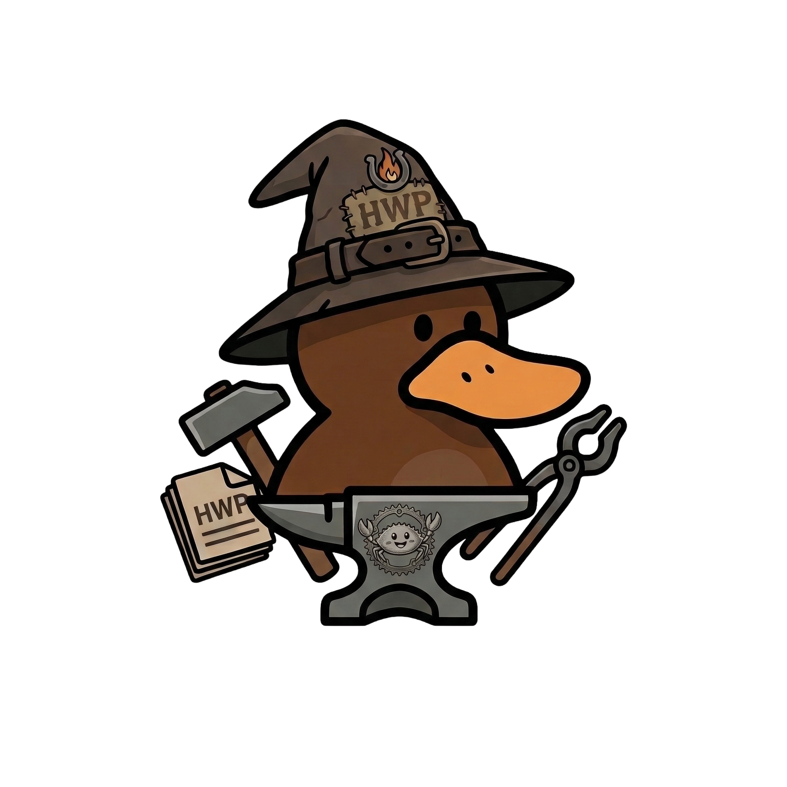
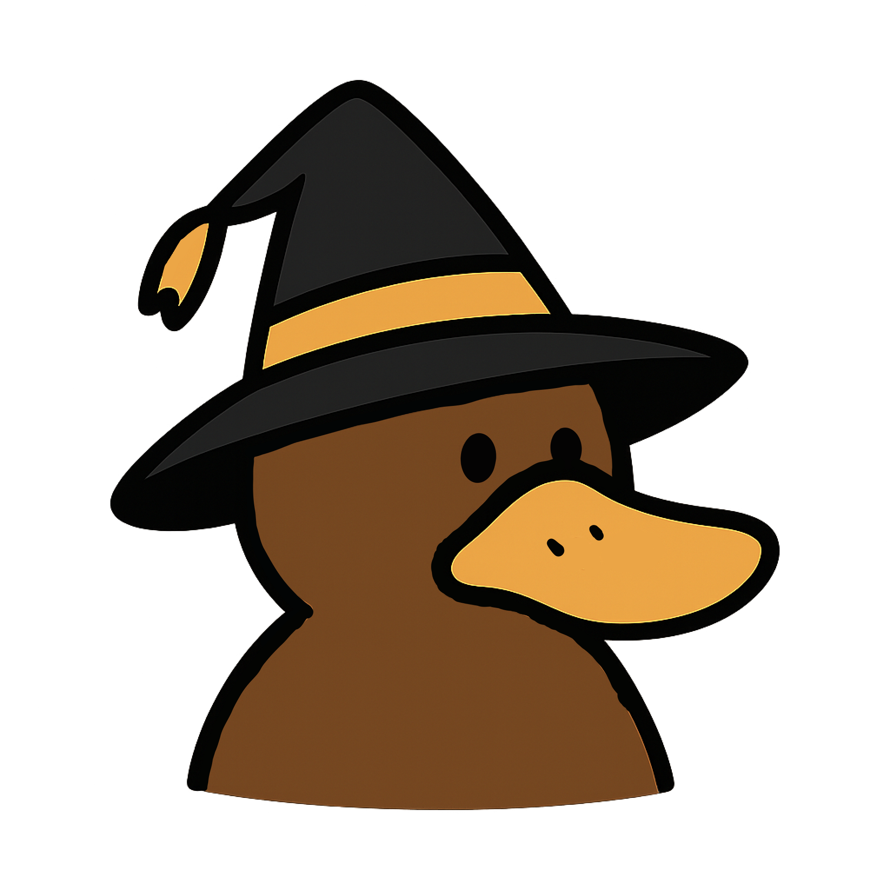
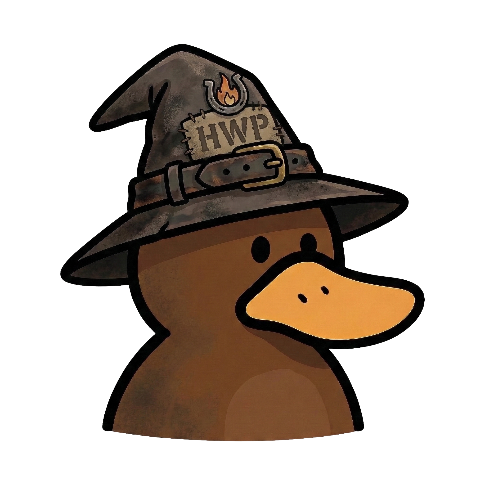

# HwpForge Branding Guide

## Project Identity

**HwpForge** — 한글 문서를 코드로 벼려내는 대장간

- **이름 유래**: HWP(한글 문서) + Forge(대장간). 대장장이가 쇠를 벼려 도구를 만들듯, 코드로 한글 문서를 만들어내는 Rust 라이브러리.
- **태그라인**: `Forge Korean Documents with Code`
- **한글 태그라인**: `한글 문서를 코드로 벼려내다`
- **포지셔닝**: LLM-first 오픈소스 Rust 라이브러리. AI 에이전트가 자연어와 마크다운으로 한컴오피스 한글(.hwpx) 문서를 생성하도록 설계됨.

---

## Mascot: 쇠부리 Anvilscribe (SoeBuri Anvilscribe)

> **쇠부리 Anvilscribe** — 한 문서를 불에 달구어 단단하게 벼려내는 대장장이 오리너구리.
> 모루(Anvil) 위에서 문서를 기록하는 서기관(Scribe).

HwpForge의 마스코트. "쇠부리"는 쇠(철/금속)와 부리(주둥이)를 합친 이름으로, 대장간에서 쇳물을 다루는 장인이자 뾰족한 부리로 문서를 정밀하게 다듬는 오리너구리의 정체성을 담고 있다. 대장장이 모자에 "HWP" 명패와 불꽃 엠블럼을 달고, 망치와 집게를 들고 모루 앞에서 한글 문서를 벼려내는 모습.

### Assets

#### mascot-main.png — 풀바디 마스코트 (메인)

대장간 도구(망치, 집게, 모루)와 HWP 문서를 들고 있는 전신 일러스트. README, 문.서 헤더, 발표 자료에 사용.



| 항목 | 값                                      |
| ---- | --------------------------------------- |
| 파일 | `assets/mascot-main.png`                |
| 용도 | README 메인, 문서 헤더, 발표 자료       |
| 배경 | 회색 (투명 배경 버전 필요 시 별도 제작) |

---

#### mascot.png — 심플 아이콘

금색 띠가 있는 검은 모자를 쓴 미니멀 버스트. 파비콘, SNS 프로필, 작은 아이콘에 적합.



| 항목 | 값                                 |
| ---- | ---------------------------------- |
| 파일 | `assets/mascot.png`                |
| 용도 | 파비콘, 프로필 이미지, 작은 아이콘 |
| 배경 | 투명 (흰색)                        |

---

#### mascot2.png — 디테일 버스트

가죽 벨트와 HWP 명패가 달린 낡은 대장장이 모자. 수채화 질감의 정밀한 버전. 블로그 포스트, 큰 프로필에 사용.



| 항목 | 값                             |
| ---- | ------------------------------ |
| 파일 | `assets/mascot2.png`           |
| 용도 | 블로그, 큰 프로필, 소개 페이지 |
| 배경 | 투명 (흰색)                    |

---

#### banner-main.png — 메인 배너

대장간 작업실 전경. 마스코트가 화로 앞에서 작업 중이며 주변에 HWP 문서 더미, 대장간 도구, 포션, Rust 기어 로고가 배치됨. "Open-Source Rust Library", "Hancom Document Creation" 표어 포함.


| 항목 | 값                                                   |
| ---- | ---------------------------------------------------- |
| 파일 | `assets/banner-main.png`                             |
| 용도 | GitHub README 상단, 소셜 미디어 OG 이미지, 발표 표지 |
| 비율 | 가로형 (약 16:9)                                     |

---

## Color Palette

마스코트와 배너에서 추출한 프로젝트 컬러.

| 이름           | HEX       | 용도                         |
| -------------- | --------- | ---------------------------- |
| Forge Brown    | `#6B4226` | 마스코트 본체, 프라이머리    |
| Duck Beak      | `#E8A832` | 부리/악센트, CTA 버튼, 강조  |
| Hat Dark       | `#3C3C3C` | 모자, 다크 텍스트, 코드 블록 |
| Anvil Gray     | `#5A5A5A` | 모루, 세컨더리 텍스트        |
| Fire Orange    | `#D4621A` | 불꽃, 경고, 하이라이트       |
| Parchment      | `#F5F0E8` | 문서 배경, 라이트 모드       |
| Workshop Stone | `#8B8B8B` | 배경, 보더                   |
| Rust Gear      | `#B7410E` | Rust 언어 연계, 배지         |

### 다크/라이트 모드

| 모드  | 배경                | 텍스트             | 악센트                |
| ----- | ------------------- | ------------------ | --------------------- |
| Light | `#F5F0E8` Parchment | `#3C3C3C` Hat Dark | `#D4621A` Fire Orange |
| Dark  | `#1E1E1E`           | `#E8E0D0`          | `#E8A832` Duck Beak   |

---

## Typography

| 용도      | 영문                    | 한글                |
| --------- | ----------------------- | ------------------- |
| 제목/로고 | **JetBrains Mono Bold** | **프리텐다드 Bold** |
| 본문      | Inter                   | 프리텐다드          |
| 코드      | JetBrains Mono          | JetBrains Mono      |

---

## Mascot Guidelines

### Do's

- 원본 비율을 유지할 것
- 충분한 여백(최소 캐릭터 높이의 10%)을 확보할 것
- 밝은 배경 또는 투명 배경 위에 사용할 것
- 대장간/문서/코딩 맥락에서 사용할 것

### Don'ts

- 비율을 변형하지 말 것 (늘이기, 찌그러뜨리기)
- 마스코트 위에 텍스트를 겹치지 말 것
- 색상을 임의로 변경하지 말 것
- 경쟁 제품 홍보에 사용하지 말 것

---

## Usage Examples

### GitHub README 상단

```markdown
<div align="center">
  
  <br/>
  <strong>한글 문서를 코드로 벼려내다</strong>
  <br/>
  Forge Korean Documents with Code
</div>
```

### 배지 조합

```markdown
[](https://crates.io/crates/hwpforge)
[](LICENSE)
```

### 소셜 미디어

| 플랫폼              | 추천 에셋              | 크기     |
| ------------------- | ---------------------- | -------- |
| GitHub 프로필       | `mascot.png`           | 500x500  |
| GitHub README       | `banner-main.png`      | 원본     |
| X / Twitter 헤더    | `banner-main.png` 크롭 | 1500x500 |
| X / Twitter 프로필  | `mascot2.png`          | 400x400  |
| Discord 서버 아이콘 | `mascot.png`           | 512x512  |
| PyPI / crates.io    | `mascot.png`           | 원본     |

---

## Asset Checklist

현재 보유 에셋과 추가 제작이 필요한 항목.

| 에셋                              | 상태    | 비고                          |
| --------------------------------- | ------- | ----------------------------- |
| 풀바디 마스코트 (mascot-main.png) | ✅ 완료 |                               |
| 심플 아이콘 (mascot.png)          | ✅ 완료 |                               |
| 디테일 버스트 (mascot2.png)       | ✅ 완료 |                               |
| 메인 배너 (banner-main.png)       | ✅ 완료 |                               |
| 투명 배경 마스코트                | ☐ 필요  | mascot-main의 투명 배경 버전  |
| SVG 로고                          | ☐ 필요  | 벡터 버전 (확대 시 깨짐 방지) |
| 파비콘 (favicon.ico)              | ☐ 필요  | mascot.png 기반 16/32/48px    |
| OG 이미지 (1200x630)              | ☐ 필요  | 문서 사이트/블로그용          |
| 다크 모드 배너                    | ☐ 필요  | 어두운 배경 버전              |

---

## License

브랜딩 에셋의 저작권은 AiScream에 있습니다.
코드는 MIT/Apache-2.0 듀얼 라이선스이나, 마스코트 및 브랜딩 에셋은 별도 저작권이 적용됩니다.
