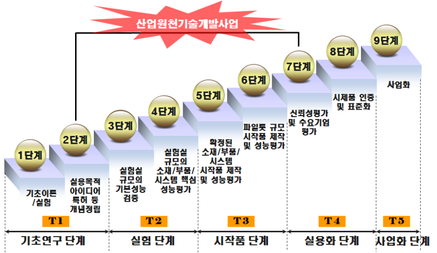

\[2026-기술개발사업-신청용 계획서\]

# <u><strong>정보통신·방송 기술개발사업 신청용 연구개발계획서</strong></u>

<table>
<tbody>
<tr>
  <td><strong>작성 요령</strong></td>
  <td></td>
  <td></td>
</tr>
<tr>
  <td colspan="3"> <strong>□ 연구개발계획서 작성․제출 시 유의 사항</strong>    - 동 연구개발계획서 서식을 준용하여 각 사업별로 정한 서식으로 제출  - A4 용지를 사용하여 작성하고, ‘1.연구개발과제의 필요성’부터 쪽번호를 기입    - 연구개발계획서는 전산 등록 시 한글 파일 등록 (단, 연구개발계획서 앞장(직인날인)한글파일 삭제하지 말고, 직인날인 부분은 이미지화하여 맨 앞장에 삽입)    - 부속 서류는 순서대로 정리하여 제출  <em>   ☞ 제출된 서류 및 연구개발계획서가 허위, 위․변조, 그 밖의 방법으로 부정하게 작성된 경우 관련 규정에 의거 선정 취소 및 협약 해약됨을 알려 드립니다.</em>  <em>   ☞ 과제 신청 관계자(기업, 대표자, 연구책임자, 연구자 등)는 채무불이행 등 신용조회 및 과제 관리를 위한 개인정보 활용에 동의한 것으로 간주합니다.</em>  <em>   ☞ 연구개발계획서 양식 중  </em><u><em><strong>본문 1</strong></em></u><em>분량은 아래 기준으로 </em><u><em><strong>작성 권고함</strong></em></u>  <table>
<tbody>
<tr>
  <td><strong>o 연간 정부지원연구개발비 (본문 글자크기는 12pt 기준 권고)</strong> <strong>  - 5억원 이하 과제 : 30</strong><u><strong>쪽 이내</strong></u> <strong>  - 5억원 초과 과제 : </strong><u><strong>50쪽 이내</strong></u> <strong>*평가시간 內 충분한 연구개발계획서 검토와 평가를 위해 </strong><u><strong>적정한 분량 작성을 권고함</strong></u></td>
</tr>
</tbody>
</table>   <strong>※ 연구개발계획서 제출 시 ‘유의사항’은 삭제해 주세요.</strong>    </td>
</tr>
</tbody>
</table>

<table>
<tbody>
<tr>
  <td> <table>
<tbody>
<tr>
  <td colspan="13" rowspan="2">연구개발계획서</td>
  <td colspan="14" rowspan="2">[○] 신청용  [  ] 협약용</td>
  <td colspan="7">보안등급</td>
</tr>
<tr>
  <td colspan="7">일반[  ], 보안[  ]</td>
</tr>
<tr>
  <td colspan="6" rowspan="2">중앙행정기관명</td>
  <td colspan="11" rowspan="2">과학기술정보통신부</td>
  <td colspan="3" rowspan="3">사업명</td>
  <td colspan="7">사업명</td>
  <td colspan="7"></td>
</tr>
<tr>
  <td colspan="7" rowspan="2">내역사업명
(해당 시 작성)</td>
  <td colspan="7" rowspan="2"></td>
</tr>
<tr>
  <td colspan="6">전문기관명</td>
  <td colspan="11">정보통신기획평가원</td>
</tr>
<tr>
  <td colspan="6" rowspan="2">공고번호</td>
  <td colspan="11" rowspan="2"></td>
  <td colspan="10">총괄연구개발과제번호  (해당 시 작성)</td>
  <td colspan="7"></td>
</tr>
<tr>
  <td colspan="10">연구개발과제번호</td>
  <td colspan="7"></td>
</tr>
<tr>
  <td colspan="6">선정방식</td>
  <td colspan="28">정책지정[  ]  공모:  지정공모[  ]  품목공모[  ]  분야공모[  ]  자유공모[  ]</td>
</tr>
<tr>
  <td colspan="2" rowspan="2">기술 분류</td>
  <td colspan="4">국가과학기술표준분류</td>
  <td colspan="6">1순위 소분류명 (코드명)</td>
  <td colspan="3">%</td>
  <td colspan="8">2순위 소분류명 (코드명)</td>
  <td colspan="3">%</td>
  <td colspan="7">3순위 소분류명 (코드명)</td>
  <td>%</td>
</tr>
<tr>
  <td colspan="4">ICT기술분류</td>
  <td colspan="6">1순위 소분류명 (코드명)</td>
  <td colspan="3">%</td>
  <td colspan="8">2순위 소분류명 (코드명)</td>
  <td colspan="3">%</td>
  <td colspan="7">3순위 소분류명 (코드명)</td>
  <td>%</td>
</tr>
<tr>
  <td colspan="6" rowspan="2">총괄연구개발과제명 (해당 시 작성)</td>
  <td colspan="4">국문</td>
  <td colspan="24"></td>
</tr>
<tr>
  <td colspan="4">영문</td>
  <td colspan="24"></td>
</tr>
<tr>
  <td colspan="6" rowspan="2">연구개발과제명</td>
  <td colspan="4">국문</td>
  <td colspan="24"></td>
</tr>
<tr>
  <td colspan="4">영문</td>
  <td colspan="24"></td>
</tr>
<tr>
  <td colspan="6" rowspan="2">주관연구개발기관</td>
  <td colspan="4">기관명</td>
  <td colspan="12"></td>
  <td colspan="8">사업자등록번호</td>
  <td colspan="4"></td>
</tr>
<tr>
  <td colspan="4">주소</td>
  <td colspan="12">(우)</td>
  <td colspan="8">법인등록번호</td>
  <td colspan="4"></td>
</tr>
<tr>
  <td colspan="6" rowspan="3">연구책임자</td>
  <td colspan="6">성명</td>
  <td colspan="10"></td>
  <td colspan="8">직위</td>
  <td colspan="4"></td>
</tr>
<tr>
  <td colspan="2" rowspan="2">연락처</td>
  <td colspan="4">직장전화</td>
  <td colspan="10"></td>
  <td colspan="8">휴대전화</td>
  <td colspan="4"></td>
</tr>
<tr>
  <td colspan="4">전자우편</td>
  <td colspan="10"></td>
  <td colspan="8">국가연구자번호</td>
  <td colspan="4"></td>
</tr>
<tr>
  <td colspan="4" rowspan="5">연구개발기간</td>
  <td colspan="7">전체</td>
  <td colspan="23">YYYY. MM. DD - YYYY. MM. DD(  년  개월)</td>
</tr>
<tr>
  <td rowspan="4">단계 (해당 시 작성)</td>
  <td colspan="4" rowspan="2">1단계</td>
  <td colspan="2">1년차</td>
  <td colspan="23">YYYY. MM. DD - YYYY. MM. DD(  년  개월)</td>
</tr>
<tr>
  <td colspan="2">n년차</td>
  <td colspan="23">YYYY. MM. DD - YYYY. MM. DD(  년  개월)</td>
</tr>
<tr>
  <td colspan="4" rowspan="2">n단계</td>
  <td colspan="2">1년차</td>
  <td colspan="23">YYYY. MM. DD - YYYY. MM. DD(  년  개월)</td>
</tr>
<tr>
  <td colspan="2">n년차</td>
  <td colspan="23">YYYY. MM. DD - YYYY. MM. DD(  년  개월)</td>
</tr>
<tr>
  <td colspan="4" rowspan="3">연구개발비 (단위: 천원)</td>
  <td rowspan="2">정부지원
연구개발비</td>
  <td colspan="4" rowspan="2">기관부담
연구개발비</td>
  <td colspan="12">그 외 기관 등의 지원금</td>
  <td colspan="10" rowspan="2">합계</td>
  <td rowspan="3"></td>
  <td colspan="2" rowspan="3">미포함 예산</td>
</tr>
<tr>
  <td colspan="7">지방자치단체</td>
  <td colspan="5">기타(   )</td>
</tr>
<tr>
  <td>현금</td>
  <td colspan="2">현금</td>
  <td colspan="2">현물</td>
  <td colspan="2">현금</td>
  <td colspan="5">현물</td>
  <td colspan="2">현금</td>
  <td colspan="3">현물</td>
  <td colspan="4">현금</td>
  <td colspan="3">현물</td>
  <td colspan="3">합계</td>
</tr>
<tr>
  <td rowspan="5"></td>
  <td colspan="3">총계</td>
  <td></td>
  <td colspan="2"></td>
  <td colspan="2"></td>
  <td colspan="2"></td>
  <td colspan="5"></td>
  <td colspan="2"></td>
  <td colspan="3"></td>
  <td colspan="4"></td>
  <td colspan="3"></td>
  <td colspan="3"></td>
  <td></td>
  <td colspan="2"></td>
</tr>
<tr>
  <td colspan="2" rowspan="2">1단계</td>
  <td>1년차</td>
  <td></td>
  <td colspan="2"></td>
  <td colspan="2"></td>
  <td colspan="2"></td>
  <td colspan="5"></td>
  <td colspan="2"></td>
  <td colspan="3"></td>
  <td colspan="4"></td>
  <td colspan="3"></td>
  <td colspan="3"></td>
  <td></td>
  <td colspan="2"></td>
</tr>
<tr>
  <td>n년차</td>
  <td></td>
  <td colspan="2"></td>
  <td colspan="2"></td>
  <td colspan="2"></td>
  <td colspan="5"></td>
  <td colspan="2"></td>
  <td colspan="3"></td>
  <td colspan="4"></td>
  <td colspan="3"></td>
  <td colspan="3"></td>
  <td></td>
  <td colspan="2"></td>
</tr>
<tr>
  <td colspan="2" rowspan="2">n단계</td>
  <td>1년차</td>
  <td></td>
  <td colspan="2"></td>
  <td colspan="2"></td>
  <td colspan="2"></td>
  <td colspan="5"></td>
  <td colspan="2"></td>
  <td colspan="3"></td>
  <td colspan="4"></td>
  <td colspan="3"></td>
  <td colspan="3"></td>
  <td></td>
  <td colspan="2"></td>
</tr>
<tr>
  <td>n년차</td>
  <td></td>
  <td colspan="2"></td>
  <td colspan="2"></td>
  <td colspan="2"></td>
  <td colspan="5"></td>
  <td colspan="2"></td>
  <td colspan="3"></td>
  <td colspan="4"></td>
  <td colspan="3"></td>
  <td colspan="3"></td>
  <td></td>
  <td colspan="2"></td>
</tr>
<tr>
  <td colspan="6" rowspan="2">공동연구개발기관 등 (해당 시 작성)</td>
  <td colspan="3" rowspan="2">기관명</td>
  <td colspan="5" rowspan="2">책임자</td>
  <td colspan="5" rowspan="2">직위</td>
  <td colspan="5" rowspan="2">휴대전화</td>
  <td colspan="5" rowspan="2">전자우편</td>
  <td colspan="5">비고</td>
</tr>
<tr>
  <td colspan="3">역할</td>
  <td colspan="2">기관유형</td>
</tr>
<tr>
  <td rowspan="6"> </td>
  <td colspan="5" rowspan="2">공동연구개발기관</td>
  <td colspan="3"></td>
  <td colspan="5"></td>
  <td colspan="5"></td>
  <td colspan="5"></td>
  <td colspan="5"></td>
  <td colspan="3"></td>
  <td colspan="2"></td>
</tr>
<tr>
  <td colspan="3"></td>
  <td colspan="5"></td>
  <td colspan="5"></td>
  <td colspan="5"></td>
  <td colspan="5"></td>
  <td colspan="3"></td>
  <td colspan="2"></td>
</tr>
<tr>
  <td colspan="5" rowspan="2">위탁연구개발기관</td>
  <td colspan="3"></td>
  <td colspan="5"></td>
  <td colspan="5"></td>
  <td colspan="5"></td>
  <td colspan="5"></td>
  <td colspan="3"></td>
  <td colspan="2"></td>
</tr>
<tr>
  <td colspan="3"></td>
  <td colspan="5"></td>
  <td colspan="5"></td>
  <td colspan="5"></td>
  <td colspan="5"></td>
  <td colspan="3"></td>
  <td colspan="2"></td>
</tr>
<tr>
  <td colspan="5" rowspan="2">연구개발기관 외 기관</td>
  <td colspan="3"></td>
  <td colspan="5"></td>
  <td colspan="5"></td>
  <td colspan="5"></td>
  <td colspan="5"></td>
  <td colspan="3"></td>
  <td colspan="2"></td>
</tr>
<tr>
  <td colspan="3"></td>
  <td colspan="5"></td>
  <td colspan="5"></td>
  <td colspan="5"></td>
  <td colspan="5"></td>
  <td colspan="3"></td>
  <td colspan="2"></td>
</tr>
<tr>
  <td colspan="6" rowspan="3">연구개발과제 실무담당자</td>
  <td colspan="6">성명</td>
  <td colspan="8"></td>
  <td colspan="9">직위</td>
  <td colspan="5"></td>
</tr>
<tr>
  <td colspan="2" rowspan="2">연락처</td>
  <td colspan="4">직장전화</td>
  <td colspan="8"></td>
  <td colspan="9">휴대전화</td>
  <td colspan="5"></td>
</tr>
<tr>
  <td colspan="4">전자우편</td>
  <td colspan="8"></td>
  <td colspan="9">국가연구자번호</td>
  <td colspan="5"></td>
</tr>
<tr>
  <td colspan="34"> 관련 법령 및 규정과 모든 의무사항을 준수하면서 이 연구개발과제를 성실하게 수행하기 위하여 연구개발계획서를 제출합니다. 아울러 이 연구개발계획서에 기재된 내용이 사실임을 확인하며, 만약 사실이 아닌 경우 연구개발과제 선정 취소, 협약 해약 등의 불이익도 감수하겠습니다.         년        월        일  연구책임자:                (인) 주관연구개발기관의 장:             (직인)  공동연구개발기관의 장:             (직인) (신청시 제외) 위탁연구개발기관의 장:             (직인) (신청시 제외) <strong>    과학기술정보통신부장관 </strong>귀하</td>
</tr>
</tbody>
</table></td>
</tr>
</tbody>
</table>

<table>
<tbody>
<tr>
  <td><strong>앞표지 작성요령</strong></td>
  <td></td>
  <td></td>
</tr>
<tr>
  <td colspan="3"> 1. 보안등급: 법 제21조제2항에 따른 보안과제에 해당하는 경우 ‘보안’에, 그 외의 경우 &#39;일반’에 [√] 표시(연구자 직접 기입 불필요)  2. 중앙행정기관명: 과학기술정보통신부  3. 전문기관명: 정보통신기획평가원  4. 사업명: 해당 연구개발과제의 사업명(신청시 기입 불필요)  5. 내역사업명: 해당 연구개발과제의 내역사업명(신청시 불필요)  6. 공고번호: 연구개발과제 공고문 상단의 공고번호  7. 총괄연구개발과제번호: 총괄연구개발과제 선정 시 부여되는 번호 (신청시 기입 불필요)  8. 연구개발과제번호: 연구개발과제 선정 시 부여되는 번호 (신청시 기입 불필요)  9. 선정방식: 공고문에서 제시한 선정방식(신청시 기입 불필요)   10. 국가과학기술표준분류: ‘국가과학기술표준분류표’ 중 연구개발과제에 해당하는 소분류를 우선순위에 따라 그 코드명과 비중을 기재  11. 부처기술분류: ‘ICT연구개발기술분류체계’ 소분류를 우선순위에 따라 그 코드명과 비중을 기재  12. 총괄연구개발과제명: 2개 이상의 연구개발과제가 서로 연관되어 추진되는 경우에 이들 연구개발과제를 총괄하는 연구개발과제의 명칭을 기재  13. 연구개발과제명: 연구개발기관이 수행하는 연구개발과제의 명칭을 기재  14. 연구개발기간: 연구개발과제가 단계로 구분되지 아니하는 경우에는 연구개발기간 전체를 1단계로 간주   1) 전체: 연구개발과제의 전체 연구개발기간으로서 협약기간을 기재   2) 단계: 연구개발과제가 단계로 구분된 경우에 해당 단계의 연구개발기간을 기재  15. 연구개발비: 연구개발과제가 단계로 구분되지 아니하는 경우에는 연구개발기간 전체를 1단계로 간주   1) 정부지원연구개발비: 정부가 지원하는 연구개발비를 기재   2) 기관부담연구개발비: 연구개발기관이 부담하는 연구개발비를 현금과 현물로 구분하여 기재    3) 그 외 기관 등의 지원금 : 중앙행정기관 또는 연구개발기관이 아닌 국내 기관·단체·개인이 지원하는 연구개발비를 현금과 현물로 구분하여 기재   4) 미포함 예산 : 국제기구, 외국의 정부.기관.단체 등이 지원.부담하는 금액으로 연구개발비에 포함하지 않는 금액 및 중앙행정기관(소속기관 포함)이 소관 업무를 위하여 직접 수행하는 사업의 연구개발비  16. 공동연구개발기관의 역할   1) 공동연구개발기관이 수요기업과 국외 연구개발기관이 아닌 경우에 “공동”으로 기재   2) 공동연구개발기관이 국외 연구개발기관인 경우에 “국협”으로 기재   3) 공동연구개발기관이 수요기업인 경우에 “수요”로 기재   17. 위탁연구개발기관의 역할 : “위탁”으로 기재  18. 연구개발기관 이외 기관의 역할(사업 공고 시 요구한 경우에 한하여 기재)   1) 해당 기관이 지방자치단체인 경우에 “지자체”로 기재   2) 해당 기관인 연구개발성과를 활용하는 기관인 경우에 “수혜”로 기재   3) 해당 기관이 연구개발과제와 관련된 컨설팅을 하는 기관인 경우에 “컨설팅”으로 기재   4) 그 외는 “기타”로 기재  19. 기관유형   1) 국가가 직접 설치하여 운영하는 연구기관인 경우에 “국립연”으로 기재(중앙행정기관(소속기관을 제외한다)이 직접 연구개발과제를 수행하는 경우에는 “정부부처”로 기재)   2) 지방자치단체가 직접 설치하여 운영하는 연구기관인 경우에 “공립연”으로 기재(지방자치단체(소속기관을 제외한다)가 직접 연구개발과제를 수행하는 경우에는 “지자체”로 기재)   3) 「고등교육법」 제2조에 따른 학교인 경우에 “대학”으로 기재   4) 다음의 어느 하나에 해당하는 기관인 경우에 “정부출연연”으로 기재     (1)「정부출연연구기관 등의 설립·운영 및 육성에 관한 법률」제2조에 따른 정부출연연구기관     (2)「과학기술분야 정부출연연구기관 등의 설립·운영 및 육성에 관한 법률」제2조에 따른 과학기술분야 정부출연연구기관     (3)「특정연구기관육성법」제2조에 따른 특정연구기관     (4)「한국해양과학기술원법」 제3조에 따라 설립된 한국해양과학기술원     (5)「국방과학연구소법」 제3조에 따라 설립된 국방과학연구소   5)「지방자치단체출연 연구원의 설립 및 운영에 관한 법률」제2조에 따른 지방자치단체출연연구원인 경우에 “지자체 출연연”으로 기재   6)「중소기업기본법」제2조에 따른 기업인 경우에 “중소기업”으로 기재   7)「중견기업 성장촉진 및 경쟁력 강화에 관한 특별법」제2조제1호에 따른 기업인 경우에 “중견기업”으로 기재    8)「상법」제169조에 따른 회사로서 중소기업 또는 중견기업이 아닌 경우에 “대기업”으로 기재   9)「의료법」제3조제2항제3호에 따른 병원급 의료기관인 경우 “병원”으로 기재   10)「산업기술혁신 촉진법」 제42조제1항에 따른 전문생산기술연구소인 경우 “전문연”으로 기재   11) 1)부터 10)까지에 해당하지 아니하는 기관인 경우에 “기타”로 기재  20. 연구개발과제 실무담당자: 연구개발과제에 참여하여 연구개발내용에 이해도가 높고 전문기관과 연구개발내용에 대한 실무적인 협의가 가능한 주관연구개발기관 담당자를 기재  21. 기관장 서명: 전자서명으로 하고, 신청서 작성·제출 시에는 주관연구개발기관의 장, 협약 시에는 주관연구개발기관의 장과 공동연구개발기관의 장의 전자서명을 날인      <em>※ 연구개발계획서 제출 시 본 ‘작성요령’ 및 본문의 ‘작성요령’은 삭제 할 것</em></td>
</tr>
</tbody>
</table>

---

<table>
<tbody>
<tr>
  <td colspan="27"><strong>&lt; 요 약 문 &gt;</strong>  ※ 요약문은 5쪽 이내로 작성</td>
</tr>
<tr>
  <td colspan="4">사업명</td>
  <td colspan="11"></td>
  <td colspan="6">총괄연구개발과제번호  (해당 시 작성)</td>
  <td colspan="6"></td>
</tr>
<tr>
  <td colspan="4">내역사업명 (해당 시 작성)</td>
  <td colspan="11"></td>
  <td colspan="6">연구개발과제번호</td>
  <td colspan="6"></td>
</tr>
<tr>
  <td rowspan="2">기술 분류</td>
  <td colspan="3">국가과학기술
표준분류</td>
  <td colspan="6">1순위 소분류명 (코드명)</td>
  <td>%</td>
  <td colspan="7">2순위 소분류명 (코드명)</td>
  <td colspan="2">%</td>
  <td colspan="5">3순위 소분류명 (코드명)</td>
  <td colspan="2">%</td>
</tr>
<tr>
  <td colspan="3">ICT기술분류</td>
  <td colspan="6">1순위 소분류명 (코드명)</td>
  <td>%</td>
  <td colspan="7">2순위 소분류명 (코드명)</td>
  <td colspan="2">%</td>
  <td colspan="5">3순위 소분류명 (코드명)</td>
  <td colspan="2">%</td>
</tr>
<tr>
  <td colspan="4">총괄연구개발과제명 (해당 시 작성)</td>
  <td colspan="23"></td>
</tr>
<tr>
  <td colspan="4">연구개발과제명</td>
  <td colspan="23"></td>
</tr>
<tr>
  <td colspan="4">전체 연구개발기간</td>
  <td colspan="23"></td>
</tr>
<tr>
  <td colspan="4">총 연구개발비</td>
  <td colspan="23">총    천원
 (정부지원연구개발비:   천원,  기관부담연구개발비 :   천원,
 지방자치단체지원연구개발비:   천원,  그 외 지원연구개발비:   천원)</td>
</tr>
<tr>
  <td colspan="4">연구개발단계</td>
  <td colspan="11">기초[  ] 응용[  ] 개발[  ]
기타(위 3가지에 해당되지 않는 경우)[ ]</td>
  <td colspan="6">기술성숙도 (해당 시 작성)</td>
  <td colspan="6">착수시점 기준(   )   종료시점 목표(   )</td>
</tr>
<tr>
  <td colspan="4" rowspan="3">연구개발과제 특성 (해당사항 모두 체크)</td>
  <td colspan="2">기술료비징수</td>
  <td colspan="2"></td>
  <td colspan="4">사회문제해결</td>
  <td colspan="2"></td>
  <td colspan="2">혁신도약형</td>
  <td colspan="3"></td>
  <td colspan="3">경쟁형과제</td>
  <td colspan="2"></td>
  <td colspan="2">표준화연계</td>
  <td></td>
</tr>
<tr>
  <td colspan="2">공개SW</td>
  <td colspan="2"></td>
  <td colspan="4">SW자산뱅크</td>
  <td colspan="2"></td>
  <td colspan="2">연구데이터공개</td>
  <td colspan="3"></td>
  <td colspan="3">일자리연계</td>
  <td colspan="2"></td>
  <td colspan="2">규제샌드박스</td>
  <td></td>
</tr>
<tr>
  <td colspan="2">정책지정</td>
  <td colspan="2"></td>
  <td colspan="4">국제공동</td>
  <td colspan="2"></td>
  <td colspan="2">사업화연계</td>
  <td colspan="3"></td>
  <td colspan="3">소재부품장비</td>
  <td colspan="2"></td>
  <td colspan="2">수요기업</td>
  <td></td>
</tr>
<tr>
  <td colspan="2" rowspan="6">연구개발
목표 및 내용</td>
  <td colspan="7">최종 목표</td>
  <td colspan="18"></td>
</tr>
<tr>
  <td colspan="7">전체 내용</td>
  <td colspan="18"></td>
</tr>
<tr>
  <td colspan="3" rowspan="2">1단계 (해당 시 작성)</td>
  <td colspan="4">목표</td>
  <td colspan="18"></td>
</tr>
<tr>
  <td colspan="4">내용</td>
  <td colspan="18"></td>
</tr>
<tr>
  <td colspan="3" rowspan="2">n단계 (해당 시 작성)</td>
  <td colspan="4">목표</td>
  <td colspan="18"></td>
</tr>
<tr>
  <td colspan="4">내용</td>
  <td colspan="18"></td>
</tr>
<tr>
  <td colspan="27"></td>
</tr>
<tr>
  <td colspan="3">연구개발성과
활용계획 및 기대 효과</td>
  <td colspan="24"></td>
</tr>
<tr>
  <td colspan="3">국문핵심어 (5개 이내)</td>
  <td colspan="4"></td>
  <td colspan="6"></td>
  <td colspan="4"></td>
  <td colspan="6"></td>
  <td colspan="4"></td>
</tr>
<tr>
  <td colspan="3">영문핵심어 (5개 이내)</td>
  <td colspan="4"></td>
  <td colspan="6"></td>
  <td colspan="4"></td>
  <td colspan="6"></td>
  <td colspan="4"></td>
</tr>
</tbody>
</table>

<table>
<tbody>
<tr>
  <td><strong>요약문 작성요령</strong></td>
  <td></td>
  <td></td>
</tr>
<tr>
  <td colspan="3"> 1. 사업명: 해당 연구개발과제의 사업명 (신청시 기입 불필요)  2. 내역사업명: 해당 연구개발과제의 내역사업명 (신청시 기입 불필요)  3. 총괄연구개발과제번호: 총괄연구개발과제 선정 시 부여되는 번호 (신청시 기입 불필요)  4. 연구개발과제번호: 연구개발과제 선정 시 부여되는 번호 (신청시 기입 불필요)  5. 기술분류: 연구개발계획서 표지에 기재한 기술분류  6. 총괄연구개발과제명: 연구개발계획서 표지에 기재한 총괄 연구개발과제명  7. 연구개발과제명: 연구개발계획서 표지에 기재한 연구개발과제명  8. 전체 연구개발기간: 연구개발계획서 표지에 기재한 연구개발과제의 전체 연구개발기간  9. 총 연구개발비: 연구개발계획서 표지에 기재한 연구개발과제의 총 연구개발비  10. 연구개발단계: 해당되는 연구개발과제의 연구개발단계 유형에 [√] 표시    1) 기초연구단계란 특수한 응용 또는 사업을 직접적 목표로 하지 아니하고 현상 및 관찰 가능한 사실에 대한 새로운 지식을 얻기 위하여 수행하는 이론적 또는 실험적 연구단계를 말함   2) 응용연구단계란 기초연구단계에서 얻어진 지식을 이용하여 주로 실용적인 목적으로 새로운 과학적 지식을 얻기 위하여 수행하는 독창적인 연구단계를 말함   3) 개발연구단계란 기초연구단계, 응용연구단계 및 실제 경험에서 얻어진 지식을 이용하여 새로운 제품, 장치 및 서비스를 생산하거나 이미 생산되거나 설치된 것을 실질적으로 개선하기 위하여 수행하는 체계적 연구단계를 말함   4) 기타는 기초, 응용, 개발 등 3가지 단계에 해당하지 않는 경우를 말함  11. 기술성숙도: 특정기술(재료, 부품, 소자, 시스템 등)의 성숙도로서 최종 연구개발 목표, 내용, 최종 결과물 등을 고려하여 9단계 중 다음 각 목에 해당하는 단계를 선택(특정기술의 개발을 목적으로 하는 연구개발과제의 경우에만 작성)   1) 기초연구단계: 1단계(기초 이론·실험), 2단계(실용 목적의 아이디어, 특허 등 개념 정립)   2) 실험단계: 3단계(연구실 규모의 기본성능 검증), 4단계(연구실 규모의 소재·부품·시스템 핵심성능 평가)   3) 시작품단계: 5단계(확정된 소재·부품·시스템 시작품 제작 및 성능 평가), 6단계(시범규모의 시작품 제작 및 성능 평가)   4) 제품화 단계: 7단계(신뢰성평가 및 수요기업 평가), 8단계(시제품 인증 및 표준화)   5) 사업화 단계: 9단계(사업화)  12. 연구개발과제 특성: 연구개발과제 공고 시 RFP 등에 기재한 연구개발과제의 특성 (신청시 기입 불필요)  13. 연구개발 목표: 연구개발과제의 목표를 500자 내외로 기재  14. 연구개발 내용: 연구개발과제의 내용을 1,000자 내외로 기재  15. 연구개발성과 활용계획 및 기대효과: 연구개발성과의 수요처, 활용내용, 경제적 파급효과 등을 500자 내외로 기재(연구시설·장비 구축을 목적으로 하는 연구개발과제의 경우에 연구시설·장비를 활용한 성과관리 및 자립운영계획, 수입금 관리 및 운영계획 등을 기재) <em>※ 연구개발계획서 제출 시 본 ‘작성요령’은 삭제 할 것</em></td>
</tr>
</tbody>
</table>

# <strong>&lt; 본문 1 &gt;</strong>

**목 차**

**1. 연구개발과제의 필요성**

1-1. 연구개발과제의 개요

1-2. 연구개발 대상의 국내외 현황

1-3. 사회문제 해결 방안 개요<u>(해당 시 작성)</u>

**2. 연구개발과제의 목표 및 내용**

2-1. 연구개발과제의 최종 목표

2-2. 연구개발과제의 단계별 목표<u>(해당 시 작성)</u>

2-3. 연구개발과제의 연구 내용

2-4. 연구개발과제의 수행일정 및 주요 결과물

**3. 연구개발과제의 추진전략·방법 및 추진체계**

3-1. 연구개발과제의 추진전략·방법

3-2. 연구개발과제의 추진체계

**4. 연구개발과제의 활용 방안 및 기대효과**

4-1. 연구개발성과의 활용방안

4-2. 연구개발성과의 기대효과

**5. 연구개발성과의 사업화 전략 및 계획**

5-1. 사업화 계획

5-2. 표준화 전략

5-3. 공개SW 활성화 전략<u>(해당 시 작성)</u>

**6. 연구개발 안전 및 보안조치 이행계획**

6-1. 안전조치 이행계획

6-2. 보안조치 이행계획

6-3. 기타 조치사항 이행계획

| **1** |   | **연구개발과제의 필요성** |
| ----- | - | ------------------------- |

**1-1. 연구개발과제의 개요**

<table>
<tbody>
<tr>
  <td><strong>작성 요령</strong></td>
  <td></td>
  <td></td>
</tr>
<tr>
  <td colspan="3">※ 작성방법(연구개발계획서 전체 해당사항)    ◦ 연구개발과제 필요성은 가급적 중요 정보로만 작성(분량 상한 고려)    ◦ 중복 용어에 대한 구별을 위해 전문용어에 대한 주석처리(약어는 full name 표기)      (예) SIP 응용계층에 특화된 해킹, DDoS 등 신규 위협으로부터 SIP 응용서비스망을 보호하고,,,,,, [^1]  ◦ 기술개발의 개요   - 개발 대상 기술․제품의 ‘기본 개념도’, ‘그림’ 또는 ‘사진’ 등으로 서술   - 개발 대상 기술․제품의 ‘용도’ 및 ‘적용 분야’를 구체적으로 서술   - (기술개발의 중요성) 기술개발과제의 기술, 경제․산업적 중요성과 이에 따른 연구개발의 필요성을 구체적으로 서술  ◦ (혁신도약형 과제) 기존기술 또는 유사기술과 비교하여 개발기술이 갖는 성능의 우수성에 대해 정량적으로 비교 제시     예) 원가경쟁력, 정확성 향상, 순도 향상 등   ※ 표, 차트, 다이어그램, 기본 개념도, 그림, 사진 등을 활용  (작성 예) &lt; 성능향상 &gt; ○ MEMS형 센서 : 감도 00% 향상 등(표, 차트 등을 활용 세부 기술 및 성능별 우수성에 대해 구체적으로 제시) <table>
<tbody>
<tr>
  <td colspan="2">구분</td>
  <td>기존</td>
  <td>개선</td>
  <td>비고</td>
</tr>
<tr>
  <td rowspan="2">MEMS</td>
  <td>센서감도</td>
  <td>0.1～0.5mV/kPa</td>
  <td>0.1～1.2mV/kPa</td>
  <td></td>
</tr>
<tr>
  <td>온도범위</td>
  <td>-30～100℃</td>
  <td>-30～120℃</td>
  <td></td>
</tr>
</tbody>
</table></td>
</tr>
</tbody>
</table>

**1-2. 연구개발 대상의 국내외 현황**

**1-2-1. 국내․외 기술 현황**

(1) 국내‧외 기술 동향 및 수준(신청 기관 포함)

**1-2-2. 국내·외 시장 동향**

(1) 국내·외 시장규모

| 년도           | (20 년) 현재년도 | (20 년) 개발 종료후 1년 | (20 년) 개발 종료후 3년 |
| -------------- | ------------------- | -------------------------- | -------------------------- |
| 세계 시장 규모 |                     |                            |                            |
| 한국 시장 규모 |                     |                            |                            |

<em>* 본 기술/제품과 직접적으로 관련된 시장 규모</em>

(1) 국내·외 주요 수요처 현황

| 수요처 | 국명 | 수요량1) | 관련제품2) |
| ------ | ---- | -------- | ---------- |
|        |      |          |            |
|        |      |          |            |
|        |      |          |            |

<em>* 1)본 기술/제품의 수요량(단위 포함) - 파악이 가능한 경우 작성</em>

<em>* 2)본 기술/제품이 수요처에서 원부자재로 사용되는 경우의 최종 제품</em>

**1-2-3. 국내·외 경쟁기관 현황**

o 본 기술/제품과 직접적 경쟁관계에 있는 국내․외 기관․기업 현황

**1-2-4. 국내·외 지식재산권 현황**

(1)관련 기술/제품의 국내‧외 지식재산권(특허 등) 현황

**1-2-5. 국내·외 인증기준 현황**

o 관련 기술/제품의 국내․외 인증기관 및 기준 현황

**1-2-6. 국내·외 표준화 현황**

(1) 본 기술/제품과 직접적으로 관련 있는 국내‧외 표준화 현황

**1-3. 사회문제 해결방안 개요** <em>(사회문제해결형R&amp;D과제 해당시 작성)</em>

<table>
<tbody>
<tr>
  <td><strong>작성 요령</strong></td>
  <td></td>
  <td></td>
</tr>
<tr>
  <td colspan="3">◦ 사회문제 해결방안 개요    - 공고된 문제정의서에 정의된 사회문제 해결을 위한 방안 제시   - 제안하는 문제해결 방안의 적절성, 적합성 등에 대해 기술   - 문제 해결 과제도출(기획) 과정 및 체계성, 적절성 등에 대해 기술</td>
</tr>
</tbody>
</table>

| **2** |   | **연구개발과제의 목표 및 내용** |
| ----- | - | ------------------------------- |

**2-1. 연구개발과제의 최종 목표** _**※**_ <u><em><strong>표준화연계 과제의 경우, 표준화 추진 목표도 명기</strong></em></u>

<table>
<tbody>
<tr>
  <td><strong>구분</strong></td>
  <td><strong>내용</strong></td>
</tr>
<tr>
  <td>최종목표</td>
  <td>o (예) 실시간(200건/초) 고인식(FAR 1.0%이내) 다중(지문/얼굴/정맥) 생체정보 인증 및 검색시스템 개발  o (예) IPv6기반 유무선통합망용 멀티캐스트 보안 모듈 개발 <em>※ 작성방법 : 최종목표를 위 예제와 같이 명확한 문구를 사용하여 표기</em>  <strong> o End Product</strong>    - ooo 알고리즘(SW)    - ooo 시스템(HW)    - ooo 시스템(SYS),,,, <em>※ 작성방법 : End Product 결과물을 HW(칩), HW(모듈), SW(서버탑재형SW),SW(단말탑재형SW), SYS(HW+SW) 으로 구분하여 표기</em></td>
</tr>
<tr>
  <td>세부목표</td>
  <td><strong> o 주요 기능(또는 규격)</strong>    - (예) 다중 (지문/얼굴/정맥) 생체정보 인식(1:N) 기능    - (예) 다중 (지문/정맥) 생체정보 인증(1:1) 기능    - (예) 생체정보 (전송 및 저장) 보호 기능  <strong> o 주요 성능치</strong>    - (예) 인식률 : 정보보호를 위해 변환된 템플릿 도메인에서 성능저하 <table>
<tbody>
<tr>
  <td></td>
  <td>알고리즘인식률</td>
  <td>워터마킹</td>
  <td>인식시스템</td>
  <td>비고</td>
</tr>
<tr>
  <td>얼굴인식</td>
  <td>&lt; ΔEER 2%</td>
  <td>&lt; ΔEER 1%</td>
  <td>&lt; ΔEER 3%</td>
  <td>FRVT2002 기준</td>
</tr>
<tr>
  <td>지문인식</td>
  <td>&lt; ΔEER 2%</td>
  <td>&lt; ΔEER 1%</td>
  <td>&lt; ΔEER 3%</td>
  <td>FVC2004 기준</td>
</tr>
</tbody>
</table>    - (예) 처리속도 : 다중(지문/얼굴/정맥) 생체정보에 대한 200건/초 이상의 인식속도    - (예) 검색대상크기 : 백만 명 이상의 생체정보 데이터베이스에 대해 검색 가능  <strong> o 핵심 기술</strong>    - (예) 바이오정보(지문/얼굴)의 위변조 검증 기술 (세계 Top 3위)    - (예) 호스트 및 서버용 Secure NIC 기술 (세계 최초) <em>※ 작성방법 : 본 과제에서 새롭게 개발하는 신규기술로 원천기술이나 독창성, 혁신성이 높거나 기술적/산업적/경제적 파급효과가 큰 기술 (세계 최초, 세계 3번째 기술 개발 또는 세계 5번째 기술 개발 등)</em>  <strong> o 적용범위(또는 서비스)</strong>  - (예) <em>(바이오인식의 경우</em>) e-ID, 출입국심사 등 사용자 프라이버시가강조되는 대국민 공공 서비스 및 지문/얼굴 인식 기술을 채용한 전자지불, 금융거래, 의료시스템에 활용 가능   - (예)<em> (포렌식의 경우)</em> 컴퓨터 및 모바일 범죄 등과 관련된 과학수사 및 민․형사 소송에 활용 가능 <em>※ 작성방법 : 일반적인 내용이 아닌, 본 과제에 특화된 내용으로 2꼭지 이상 기재 요망 </em></td>
</tr>
</tbody>
</table>

※ 주요 성능 지표 정의 및 목표치 근거<em>(반드시 작성)</em>

<em>[주요성능치] SIP 세션상태기반 탐지를 위한 동시세션처리수 : 5,000세션/초 이상 인 경우</em>

(작성 예)

o SIP 세션상태기반 탐지를 위한 동시세션처리수

\[성능 지표 정의\]

- 동시세션처리수 : 탐지 및 차단 기능을 수행하면서 동시에 유지할 수 있는 최대 세션수를 의미함(SIP기반 응용서비스에서는 INVITE, BYE 등의 메시지를 이용하여 호가 설정되고 종료되기까지를 하나의 통화 세션으로 정의함)

\[성능목표치 근거\]

- 국내 VoIP 사업자 환경은 일반 교환장비에서 2,000\~4,000세션(10,000\~20,000기업가입자) 수준의 동시세션처리성능을 제공하고 있음

- 탐지/차단 보안기능이 적용된 상태에서 외산 SIP 전용 IPS 장비(Sipera社)는 현재 2,000tptus 정도 처리하는 수준임

**2-2. 연구개발과제의 단계별 목표** <em>(단계과제 해당시 작성)</em>

<strong>&lt;</strong>

<table>
<tbody>
<tr>
  <td><strong>구분</strong></td>
  <td><strong>내용</strong></td>
</tr>
<tr>
  <td rowspan="2">단계 목표</td>
  <td>o (예) 실시간(200건/초) 고인식(FAR 1.0%이내) 다중(지문/얼굴/정맥) 생체정보 인증 및 검색시스템 개발  o (예) IPv6기반 유무선통합망용 멀티캐스트 보안 모듈 개발 <em>※ 작성방법 : 단계목표를 위 예제와 같이 명확한 문구를 사용하여 표기</em>  <strong> o End Product</strong>    - ooo 알고리즘(SW)    - ooo 시스템(HW)    - ooo 시스템(SYS),,,, <em>※ 작성방법 : End Product 결과물을 HW(칩), HW(모듈), SW(서버탑재형SW),SW(단말탑재형SW), SYS(HW+SW) 으로 구분하여 표기</em></td>
</tr>
<tr>
  <td rowspan="2"> <strong> o 주요 기능(또는 규격)</strong>    - (예) 다중 (지문/얼굴/정맥) 생체정보 인식(1:N) 기능    - (예) 다중 (지문/정맥) 생체정보 인증(1:1) 기능    - (예) 생체정보 (전송 및 저장) 보호 기능  <strong> o 주요 성능치</strong>    - (예) 인식률 : 정보보호를 위해 변환된 템플릿 도메인에서 성능저하 <table>
<tbody>
<tr>
  <td></td>
  <td>알고리즘인식률</td>
  <td>워터마킹</td>
  <td>인식시스템</td>
  <td>비고</td>
</tr>
<tr>
  <td>얼굴인식</td>
  <td>&lt; ΔEER 2%</td>
  <td>&lt; ΔEER 1%</td>
  <td>&lt; ΔEER 3%</td>
  <td>FRVT2002 기준</td>
</tr>
<tr>
  <td>지문인식</td>
  <td>&lt; ΔEER 2%</td>
  <td>&lt; ΔEER 1%</td>
  <td>&lt; ΔEER 3%</td>
  <td>FVC2004 기준</td>
</tr>
</tbody>
</table>    - (예) 처리속도 : 다중(지문/얼굴/정맥) 생체정보에 대한 200건/초 이상의 인식속도    - (예) 검색대상크기 : 백만 명 이상의 생체정보 데이터베이스에 대해 검색 가능</td>
</tr>
<tr>
  <td>세부 내용</td>
</tr>
</tbody>
</table><strong>1단계 &gt;</strong>

<strong>&lt; N단계 &gt;</strong>

<table>
<tbody>
<tr>
  <td><strong>구분</strong></td>
  <td><strong>내용</strong></td>
</tr>
<tr>
  <td rowspan="2">단계 목표</td>
  <td>o (예) 실시간(200건/초) 고인식(FAR 1.0%이내) 다중(지문/얼굴/정맥) 생체정보 인증 및 검색시스템 개발  o (예) IPv6기반 유무선통합망용 멀티캐스트 보안 모듈 개발 <em>※ 작성방법 : 단계목표를 위 예제와 같이 명확한 문구를 사용하여 표기</em>  <strong> o End Product</strong>    - ooo 알고리즘(SW)    - ooo 시스템(HW)    - ooo 시스템(SYS),,,, <em>※ 작성방법 : End Product 결과물을 HW(칩), HW(모듈), SW(서버탑재형SW),SW(단말탑재형SW), SYS(HW+SW) 으로 구분하여 표기</em></td>
</tr>
<tr>
  <td rowspan="2"> <strong> o 주요 기능(또는 규격)</strong>    - (예) 다중 (지문/얼굴/정맥) 생체정보 인식(1:N) 기능    - (예) 다중 (지문/정맥) 생체정보 인증(1:1) 기능    - (예) 생체정보 (전송 및 저장) 보호 기능  <strong> o 주요 성능치</strong>    - (예) 인식률 : 정보보호를 위해 변환된 템플릿 도메인에서 성능저하 <table>
<tbody>
<tr>
  <td></td>
  <td>알고리즘인식률</td>
  <td>워터마킹</td>
  <td>인식시스템</td>
  <td>비고</td>
</tr>
<tr>
  <td>얼굴인식</td>
  <td>&lt; ΔEER 2%</td>
  <td>&lt; ΔEER 1%</td>
  <td>&lt; ΔEER 3%</td>
  <td>FRVT2002 기준</td>
</tr>
<tr>
  <td>지문인식</td>
  <td>&lt; ΔEER 2%</td>
  <td>&lt; ΔEER 1%</td>
  <td>&lt; ΔEER 3%</td>
  <td>FVC2004 기준</td>
</tr>
</tbody>
</table>    - (예) 처리속도 : 다중(지문/얼굴/정맥) 생체정보에 대한 200건/초 이상의 인식속도    - (예) 검색대상크기 : 백만 명 이상의 생체정보 데이터베이스에 대해 검색 가능</td>
</tr>
<tr>
  <td>세부 내용</td>
</tr>
</tbody>
</table>

**2-3. 연구개발과제의 연구 내용** <em>(단계과제의 경우 단계별로 구분하여 작성)</em>

_※ 표준화 연계과제의 경우, 표준화 추진 내용 명기_

<strong>&lt; 1단계 &gt;</strong>

**① 1차년도 개발 내용 및 범위** <em><strong>(시스템 구성도, 구조 등을 그림으로 구체적 표현)</strong></em>

- 주관연구개발기관<em><strong>(기관명칭 기입 요망)</strong></em>

- 공동연구개발기관 1<em><strong>(기관명칭 기입 요망)</strong></em>

- 공동연구개발기관 2<em><strong>(기관명칭 기입 요망)</strong></em>

- 위탁연구개발기관<em><strong>(기관명칭 기입 요망)</strong></em>

**② 2차년도 개발 내용 및 범위** <em><strong>(시스템 구성도, 구조 등을 그림으로 구체적 표현)</strong></em>

- 주관연구개발기관<em><strong>(기관명칭 기입 요망)</strong></em>

- 공동연구개발기관 1<em><strong>(기관명칭 기입 요망)</strong></em>

- 공동연구개발기관 2<em><strong>(기관명칭 기입 요망)</strong></em>

- 위탁연구개발기관<em><strong>(기관명칭 기입 요망)</strong></em>

<strong>&lt; N단계 &gt;</strong>

**① L차년도 개발 내용 및 범위** <em><strong>(시스템 구성도, 구조 등을 그림으로 구체적 표현)</strong></em>

- 주관연구개발기관<em><strong>(기관명칭 기입 요망)</strong></em>

- 공동연구개발기관 1<em><strong>(기관명칭 기입 요망)</strong></em>

- 공동연구개발기관 2<em><strong>(기관명칭 기입 요망)</strong></em>

- 위탁연구개발기관<em><strong>(기관명칭 기입 요망)</strong></em>

**② L+1차년도 개발 내용 및 범위** <em><strong>(시스템 구성도, 구조 등을 그림으로 구체적 표현)</strong></em>

- 주관연구개발기관<em><strong>(기관명칭 기입 요망)</strong></em>

- 공동연구개발기관 1<em><strong>(기관명칭 기입 요망)</strong></em>

- 공동연구개발기관 2<em><strong>(기관명칭 기입 요망)</strong></em>

- 위탁연구개발기관<em><strong>(기관명칭 기입 요망)</strong></em>

<table>
<tbody>
<tr>
  <td><strong>작성 요령</strong></td>
  <td></td>
  <td></td>
  <td></td>
  <td></td>
</tr>
<tr>
  <td colspan="5">◦ <strong>최종 목표와 연차별 개발 목표 및 내용</strong>   - 총 연구개발기간에 대해 ‘최종목표 및 평가방법’ 및 등 상세내용 기재   - 개발 대상 기술․제품의 ‘기본 개념도’, ‘그림’ 또는 ‘사진’ 등으로 서술   - 개발 대상 기술․제품의 ‘용도’ 및 ‘적용 분야’를 구체적으로 서술   - 기술개발의 최종 목표와 연차별 개발 목표 및 내용․범위를 기술적 측면에서 명확성과 상호연계성이 유지되도록 개조식으로 구체적 서술   - 개발 목표는 개발하고자 하는 기술(또는 공정)의 수준, 성능 품질을 가능한 한 정량적으로 기술    - 개발 내용 및 범위는 타 연구개발사업과제와 기존 연구수행 내용에 대하여 충분히 사전 조사하여기지원․기개발 과제와 중복되지 않도록 차별성 있는 내용으로 서술하고, 목표 달성을 위해 수행할세부 내용 및 이에 대한 구체적 설명을 서술하되 시스템 구성 및 구조도는 가능한 한 그림으로 표현   - “연차별 개발 내용 및 범위”는 연도별 누적 기재하되 연차별 차별화를 제시   - 연차별 주요 개발 내용 작성시 시제품이 제작되는 경우 제작할 시제품의 목표, 사양, 성능, 용도, 기능 등을 명시(총 개발기간에 해당되는 연차별 사항 기입)   - 수행 과정 중 예측되는 장애 요소 및 그것을 해결하기 위한 기술적 해결 방안 등을 구체적으로 서술   - “개발내용 및 범위”에서 주관연구개발기관 및 공동연구개발기관이 담당하는 부분을 기술 ․ 표시   - 수행기관별 연차별 개발목표, 내용 및 범위가 명확히 드러나도록 기술(공동연구개발기관이 없는 경우 생략)</td>
</tr>
</tbody>
</table>

**2-4. 연구개발과제 수행일정 및 주요 결과물**

**2-4-1. 수행 일정**

<table>
<tbody>
<tr>
  <td colspan="27">1차년도</td>
</tr>
<tr>
  <td rowspan="2">일련 번호</td>
  <td rowspan="2">개발내용</td>
  <td colspan="24">추진 일정</td>
  <td rowspan="2">책임자 (소속 기관)</td>
</tr>
<tr>
  <td colspan="2">1</td>
  <td colspan="2">2</td>
  <td colspan="2">3</td>
  <td colspan="2">4</td>
  <td colspan="2">5</td>
  <td colspan="2">6</td>
  <td colspan="2">7</td>
  <td colspan="2">8</td>
  <td colspan="2">9</td>
  <td colspan="2">10</td>
  <td colspan="2">11</td>
  <td colspan="2">12</td>
</tr>
<tr>
  <td rowspan="3">1</td>
  <td rowspan="3">계획수립 및 자료조사</td>
  <td></td>
  <td></td>
  <td></td>
  <td></td>
  <td></td>
  <td></td>
  <td></td>
  <td></td>
  <td></td>
  <td></td>
  <td></td>
  <td></td>
  <td></td>
  <td></td>
  <td></td>
  <td></td>
  <td></td>
  <td></td>
  <td></td>
  <td></td>
  <td></td>
  <td></td>
  <td></td>
  <td></td>
  <td rowspan="3"></td>
</tr>
<tr>
  <td></td>
  <td></td>
  <td></td>
  <td></td>
  <td></td>
  <td></td>
  <td></td>
  <td></td>
  <td></td>
  <td></td>
  <td></td>
  <td></td>
  <td></td>
  <td></td>
  <td></td>
  <td></td>
  <td></td>
  <td></td>
  <td></td>
  <td></td>
  <td></td>
  <td></td>
  <td></td>
  <td></td>
</tr>
<tr>
  <td></td>
  <td></td>
  <td></td>
  <td></td>
  <td></td>
  <td></td>
  <td></td>
  <td></td>
  <td></td>
  <td></td>
  <td></td>
  <td></td>
  <td></td>
  <td></td>
  <td></td>
  <td></td>
  <td></td>
  <td></td>
  <td></td>
  <td></td>
  <td></td>
  <td></td>
  <td></td>
  <td></td>
</tr>
<tr>
  <td rowspan="3">2</td>
  <td rowspan="3">설계도면 작성</td>
  <td></td>
  <td></td>
  <td></td>
  <td></td>
  <td></td>
  <td></td>
  <td></td>
  <td></td>
  <td></td>
  <td></td>
  <td></td>
  <td></td>
  <td></td>
  <td></td>
  <td></td>
  <td></td>
  <td></td>
  <td></td>
  <td></td>
  <td></td>
  <td></td>
  <td></td>
  <td></td>
  <td></td>
  <td rowspan="3"></td>
</tr>
<tr>
  <td></td>
  <td></td>
  <td></td>
  <td></td>
  <td></td>
  <td></td>
  <td></td>
  <td></td>
  <td></td>
  <td></td>
  <td></td>
  <td></td>
  <td></td>
  <td></td>
  <td></td>
  <td></td>
  <td></td>
  <td></td>
  <td></td>
  <td></td>
  <td></td>
  <td></td>
  <td></td>
  <td></td>
</tr>
<tr>
  <td></td>
  <td></td>
  <td></td>
  <td></td>
  <td></td>
  <td></td>
  <td></td>
  <td></td>
  <td></td>
  <td></td>
  <td></td>
  <td></td>
  <td></td>
  <td></td>
  <td></td>
  <td></td>
  <td></td>
  <td></td>
  <td></td>
  <td></td>
  <td></td>
  <td></td>
  <td></td>
  <td></td>
</tr>
<tr>
  <td rowspan="3">3</td>
  <td rowspan="3">시험 장비</td>
  <td></td>
  <td></td>
  <td></td>
  <td></td>
  <td></td>
  <td></td>
  <td></td>
  <td></td>
  <td></td>
  <td></td>
  <td></td>
  <td></td>
  <td></td>
  <td></td>
  <td></td>
  <td></td>
  <td></td>
  <td></td>
  <td></td>
  <td></td>
  <td></td>
  <td></td>
  <td></td>
  <td></td>
  <td rowspan="3"></td>
</tr>
<tr>
  <td></td>
  <td></td>
  <td></td>
  <td></td>
  <td></td>
  <td></td>
  <td></td>
  <td></td>
  <td></td>
  <td></td>
  <td></td>
  <td></td>
  <td></td>
  <td></td>
  <td></td>
  <td></td>
  <td></td>
  <td></td>
  <td></td>
  <td></td>
  <td></td>
  <td></td>
  <td></td>
  <td></td>
</tr>
<tr>
  <td></td>
  <td></td>
  <td></td>
  <td></td>
  <td></td>
  <td></td>
  <td></td>
  <td></td>
  <td></td>
  <td></td>
  <td></td>
  <td></td>
  <td></td>
  <td></td>
  <td></td>
  <td></td>
  <td></td>
  <td></td>
  <td></td>
  <td></td>
  <td></td>
  <td></td>
  <td></td>
  <td></td>
</tr>
<tr>
  <td rowspan="3">4</td>
  <td rowspan="3">전체시스템 구성</td>
  <td></td>
  <td></td>
  <td></td>
  <td></td>
  <td></td>
  <td></td>
  <td></td>
  <td></td>
  <td></td>
  <td></td>
  <td></td>
  <td></td>
  <td></td>
  <td></td>
  <td></td>
  <td></td>
  <td></td>
  <td></td>
  <td></td>
  <td></td>
  <td></td>
  <td></td>
  <td></td>
  <td></td>
  <td rowspan="3"></td>
</tr>
<tr>
  <td></td>
  <td></td>
  <td></td>
  <td></td>
  <td></td>
  <td></td>
  <td></td>
  <td></td>
  <td></td>
  <td></td>
  <td></td>
  <td></td>
  <td></td>
  <td></td>
  <td></td>
  <td></td>
  <td></td>
  <td></td>
  <td></td>
  <td></td>
  <td></td>
  <td></td>
  <td></td>
  <td></td>
</tr>
<tr>
  <td></td>
  <td></td>
  <td></td>
  <td></td>
  <td></td>
  <td></td>
  <td></td>
  <td></td>
  <td></td>
  <td></td>
  <td></td>
  <td></td>
  <td></td>
  <td></td>
  <td></td>
  <td></td>
  <td></td>
  <td></td>
  <td></td>
  <td></td>
  <td></td>
  <td></td>
  <td></td>
  <td></td>
</tr>
<tr>
  <td rowspan="3">5</td>
  <td rowspan="3">주요평가방법에 따른  성능평가항목 결정</td>
  <td></td>
  <td></td>
  <td></td>
  <td></td>
  <td></td>
  <td></td>
  <td></td>
  <td></td>
  <td></td>
  <td></td>
  <td></td>
  <td></td>
  <td></td>
  <td></td>
  <td></td>
  <td></td>
  <td></td>
  <td></td>
  <td></td>
  <td></td>
  <td></td>
  <td></td>
  <td></td>
  <td></td>
  <td rowspan="3"></td>
</tr>
<tr>
  <td></td>
  <td></td>
  <td></td>
  <td></td>
  <td></td>
  <td></td>
  <td></td>
  <td></td>
  <td></td>
  <td></td>
  <td></td>
  <td></td>
  <td></td>
  <td></td>
  <td></td>
  <td></td>
  <td></td>
  <td></td>
  <td></td>
  <td></td>
  <td></td>
  <td></td>
  <td></td>
  <td></td>
</tr>
<tr>
  <td></td>
  <td></td>
  <td></td>
  <td></td>
  <td></td>
  <td></td>
  <td></td>
  <td></td>
  <td></td>
  <td></td>
  <td></td>
  <td></td>
  <td></td>
  <td></td>
  <td></td>
  <td></td>
  <td></td>
  <td></td>
  <td></td>
  <td></td>
  <td></td>
  <td></td>
  <td></td>
  <td></td>
</tr>
<tr>
  <td rowspan="3">6</td>
  <td rowspan="3">실험실에서 성능평가 모의 실험</td>
  <td></td>
  <td></td>
  <td></td>
  <td></td>
  <td></td>
  <td></td>
  <td></td>
  <td></td>
  <td></td>
  <td></td>
  <td></td>
  <td></td>
  <td></td>
  <td></td>
  <td></td>
  <td></td>
  <td></td>
  <td></td>
  <td></td>
  <td></td>
  <td></td>
  <td></td>
  <td></td>
  <td></td>
  <td rowspan="3"></td>
</tr>
<tr>
  <td></td>
  <td></td>
  <td></td>
  <td></td>
  <td></td>
  <td></td>
  <td></td>
  <td></td>
  <td></td>
  <td></td>
  <td></td>
  <td></td>
  <td></td>
  <td></td>
  <td></td>
  <td></td>
  <td></td>
  <td></td>
  <td></td>
  <td></td>
  <td></td>
  <td></td>
  <td></td>
  <td></td>
</tr>
<tr>
  <td></td>
  <td></td>
  <td></td>
  <td></td>
  <td></td>
  <td></td>
  <td></td>
  <td></td>
  <td></td>
  <td></td>
  <td></td>
  <td></td>
  <td></td>
  <td></td>
  <td></td>
  <td></td>
  <td></td>
  <td></td>
  <td></td>
  <td></td>
  <td></td>
  <td></td>
  <td></td>
  <td></td>
</tr>
<tr>
  <td rowspan="3">7</td>
  <td rowspan="3">성능평가 표준방법  확립</td>
  <td></td>
  <td></td>
  <td></td>
  <td></td>
  <td></td>
  <td></td>
  <td></td>
  <td></td>
  <td></td>
  <td></td>
  <td></td>
  <td></td>
  <td></td>
  <td></td>
  <td></td>
  <td></td>
  <td></td>
  <td></td>
  <td></td>
  <td></td>
  <td></td>
  <td></td>
  <td></td>
  <td></td>
  <td rowspan="3"></td>
</tr>
<tr>
  <td></td>
  <td></td>
  <td></td>
  <td></td>
  <td></td>
  <td></td>
  <td></td>
  <td></td>
  <td></td>
  <td></td>
  <td></td>
  <td></td>
  <td></td>
  <td></td>
  <td></td>
  <td></td>
  <td></td>
  <td></td>
  <td></td>
  <td></td>
  <td></td>
  <td></td>
  <td></td>
  <td></td>
</tr>
<tr>
  <td></td>
  <td></td>
  <td></td>
  <td></td>
  <td></td>
  <td></td>
  <td></td>
  <td></td>
  <td></td>
  <td></td>
  <td></td>
  <td></td>
  <td></td>
  <td></td>
  <td></td>
  <td></td>
  <td></td>
  <td></td>
  <td></td>
  <td></td>
  <td></td>
  <td></td>
  <td></td>
  <td></td>
</tr>
<tr>
  <td rowspan="3">8</td>
  <td rowspan="3">1차 시제품 설계도면 작성</td>
  <td></td>
  <td></td>
  <td></td>
  <td></td>
  <td></td>
  <td></td>
  <td></td>
  <td></td>
  <td></td>
  <td></td>
  <td></td>
  <td></td>
  <td></td>
  <td></td>
  <td></td>
  <td></td>
  <td></td>
  <td></td>
  <td></td>
  <td></td>
  <td></td>
  <td></td>
  <td></td>
  <td></td>
  <td rowspan="3"></td>
</tr>
<tr>
  <td></td>
  <td></td>
  <td></td>
  <td></td>
  <td></td>
  <td></td>
  <td></td>
  <td></td>
  <td></td>
  <td></td>
  <td></td>
  <td></td>
  <td></td>
  <td></td>
  <td></td>
  <td></td>
  <td></td>
  <td></td>
  <td></td>
  <td></td>
  <td></td>
  <td></td>
  <td></td>
  <td></td>
</tr>
<tr>
  <td></td>
  <td></td>
  <td></td>
  <td></td>
  <td></td>
  <td></td>
  <td></td>
  <td></td>
  <td></td>
  <td></td>
  <td></td>
  <td></td>
  <td></td>
  <td></td>
  <td></td>
  <td></td>
  <td></td>
  <td></td>
  <td></td>
  <td></td>
  <td></td>
  <td></td>
  <td></td>
  <td></td>
</tr>
<tr>
  <td rowspan="3">9</td>
  <td rowspan="3">1차 시제품 가공 및 평가</td>
  <td></td>
  <td></td>
  <td></td>
  <td></td>
  <td></td>
  <td></td>
  <td></td>
  <td></td>
  <td></td>
  <td></td>
  <td></td>
  <td></td>
  <td></td>
  <td></td>
  <td></td>
  <td></td>
  <td></td>
  <td></td>
  <td></td>
  <td></td>
  <td></td>
  <td></td>
  <td></td>
  <td></td>
  <td rowspan="3"></td>
</tr>
<tr>
  <td></td>
  <td></td>
  <td></td>
  <td></td>
  <td></td>
  <td></td>
  <td></td>
  <td></td>
  <td></td>
  <td></td>
  <td></td>
  <td></td>
  <td></td>
  <td></td>
  <td></td>
  <td></td>
  <td></td>
  <td></td>
  <td></td>
  <td></td>
  <td></td>
  <td></td>
  <td></td>
  <td></td>
</tr>
<tr>
  <td></td>
  <td></td>
  <td></td>
  <td></td>
  <td></td>
  <td></td>
  <td></td>
  <td></td>
  <td></td>
  <td></td>
  <td></td>
  <td></td>
  <td></td>
  <td></td>
  <td></td>
  <td></td>
  <td></td>
  <td></td>
  <td></td>
  <td></td>
  <td></td>
  <td></td>
  <td></td>
  <td></td>
</tr>
<tr>
  <td>공개</td>
  <td>[공개SW과제만 해당] 공개 산출물(SW, 기술문서 등)</td>
  <td colspan="12">000 SW V.1 기술문서</td>
  <td colspan="12">000 SW V.2 기술문서</td>
  <td></td>
</tr>
<tr>
  <td colspan="27">2차년도</td>
</tr>
<tr>
  <td>1</td>
  <td></td>
  <td colspan="2"></td>
  <td colspan="2"></td>
  <td colspan="2"></td>
  <td colspan="2"></td>
  <td colspan="2"></td>
  <td colspan="2"></td>
  <td colspan="2"></td>
  <td colspan="2"></td>
  <td colspan="2"></td>
  <td colspan="2"></td>
  <td colspan="2"></td>
  <td colspan="2"></td>
  <td></td>
</tr>
<tr>
  <td>2</td>
  <td></td>
  <td colspan="2"></td>
  <td colspan="2"></td>
  <td colspan="2"></td>
  <td colspan="2"></td>
  <td colspan="2"></td>
  <td colspan="2"></td>
  <td colspan="2"></td>
  <td colspan="2"></td>
  <td colspan="2"></td>
  <td colspan="2"></td>
  <td colspan="2"></td>
  <td colspan="2"></td>
  <td></td>
</tr>
<tr>
  <td>3</td>
  <td></td>
  <td colspan="2"></td>
  <td colspan="2"></td>
  <td colspan="2"></td>
  <td colspan="2"></td>
  <td colspan="2"></td>
  <td colspan="2"></td>
  <td colspan="2"></td>
  <td colspan="2"></td>
  <td colspan="2"></td>
  <td colspan="2"></td>
  <td colspan="2"></td>
  <td colspan="2"></td>
  <td></td>
</tr>
<tr>
  <td>4</td>
  <td></td>
  <td colspan="2"></td>
  <td colspan="2"></td>
  <td colspan="2"></td>
  <td colspan="2"></td>
  <td colspan="2"></td>
  <td colspan="2"></td>
  <td colspan="2"></td>
  <td colspan="2"></td>
  <td colspan="2"></td>
  <td colspan="2"></td>
  <td colspan="2"></td>
  <td colspan="2"></td>
  <td></td>
</tr>
<tr>
  <td>5</td>
  <td></td>
  <td colspan="2"></td>
  <td colspan="2"></td>
  <td colspan="2"></td>
  <td colspan="2"></td>
  <td colspan="2"></td>
  <td colspan="2"></td>
  <td colspan="2"></td>
  <td colspan="2"></td>
  <td colspan="2"></td>
  <td colspan="2"></td>
  <td colspan="2"></td>
  <td colspan="2"></td>
  <td></td>
</tr>
<tr>
  <td colspan="27">3차년도</td>
</tr>
<tr>
  <td>1</td>
  <td></td>
  <td colspan="2"></td>
  <td colspan="2"></td>
  <td colspan="2"></td>
  <td colspan="2"></td>
  <td colspan="2"></td>
  <td colspan="2"></td>
  <td colspan="2"></td>
  <td colspan="2"></td>
  <td colspan="2"></td>
  <td colspan="2"></td>
  <td colspan="2"></td>
  <td colspan="2"></td>
  <td></td>
</tr>
<tr>
  <td>2</td>
  <td></td>
  <td colspan="2"></td>
  <td colspan="2"></td>
  <td colspan="2"></td>
  <td colspan="2"></td>
  <td colspan="2"></td>
  <td colspan="2"></td>
  <td colspan="2"></td>
  <td colspan="2"></td>
  <td colspan="2"></td>
  <td colspan="2"></td>
  <td colspan="2"></td>
  <td colspan="2"></td>
  <td></td>
</tr>
<tr>
  <td>3</td>
  <td></td>
  <td colspan="2"></td>
  <td colspan="2"></td>
  <td colspan="2"></td>
  <td colspan="2"></td>
  <td colspan="2"></td>
  <td colspan="2"></td>
  <td colspan="2"></td>
  <td colspan="2"></td>
  <td colspan="2"></td>
  <td colspan="2"></td>
  <td colspan="2"></td>
  <td colspan="2"></td>
  <td></td>
</tr>
<tr>
  <td>4</td>
  <td></td>
  <td colspan="2"></td>
  <td colspan="2"></td>
  <td colspan="2"></td>
  <td colspan="2"></td>
  <td colspan="2"></td>
  <td colspan="2"></td>
  <td colspan="2"></td>
  <td colspan="2"></td>
  <td colspan="2"></td>
  <td colspan="2"></td>
  <td colspan="2"></td>
  <td colspan="2"></td>
  <td></td>
</tr>
<tr>
  <td>5</td>
  <td>xxx (기술이전 및 사업화 계획 총수행기간 1/6이상 작성필수)</td>
  <td colspan="2"></td>
  <td colspan="2"></td>
  <td colspan="2"></td>
  <td colspan="2"></td>
  <td colspan="2"></td>
  <td colspan="2"></td>
  <td colspan="2"></td>
  <td colspan="2"></td>
  <td colspan="2"></td>
  <td colspan="2"></td>
  <td colspan="2"></td>
  <td colspan="2"></td>
  <td></td>
</tr>
</tbody>
</table>

**2-4-2. 주요 결과물**

<table>
<tbody>
<tr>
  <td><strong>작성 요령</strong></td>
  <td></td>
  <td></td>
  <td></td>
  <td></td>
</tr>
<tr>
  <td colspan="5">◦ 수행기간 동안의 연차별 내용 기입 ◦ 개발내용 항목은 2-2. 단계별 개발목표 및 내용 및 3-2. 연구개발 추진체계에서 기술한 항목과 일치하게 작성 ◦ 개발내용은 Bar Chart로 표시하고 각 내용별 선, 후행 관계를 명확히 표기 ◦ 공개SW과제의 경우 중간 도출물을 포함하여 결과물 공개 일정 담당자 등 명시(미해당시 삭제)</td>
</tr>
</tbody>
</table>

| **3** |   | **연구개발과제의 추진전략·방법 및 추진체계** |
| ----- | - | -------------------------------------------- |

**3-1. 연구개발과제의 추진전략·방법**

<table>
<tbody>
<tr>
  <td><strong>작성 요령</strong></td>
  <td></td>
  <td></td>
  <td></td>
</tr>
<tr>
  <td colspan="4">◦ 수행기간 동안의 연차별 내용 기입   - 개발목표 달성을 위하여 무엇을 활용하고 어떻게 수행할 것인지 등 수행 방법을 구체적으로 서술   - 세부개발 내용별 수행 방법, 수행 과정 중 예측되는 장애 요소 및 그 해결 방안, 계획된 실험과정 등을 기술  ◦ 정보수집, 전문가확보, 다른 기관과의 협조방안 및 연구개발의 목표 달성과 문제점 해결을 위하여 적용하려는 연구개발방법론(접근방법) 등을 기술   ※ 기업이 참여하는 과제는 기업의 입장에서 기술정보 수집, 전문가 확보, 연구개발방법론(접근방법) 등에 대해 서술  ◦ R&amp;D결과물(수행중,연구종료)의 기술축적 또는 시장 확산 등을 고려한 산학연   협력 체계를 구성하여 제시    * <u><strong>주관연구개발기관으로 학계·연구계가 과제를 수행하고자 하는 경우, 연구결과물이 시장에 성공적으로 확산되고 기술사업화 같은 성과를 극대화하기 위해 공동연구개발기관으로 산업계의 참여와 협력은 필수</strong></u>    * <u><strong>주관연구개발기관으로 산업계가 과제를 수행하고자 하는 경우, 기술축적과 기술사업화 과정에서 더 깊이 있는 학습 기회를 얻기 위해 공동연구개발기관으로 복수의 학계(2개 이상)의 참여와 협력은 필수</strong></u>    * <u><strong>연간 정부지원 연구개발비 규모가 5억원 이하인 소액과제의 경우, 공동연구개발기관으로 복수(2개) 이상의 학계와 컨소시움을 구성하되, 컨소시움 구성이 어려운 경우 최소 1개 이상의 학계를 컨소시움에 포함</strong></u>  ◦ (수행주체별 역할 배분) TRL 7단계 이상(과제 종료시점) 과제는 상용화·기술이전 등 사업화 성과 창출을     위한 수행주체별 역할을 명확하게 제시    - 주관연구개발기관으로 학계․연구계 등 비영리기관이 수행하는 과제는 R&amp;D 결과물이   기술사업화 및     시장에 확산될 수 있도록 산업체의 참여 비중(역할, 예산 등)을 제시 <u><strong>*산업계(공동연구개발기관)의 연구비를 해당 과제 종료연도 총 연구개발비의 40% 이상으로 증액하여 편성</strong></u>     - 원천기술 부족 및 기술 미성숙 등으로 인해 학계·연구계가 주관연구개발기관으로 주도하는 경우, 산업계    공동참여 후 과제수행 후반기에 산업계가 40% 이상 Take over하는 형태 또는 명확한 분사창업(Spin-off),  기술이전 등의 계획을 필히 제시  &lt; 예시 : 과제가 종료되는 시점으로 갈수록 산업체 참여 비중 변화 &gt; <table>
<tbody>
<tr>
  <td></td>
  <td></td>
  <td colspan="5"><strong>수행기간</strong></td>
  <td></td>
  <td></td>
</tr>
<tr>
  <td></td>
  <td></td>
  <td><strong>D년</strong> <strong>(과제 시작)</strong></td>
  <td><strong>~~~~</strong></td>
  <td><strong>~~~~</strong></td>
  <td><strong>~~~~</strong></td>
  <td><strong>D+N년</strong> <strong>(과제 종료]</strong></td>
  <td></td>
  <td></td>
</tr>
<tr>
  <td rowspan="2"><strong>수행주체</strong> <strong>(컨소시움)</strong></td>
  <td><strong>학계/ 연구계</strong></td>
  <td colspan="5" rowspan="2"> </td>
  <td rowspan="2"></td>
  <td rowspan="2">참여비중 (역할 등)</td>
</tr>
<tr>
  <td><strong>산업계</strong></td>
</tr>
</tbody>
</table>  <strong>(예시)</strong>  &lt;연구개발 추진전략&gt;  ○ 기 보유한 센서노드 관련 하드웨어기술을 기반으로 자가충전 지능형 센서 및 플랫폼 개발 추진    - ooo(주관연구개발기관)은 센서노드 등 주요 핵심기술 개발 담당    - ooo(대학)은 알고리즘 설계 등 기초/기반기술 개발 담당    - ooo(산업체)에서는 연구결과 상용화 및 테스트 담당  ○ ooo 포럼과 연계 전문가 확보 및 기술정보 수집     - ooo 포럼을 중심으로 컨설팅 센서 운영을 통해 비즈니스 모델 자문  &lt;테스트베드 구축방안&gt; ○ 테스트 베드 구축 및 시범서비스를 통한 기술홍보 및 상용화 추진 등    - xxxx 전시회 참가 등을 통한 기술홍보 추진    - xxxx 빌딩에 테스트 베드 구축 및 시범서비스 추진</td>
</tr>
</tbody>
</table>

**3-2. 연구개발과제의 추진체계**

(1) 연구개발 추진 프로세스

<em>※ 다음 예시와 같이 작성함 (예 : Wibro 플랫폼 개발)</em>

| 1차년도 (20xx년) |   |
| ------------------- | - |
| 2차년도 (20xx년) |   |
| 3차년도 (20xx년) |   |
| 4차년도 (20xx년) |   |
| 5차년도 (20xx년) |   |

<table>
<tbody>
<tr>
  <td><strong>작성 요령</strong></td>
  <td></td>
  <td></td>
  <td></td>
  <td></td>
</tr>
<tr>
  <td colspan="5">◦ <strong>연구개발 추진 프로세스</strong>   - 개발내용의 연차별 목표와 상호간의 연관 관계 및 선․후 관계를 구체적이고 명확하게 나타날 수 있도록 상세하게 작성   - 연구개발기관별 업무분장이 명확하게 드러나도록 기술(공동연구개발기관이 없는 경우 생략)</td>
</tr>
</tbody>
</table>

---

(2) 연구개발팀 편성도

<table>
<tbody>
<tr>
  <td colspan="2">주관연구개발기관</td>
  <td rowspan="2"></td>
  <td colspan="2">참 여 연 구 자</td>
  <td rowspan="2"></td>
  <td colspan="2">담당기술내용</td>
</tr>
<tr>
  <td colspan="2" rowspan="2"></td>
  <td colspan="2" rowspan="2">연구책임자(○○○)외 ○○명</td>
  <td colspan="2" rowspan="2"></td>
</tr>
<tr>
  <td></td>
  <td></td>
</tr>
<tr>
  <td></td>
  <td></td>
  <td></td>
  <td></td>
  <td></td>
  <td></td>
  <td></td>
  <td></td>
</tr>
<tr>
  <td></td>
  <td></td>
  <td></td>
  <td></td>
  <td></td>
  <td></td>
  <td></td>
  <td></td>
</tr>
<tr>
  <td colspan="2">공동연구개발기관 (수행기간:00.00.01~00.00.31)</td>
  <td></td>
  <td colspan="2">공동연구개발기관 (수요기업) (수행기간:00.00.01~00.00.31)</td>
  <td></td>
  <td colspan="2">위탁연구개발기관 (수행기간:00.00.01~00.00.31)</td>
</tr>
<tr>
  <td colspan="2"></td>
  <td></td>
  <td colspan="2"></td>
  <td></td>
  <td colspan="2"></td>
</tr>
<tr>
  <td></td>
  <td></td>
  <td></td>
  <td></td>
  <td></td>
  <td></td>
  <td></td>
  <td></td>
</tr>
<tr>
  <td colspan="2">참 여 연 구 자</td>
  <td></td>
  <td colspan="2">참 여 연 구 자</td>
  <td></td>
  <td colspan="2">참 여 연 구 자</td>
</tr>
<tr>
  <td colspan="2">개발책임자(○○○)외 ○명</td>
  <td></td>
  <td colspan="2">개발책임자(○○○)외 ○명</td>
  <td></td>
  <td colspan="2">개발책임자(○○○)외 ○명</td>
</tr>
<tr>
  <td></td>
  <td></td>
  <td></td>
  <td></td>
  <td></td>
  <td></td>
  <td></td>
  <td></td>
</tr>
<tr>
  <td colspan="2">담당 기술개발 내용</td>
  <td></td>
  <td colspan="2">담당 기술개발 내용</td>
  <td></td>
  <td colspan="2">담당 기술개발 내용</td>
</tr>
<tr>
  <td colspan="2"></td>
  <td></td>
  <td colspan="2"></td>
  <td></td>
  <td colspan="2"></td>
</tr>
</tbody>
</table>

<table>
<tbody>
<tr>
  <td><strong>작성 요령</strong></td>
  <td></td>
  <td></td>
  <td></td>
</tr>
<tr>
  <td colspan="4">◦ 상기 그림을 참조하여 1페이지로 작성 ◦ 참여연구자에는 연구책임자도 포함 ◦ 기관별 담당 기술개발 내용을 상세히 기록할 것 ◦ 연차별로 공동연구개발기관 등 개발체계 변경이 예상되는 경우는 동 사항을 추진 체계에 반영할 수 있음 ◦ 담당 기술개발 내용은 ‘2-2’ 단계별 개발목표 및 내용, ‘3-2-(1). 기술개발 추진 프로세스에서 기술한 항목과 일치하게 작성 ◦ 수요기업이 있는 경우 수요기업의 역할(제품ㆍ장치ㆍ서비스의 성능평가ㆍ검증 등)을 명시</td>
</tr>
</tbody>
</table>

---

| **4** |   | **연구개발성과의 활용방안 및 기대효과** |
| ----- | - | --------------------------------------- |

**4-1. 연구개발성과의 활용방안**

<table>
<tbody>
<tr>
  <td><strong>작성 요령</strong></td>
  <td></td>
  <td></td>
  <td></td>
</tr>
<tr>
  <td colspan="4">◦현장적용 방안(계획), 실용화․제품화 방안, 미래원천기술 확보, 신산업 창출 등 예상되는활용분야 및 활용방안을 상세히 기술하고 이에 따른 사업화, 기술이전, 후속연구 등을 서술 &lt;작성예시&gt; <strong>① 요소기술/목표제품/서비스 활용 (사업화를 위한 Business Model )</strong> ◦ 참여기업이 이전받은 기술을 활용하여 사업화 가능한 요소기술/제품/서비스에 대한 활용 예시 내용(상용화 모델 및 형태, 예상 수용처 및 단가 등) 기술 ◦ 용도 및 기능, 기술적 특징․차별성․도입효과 등 제품 전반에 대해 기술 ◦ 결과물이 100% 순수자체개발기술, Open Source 종류, 상용 License 이용 등 표시 ◦ 사업화를 비즈니스 모델(BM) (구성 요소 예시)   - BM 수립 배경, BM 목표 및 핵심경쟁요인, 목표시장 구조(경쟁기업 현황, 경쟁구조, 시장진입 장벽 등), 수익 확보 전략(주요 고객군, BM의 수익창출 방안 등)</td>
</tr>
</tbody>
</table>

**4-2 연구개발성과의 기대효과**

(1) 기술적 측면

(2) 경제적, 산업적 측면

(3) 사회적 측면

<table>
<tbody>
<tr>
  <td><strong>작성 요령</strong></td>
  <td></td>
  <td></td>
  <td></td>
</tr>
<tr>
  <td colspan="4">◦ 연구자 입장에서 기대되는 결과를 기술적 측면과 경제ㆍ산업적 측면으로 구분하여 간단 명료하게 기술   - 기술의 확산 효과(전후방 관련 산업에 대한 기술적 파급효과), 기술적 경쟁력 향상 효과(선진국의 기술이전 기피현상 극복이나 규제 회피에 효과를 발휘할 수 있는지 등)위주로 기술적 파급효과 기술   - 당해 기술개발에 따른 경제적 효과로서 예상수익, 생산성 향상에 따른 비용절감, 수입대체, 수출기대, 당해 기술의 시장성 등을 기술하고, 산업적 효과로서 산업발전에 영향을 줄 수 있는 사항 등 사회경제적 파급효과 서술   - 전문인력양성, 산업구조개선, 국가이미지 제고 효과 위주로 전략적 측면에서의 파급효과 제시  ◦ 기대성과 작성예시   - (예시 1) 연구결과에 따른 초저가, 초고감도의 광센서의 독자적인 기술을 기반으로 상품화로 세계의 광바이오 부품 및 모듈 시장에 경쟁력 확보 전망    * 2017년 기준으로 약 o% 시장을 점유할 경우 oo억$의 시장 창출이 가능할 것으로 기대   - (예시 2) 실시간 초고감도 특성과 더불어 소형화 및 저가화를 이루어 현장진단(POCT; point of care test)의 신시장 개척 기대</td>
</tr>
</tbody>
</table>

| **5** |   | **연구개발성과의 사업화 전략 및 계획** |
| ----- | - | -------------------------------------- |

**5-1. 사업화 계획**

(1) 사업화 전략

- 주관연구개발기관 :

- 공동연구개발기관 1 :

<em>* 연구개발과제를 통하여 연구개발하려는 기술·제품의 홍보, 판로 확보, 판매 전략 등을 기재</em>

<table>
<tbody>
<tr>
  <td><strong>작성 요령</strong></td>
  <td></td>
  <td></td>
  <td></td>
</tr>
<tr>
  <td colspan="4"><strong>① 사업화를 위한 시장환경 및 경쟁력 분석 (SWOT 분석)</strong> ◦ SWOT 분석을 이용하여 시장 및 요소기술/제품/서비스의 시장환경, 경쟁력, 차별성 분석 ◦ 요소기술/제품/서비스의 시장 규모 <strong>② 기술이전(사업화) 전략</strong> ◦ 요소기술/제품/서비스의 결과물의 기술이전 방법, 기술지원, 기술이전 시기, 홍보 등을 기재 ◦ 요소기술/제품/서비스의 결과물의 사업화 방법, 지원, 매출예상액 등을 기재 ◦ 기술사업화를 위한 검증/인증/시범사업/인력교류/표준화/교육 등 ◦ 기술사업화를 위한 필요한 추가지원 기재 (예: 추가기술개발, 홍보, 사업화 컨설팅, 해외진출지원, 판로확보, 판매전략 등) &lt;기술이전(사업화 전략 예시&gt; <table>
<tbody>
<tr>
  <td>구분</td>
  <td>구체적인 내용</td>
</tr>
<tr>
  <td>형태/규모</td>
  <td>o 상용화 형태 : 공조 시스템 등 o 수요처 : 자체 영업에 의해 수요 가능, 조달청 통한 관공서 등 o 예상 단가 : 시스템 판매 형태로 단가 산정 어려움 o 개발 투입인력 및 기간    - 개발 투입인력 : ~150M/M    - 개발 기간 : ~24개월 (2025년~2030년)</td>
</tr>
<tr>
  <td>상용화 능력 및 자원보유</td>
  <td>o 빌딩 자동화 분야 기업 o  본사 연구소에서 자체 개발 및 상품화  o 자체 공장을 통한 생산 및 품질 관리</td>
</tr>
<tr>
  <td>상용화 계획 및 일정</td>
  <td>o 시제품 개발 완료 및 현장 적용 : xxxx년 o 단가 절감 및 상품화 작업 완료 : xxxx년 o 판매 개시 : xxxx년</td>
</tr>
</tbody>
</table>  ㅇ <strong>(상용화·기술이전 계획 구체화)</strong> R&amp;D결과물(수행중, 연구종료)이 시장으로 확산되어 가치 창출을 할 수 있도록, <strong>후속연구 또는 상용화·기술이전(Commercialization ·Transition) 계획을 구체적으로 제시할 것</strong>     - <strong>상용화·기술이전(Commercialization·Transition) 계획은 R&amp;D 결과물을 시장으로 성공적으로 전환</strong>하기 위한 실질적인 계획을 포함해야 합니다. 이는 R&amp;D 사업화 협력 전략과 실질적인 R&amp;D 수요처를 고려한 구체적인 실행 방안을 제시하는 것을 의미     - <strong>(TRL 4단계 이하) </strong>원천기술개발 <strong>중간과정에서 창출된 기술에 대한 확산 및 응용․개발 연구로의 기여방안,   R&amp;D결과 후속연구(응용․개발) 연계방안 등을 제시</strong>     - <strong>(TRL 5단계 이상)수요처 분석과 시장에 대한 기술이전·상용화(Transition) 계획*을 제시</strong>     *상용화·기술이전(Commercialization·Transition)계획 : 상용화·기술이전을 위한 구체적인 계획으로 사업화     의 대상이 되는 연구결과와 이를 통해 구현되는 제품(또는 서비스)에 대한 설명, 기술이전 대상 또는 비즈   니스모델, 과제 진행 경과에 따라 기술사업화를 위한 수행주체(산·학·연)별 역할 등 세부사항을 포함하여 작성.     - 수요처 분석은 개발될 기술이나 제품을 가장 필요로 하는 실제 수요처가 어디인지 명확하게 분석하여 제시  ㅇ <strong>(사업화 대상기간)TRL 7단계 이상(과제 종료시점)</strong>의 과제는 <strong>상용화․기술이전 등 사업화</strong>를위한 활동기간을 <strong>전체 연구개발기간 내 1/5의 기간으로 </strong>의무적으로 편성할 것    * 예) 총 연구개발기간 57개월(`26.4월~`30.12월)인 경우, 연구개발 45개월 + 사업화활동 12개월    * 예) 총 연구개발기간 33개월(`26.4월~`28.12월)인 경우, 연구개발 26개월 + 사업화활동 7개월</td>
</tr>
</tbody>
</table>

---

(2) 투자 계획

- 주관연구개발기관 :

- 공동연구개발기관 1 :

- 공동연구개발기관 2 :

<em>* 연구개발과제를 통하여 연구개발하려는 기술·제품의 사업화를 위한 연구개발기관의 투자계획이 있을 경우 기재</em>

(3) 생산 계획

- 주관연구개발기관 :

- 공동연구개발기관 1 :

- 공동연구개발기관 2 :

<em>* 연구개발과제를 통하여 연구개발하려는 제품의 생산계획이 있을 경우 기재</em>

(4) 해외시장 진출 계획

- 주관연구개발기관 :

- 공동연구개발기관 1 :

- 공동연구개발기관 2 :

<em>* 연구개발과제를 통하여 연구개발하려는 제품의 해외시장 진출계획이 있을 경우 기재</em>

(5) 사업화에 따른 기대효과

- 주관연구개발기관 :

- 공동연구개발기관 1 :

- 공동연구개발기관 2 :

<em>* 연구개발과제를 통하여 연구개발하려는 기술·제품의 사업화를 통한 고용창출 효과, 경제 기여도, 사회가치 기여도, 지역 내 파급효과 등을 기재</em>

**5-2. 표준화 전략** <em><strong>(</strong></em><u><em><strong>표준화연계과제 및 표준화 목표가 있는 과제에 해당, 불필요시 해당없음으로 표기하고 아래내용 삭제</strong></em></u><em><strong>)</strong></em>

(1) 국내 표준화 개발 목표 및 개발 내용

(2) 국외 표준화 개발 목표 및 개발 내용

**5-3. SW품질관리계획 및 공개SW활용방안**<u><em><strong>(해당 시 작성)</strong></em></u>

**5-3-1. SW품질관리계획**<u><em><strong>(해당 시 작성, SW 자산뱅크 등록 대상 과제에 해당. 불필요시 해당없음으로 아래 내용 삭제)</strong></em></u>

(1) 프로젝트 표준 개발방안

① 개발방법론

_※ 적용 개발방법론 및 주요 개발 단계별 산출물 제시_

② 개발 표준

_※ 제품 표준, 개발 표준에 대한 기술_

(2) SW 품질확보 방안

① 개발 단계별 품질확보 방안

- 요구사항 단계 <em>(요구사항 품질 확보 방안)</em> :

- SW설계 단계 <em>(SW설계 품질 확보 방안)</em> :

- 구현 단계 <em>(SW코드 품질확보 방안)</em> :

- 테스트 단계 <em>(테스트 유형별 테스트 방안)</em> :

② 형상 및 변경관리 방안

_※ 형상관리, 변경관리, 제품 빌드 및 배포관리에 대한 절차, 도구/기법, 수행주체 등을 기술_

(3) 제품 품질관리 방안

① 제품 품질목표

<table>
<tbody>
<tr>
  <td><strong>세부시스템</strong></td>
  <td><strong>품질지표</strong></td>
  <td><strong>품질목표</strong></td>
  <td><strong>선정사유</strong></td>
</tr>
<tr>
  <td rowspan="3">전체시스템</td>
  <td></td>
  <td></td>
  <td></td>
</tr>
<tr>
  <td></td>
  <td></td>
  <td></td>
</tr>
<tr>
  <td></td>
  <td></td>
  <td></td>
</tr>
<tr>
  <td rowspan="3">OO SW</td>
  <td></td>
  <td></td>
  <td></td>
</tr>
<tr>
  <td></td>
  <td></td>
  <td></td>
</tr>
<tr>
  <td></td>
  <td></td>
  <td></td>
</tr>
</tbody>
</table>

② 품질목표 측정 및 검증 방법

<table>
<tbody>
<tr>
  <td><strong>세부</strong> <strong>시스템</strong></td>
  <td><strong>품질지표</strong></td>
  <td><strong>품질목표</strong></td>
  <td><strong>측정 메트릭(측정항목/측정산식)</strong></td>
  <td><strong>측정 및 검증방법</strong></td>
</tr>
<tr>
  <td rowspan="3">전체시스템</td>
  <td>표준 준수성</td>
  <td>100%</td>
  <td>․A=X/Y*100 ․X= 준수한 표준 요건의 수 ․Y= 준수해야 할 표준 요건의 수</td>
  <td>OOO 기관 평가 (평가 결과서 제출)</td>
</tr>
<tr>
  <td>OO 인증획득</td>
  <td>등급A</td>
  <td>인증여부</td>
  <td>OOO 인증서</td>
</tr>
<tr>
  <td></td>
  <td></td>
  <td></td>
  <td>OO측정 결과보고서</td>
</tr>
<tr>
  <td rowspan="3">OOO SW</td>
  <td></td>
  <td></td>
  <td></td>
  <td></td>
</tr>
<tr>
  <td></td>
  <td></td>
  <td></td>
  <td></td>
</tr>
<tr>
  <td></td>
  <td></td>
  <td></td>
  <td></td>
</tr>
</tbody>
</table>

(4) 과제 수행 활용 도구

_※ 원활한 프로세스 이행 및 산출물 작성, 품질확보를 위해 활용 예정인 도구, 활용용도를 기술_

<table>
<tbody>
<tr>
  <td><strong>작성 요령</strong></td>
  <td></td>
  <td></td>
  <td></td>
</tr>
<tr>
  <td colspan="4">◦ 제품표준 : 기능, 성능, 규격, 프로토콜, 인증 등 SW가 만족해야 하는 표준 ◦ 개발표준 : 개발 시 준수해야하는 용어, 네이밍룰, 문서화/설계/코딩 표준, 시험 및 검증 표준 등 ◦ 테스트 유형 :　단위테스트, 통합테스트, 시스템테스트, 인수테스트 등 ◦ 제품 품질목표 내용은 ‘2-1 기술개발의 최종목표’ 및 ‘2-2 연차별 개발 목표 및 개발 내용’ 에서 기술한 내용과 일치하게 작성</td>
</tr>
</tbody>
</table>

**5-3-2. 공개SW R&D 전략 및 활성화 계획**<u><em><strong>(해당 시 작성, 공개SW 과제에 해당. 불필요시 해당없음으로 아래 내용 삭제)</strong></em></u>

<strong>□ 공개SW 성과 지표(신청시 지표, 목표, 설정근거 및 내용만 작성)</strong>

<table>
<tbody>
<tr>
  <td rowspan="2"></td>
  <td rowspan="2"><strong>지표</strong></td>
  <td><strong>목표</strong></td>
  <td rowspan="2"><strong>실적</strong> <strong>(누적)</strong></td>
  <td rowspan="2"><strong>설정근거</strong></td>
  <td rowspan="2"><strong>내용</strong></td>
</tr>
<tr>
  <td><strong>당해 목표치</strong></td>
</tr>
<tr>
  <td rowspan="4">1차년도</td>
  <td rowspan="2"></td>
  <td></td>
  <td rowspan="2"></td>
  <td rowspan="2"></td>
  <td rowspan="2">3~6개 설정</td>
</tr>
<tr>
  <td></td>
</tr>
<tr>
  <td rowspan="2"></td>
  <td></td>
  <td rowspan="2"></td>
  <td rowspan="2"></td>
  <td rowspan="2"></td>
</tr>
<tr>
  <td></td>
</tr>
<tr>
  <td rowspan="4">....</td>
  <td rowspan="2"></td>
  <td></td>
  <td rowspan="2"></td>
  <td rowspan="2"></td>
  <td rowspan="2"></td>
</tr>
<tr>
  <td></td>
</tr>
<tr>
  <td rowspan="2"></td>
  <td></td>
  <td rowspan="2"></td>
  <td rowspan="2"></td>
  <td rowspan="2"></td>
</tr>
<tr>
  <td></td>
</tr>
<tr>
  <td rowspan="4">X차년도</td>
  <td rowspan="2"></td>
  <td></td>
  <td rowspan="2"></td>
  <td rowspan="2"></td>
  <td rowspan="2"></td>
</tr>
<tr>
  <td></td>
</tr>
<tr>
  <td rowspan="2"></td>
  <td></td>
  <td rowspan="2"></td>
  <td rowspan="2"></td>
  <td rowspan="2"></td>
</tr>
<tr>
  <td></td>
</tr>
</tbody>
</table>

\* (참고) 공개 SW 성과 목표(가이드라인) 를 활용하여 과제별 특성을 반영하여 설정

(1) 공개SW R&D 전략

<em>- 과제별 현황에 맞춰 연도별 공개SW R&amp;D 전략 및 성과활용 전략을 기재</em>

<em>- 공개SW 성과지표의 적정성, 달성계획을 포함하여 작성</em>

(2) 공개SW R&D 결과물의 활성화 방안

<em>- 상기 공개SW 성과지표와 연관된 상세한 활동 및 설명을 간략히 기재</em>

<em>- 참여인력 전체의 공개SW 관련 활동상황을 포함하여 기재</em>

&lt;참고&gt; 공개 SW 성과 목표(가이드라인)

<table>
<tbody>
<tr>
  <td rowspan="2"><strong>구분</strong> <strong>(지표)</strong></td>
  <td><strong>목표</strong></td>
  <td rowspan="2"><strong>실적</strong> <strong>(누적)</strong></td>
  <td rowspan="2"><strong>설정근거</strong></td>
  <td rowspan="2"><strong>내용</strong></td>
</tr>
<tr>
  <td><strong>당해 목표치</strong></td>
</tr>
<tr>
  <td rowspan="2">저장소</td>
  <td>10개 이상</td>
  <td rowspan="2">3</td>
  <td rowspan="2">연간 3개 이상 확보 및 유지</td>
  <td rowspan="2">연구 개발과 관련된 프로젝트의 공개 저장소를 10개 이상 지속적으로 운영</td>
</tr>
<tr>
  <td></td>
</tr>
<tr>
  <td rowspan="2">스타수</td>
  <td>100개 이상</td>
  <td rowspan="2">20</td>
  <td rowspan="2">저장소당 10개 이상</td>
  <td rowspan="2">10개 이상의 저장소에 대해 100개 이상의 스타 확보</td>
</tr>
<tr>
  <td></td>
</tr>
<tr>
  <td rowspan="2">커미트 수</td>
  <td>1,000회 이상</td>
  <td rowspan="2">200</td>
  <td rowspan="2">과제 수행연도 및 개발내용 고려/자체 설정</td>
  <td rowspan="2">Github 등 저장소 커밋 횟수를 포함한 오픈 소스 데이터베이스에 기여한 커밋 횟수</td>
</tr>
<tr>
  <td></td>
</tr>
<tr>
  <td rowspan="2">Fork 수</td>
  <td>100회 이상</td>
  <td rowspan="2">20</td>
  <td rowspan="2">과제 수행연도 및 개발내용 고려/자체 설정</td>
  <td rowspan="2">Github 등 저장소 fork 수</td>
</tr>
<tr>
  <td></td>
</tr>
<tr>
  <td rowspan="2">기여자 (명)</td>
  <td>15명 이상</td>
  <td rowspan="2">5</td>
  <td rowspan="2">과제 참여인력의 50% 이상</td>
  <td rowspan="2">실제 프로젝트 커밋에 참여하는 기여자를 15명 이상 확보</td>
</tr>
<tr>
  <td></td>
</tr>
<tr>
  <td rowspan="2">커뮤니티 활성도</td>
  <td>자체 설정</td>
  <td rowspan="2"></td>
  <td rowspan="2">활성화 점수 상위 xx% 커뮤니티와 비교</td>
  <td rowspan="2">오픈소스 커뮤니티의 생성이슈/해결이슈 개수 비교 *점수 = 해결 이슈 개수*2 + 생성 이슈 개수*1</td>
</tr>
<tr>
  <td></td>
</tr>
<tr>
  <td rowspan="2">기술이전</td>
  <td>건 이상</td>
  <td rowspan="2">0</td>
  <td rowspan="2">??</td>
  <td rowspan="2">공개 SW 커뮤니티를 통한 기술이전 건수</td>
</tr>
<tr>
  <td></td>
</tr>
<tr>
  <td rowspan="2">활동성</td>
  <td>4점 이상</td>
  <td rowspan="2">2</td>
  <td rowspan="2">과제 수행연도 및 개발내용 고려/자체 설정</td>
  <td rowspan="2">커뮤니티 버전 번호 평균과 월단위의 커뮤니티 유지기간을 곱하여 산출 *점수 = 최종 버전 # * 커뮤니티 유지 개월 수</td>
</tr>
<tr>
  <td></td>
</tr>
<tr>
  <td rowspan="2">홍보</td>
  <td>1건/년</td>
  <td rowspan="2">2</td>
  <td rowspan="2">과제 수행연도 및 개발내용 고려/자체 설정</td>
  <td rowspan="2">SCI 논문 게재 등을 통한 커뮤니티 홍보 건수</td>
</tr>
<tr>
  <td></td>
</tr>
</tbody>
</table>

| **6** |   | **연구개발 안전 및 보안조치 이행계획** |
| ----- | - | -------------------------------------- |

**6-1. 안전조치 이행계획** <em><strong>(연구개발기관 각 작성)</strong></em>

① 주관연구개발기관 :

| **구분**                              | 세부 계획  |
| ------------------------------------- | ---------- |
| 안전책임자 지정 여부                  | O( ), X( ) |
| 안전교육 실시 여부                    | O( ), X( ) |
| 안전사고 발생 시  보고 및 조치계획 |            |
| 사고 발생 시  대처방안 및 행동요령 |            |
| 정밀안전진단 실시계획                 |            |

② 공동연구개발기관 :

**6-2. 보안조치 이행계획**

(1) 자체보안관리 진단 <em>(연구개발기관 각 작성)</em>

&lt;자체보안관리진단표&gt;

<table>
<tbody>
<tr>
  <td><strong>구분</strong></td>
  <td><strong>체크항목</strong></td>
  <td><strong>결과 체크  (√표)</strong></td>
  <td><strong>비고</strong> <strong>(미실시 사유)</strong></td>
</tr>
<tr>
  <td rowspan="4">보안관리 체계</td>
  <td>o 기관 내 보안관리규정을 제정/적용하고 있다</td>
  <td>O(   ), X(   )</td>
  <td></td>
</tr>
<tr>
  <td>o 보안관리 조직이 있으며, 자체 보안점검실시 등 잘 운영되고 있다</td>
  <td>O(   ), X(   )</td>
  <td></td>
</tr>
<tr>
  <td>o 보안교육을 정기적(1회이상/연)으로 실시하고 있다</td>
  <td>O(   ), X(   )</td>
  <td></td>
</tr>
<tr>
  <td>o 보안사고에 대한 방지대책 및 비상시 대응계획이 준비되어 있다</td>
  <td>O(   ), X(   )</td>
  <td></td>
</tr>
<tr>
  <td rowspan="2">참여연구원 관리</td>
  <td>o 참여연구원에 대하여 보안서약서를 받았다</td>
  <td>O(   ), X(   )</td>
  <td></td>
</tr>
<tr>
  <td>o 참여연구원에게 보안관리의 중요성 등을 인식시키고 있다</td>
  <td>O(   ), X(   )</td>
  <td></td>
</tr>
<tr>
  <td rowspan="3">연구개발 내용/결과 관리</td>
  <td>o 주요 연구자료 및 결과물의 무단유출 방지대책을 수립하고 있다</td>
  <td>O(   ), X(   )</td>
  <td></td>
</tr>
<tr>
  <td>o 보안성 검토 방법 및 절차를 이행하고 있다</td>
  <td>O(   ), X(   )</td>
  <td></td>
</tr>
<tr>
  <td>o 기술이전 관련 내부규정 및 절차를 준수하고 있다</td>
  <td>O(   ), X(   )</td>
  <td></td>
</tr>
<tr>
  <td rowspan="3">연구시설 관리</td>
  <td>o 연구시설 보안관련 내부규정 또는 지침을 이행하고 있다</td>
  <td>O(   ), X(   )</td>
  <td></td>
</tr>
<tr>
  <td>o 주요 시설에는 보안장비가 설치되어 있다</td>
  <td>O(   ), X(   )</td>
  <td></td>
</tr>
<tr>
  <td>o 보호구역이 지정되어 있다</td>
  <td>O(   ), X(   )</td>
  <td></td>
</tr>
<tr>
  <td rowspan="6">정보통신망 관리</td>
  <td>o 정보통신망 보안관련 내부규정 또는 지침이 구비되어 있다</td>
  <td>O(   ), X(   )</td>
  <td></td>
</tr>
<tr>
  <td>o 보안관리책임자의 승인 항목이 구분되어 있다</td>
  <td>O(   ), X(   )</td>
  <td></td>
</tr>
<tr>
  <td>o 주요 데이터에 대해 백업을 실시하고 있다</td>
  <td>O(   ), X(   )</td>
  <td></td>
</tr>
<tr>
  <td>o 개인용 정보통신장비(노트북, USB메모리)에 대하여 인가/관리중이다</td>
  <td>O(   ), X(   )</td>
  <td></td>
</tr>
<tr>
  <td>o 전산망 보호를 위한 HW 및 SW 등을 도입하여 적용하고 있다</td>
  <td>O(   ), X(   )</td>
  <td></td>
</tr>
<tr>
  <td>o 직책, 임무별 열람 권한을 차등화하여 부여하고 있다</td>
  <td>O(   ), X(   )</td>
  <td></td>
</tr>
<tr>
  <td rowspan="2">외국인(기관) 보안관리</td>
  <td>o 외국기업, 단체 및 외국인의 과제 참여시 보안 절차 등에 대한 내부규정 또는 지침이 구비되어 있다</td>
  <td>O(   ), X(   )</td>
  <td></td>
</tr>
<tr>
  <td>o 외부 기관, 단체 및 외국인의 과체 참여시 공동(협동･위탁 포함) 연구 협약 시 성과물의 귀속, 자료 제공 및 장비 반납 등에 관한 사전 보안대책이 마련되어 있다</td>
  <td>O(   ), X(   )</td>
  <td></td>
</tr>
<tr>
  <td rowspan="5">보안과제 관리</td>
  <td>o 연구성과물 기술 실시(사용) 계약 시 “제3자 기술 실시(사용)권 금지협약”이 체결되어 있다</td>
  <td>O(   ), X(   )</td>
  <td></td>
</tr>
<tr>
  <td>o 연구시설 출입자에 대한 개인별 출입권한 차등 부여 및 통제</td>
  <td>O(   ), X(   )</td>
  <td></td>
</tr>
<tr>
  <td>o 외부방문자 출입 및 연구시설 출입자에 대한 통제 보안이 실시되고 있다</td>
  <td>O(   ), X(   )</td>
  <td></td>
</tr>
<tr>
  <td>o 내부망의 연구실별 물리적 또는 논리적(방화벽 등) 분리가 되어 있다</td>
  <td>O(   ), X(   )</td>
  <td></td>
</tr>
<tr>
  <td>o 업무용 컴퓨터 자료의 복사 및 외부 전송, 자료 유출 방지 등에 대한 보안 대책이 마련되어 있다</td>
  <td>O(   ), X(   )</td>
  <td></td>
</tr>
</tbody>
</table>

**6-3. 기타 조치사항 이행계획**

<table>
<tbody>
<tr>
  <td><strong>본문1 작성요령</strong></td>
  <td></td>
  <td></td>
</tr>
<tr>
  <td colspan="3">  1. 연구개발과제의 필요성: 연구개발과제와 관련되는 국내외 현황·문제점·전망, 국내 연구개발의 필요성, 정부 정책과의 연관성, 해당 국가연구개발사업 근거 법령 및 추진계획과의 부합성 등을 기재   1) 국내외 시장동향: 연구개발과제를 통하여 연구개발하려는 기술·제품과 직접적으로 관련되는 시장동향을 기재     (1) 국내외 시장규모 및 수출입 현황: 국내와 국외로 구분하여 현재 및 연구개발과제 종료 후 일정시점에 각각 예상되는 시장규모 및 수출입 현황 등을 기재     (2) 국내외 주요 수요처 현황: 국내외 주요 수요처명, 국가명, 수요량, 관련 제품 등을 기재   2) 지식재산권, 표준화 및 인증기준 현황: 국내외 지식재산권 보유기업 및 경쟁관계 기업을 구분하여 관련 현황을 기재  2. 연구개발과제의 목표 및 내용   1) 연구개발과제의 최종 목표: 연구개발하고자 하는 지식, 기술(또는 공정) 등의 정성적 도는 정량적 목표를 기재   2) 연구개발과제의 단계별 목표(해당 시 작성): 연구개발과제가 단계로 구분되어 있는 경우에 단계별 목표를 기재   3) 연구개발 내용: 연구개발하고자 하는 지식, 기술 등을 기재   4) 연구개발과제의 창의성 및 혁신성 등: 기존 연구개발과제, 지식, 기술 등과의 차별성 등을 기재   5) 연구개발과제 수행일정 및 주요 결과물(기초연구단계 연구개발과제의 경우 간략하게 작성): 주요한 연구개발과제 수행일정과 각 수행일정별 확인 가능한 결과물을 기재  3. 연구개발 추진전략·방법 및 추진체계(기초연구단계 연구개발과제의 경우 간략하게 작성)   1) 연구개발과제의 추진전략·방법: 지식재산권 확보·보호, 기술 도입, 전문가 활용, 연구개발서비스 활용,다른 기관과의 협력 등 연구개발과제의 목표 달성을 위하여 적용하려는 연구개발방법론(접근방법) 등을 기재   2) 연구개발과제의 추진체계: 연구개발과제 수행을 위한 추진체계, 방법, 절차 등을 도식적으로 표현하여 기재하되, 연구개발과제가 단계로 구분되는 경우 단계별로 구분하여 기재  4. 연구개발성과의 활용방안 및 기대효과(기초연구단계 연구개발과제의 경우 생략 가능)   1) 연구개발성과의 활용방안: 연구개발과제 수행에 따른 예상되는 연구개발성과와 그 활용분야 및 활용방안을 기재   2) 연구개발성과의 기대효과: 연구개발성과의 과학기술적, 경제·산업적, 사회적 측면에서 기대효과·파급효과 등을 기재  5. 연구개발성과의 사업화 전략 및 계획   1) 사업화계획: 연구개발기관별로 구분하여 기재     (1) 사업화 전략 : 연구개발과제를 통하여 연구개발하려는 기술·제품의 홍보, 판로 확보, 판매 전략 등을 기재     (2) 투자계획: 연구개발과제를 통하여 연구개발하려는 기술·제품의 사업화를 위한 연구개발기관의 투자계획을 기재     (3) 생산계획: 연구개발과제를 통하여 연구개발하려는 제품의 생산계획을 기재     (4) 해외시장 진출계획: 연구개발과제를 통하여 연구개발하려는 제품의 해외시장 진출계획을 기재     (5) 사업화에 따른 기대효과: 연구개발과제를 통하여 연구개발하려는 기술·제품의 사업화를 통한 고용창출 효과, 경제 기여도, 사회가치 기여도, 지역 내 파급효과 등을 기재  2) 표준화 전략 : 연구개발과제를 통하여 연구개발하려는 기술·제품과 관련된 국내외 표준화 전략을 기재  6. 연구개발 안전 및 보안조치 이행계획(연구개발과제 협약 시 제출 가능)  1) 안전조치 이행계획: 안전책임자의 지정·운영, 안전교육 실시, 안전사고 발생 시 보고 및 조치계획, 사고발생 시 대처방안 및 행동요령을 기재(필요시 해당 기술 관련 안전기준 준수방안 및 연구개발과제 수행 중 및 종료 후 안전점검(일상·정기·특별 안전점검 등), 정밀안전진단의 실시계획 등을 포함)  2) 보안조치 이행계획: 연구자 보안교육, 연구시설 및 연구관리시스템에 대한 보안조치 사항, 외국인 ·외국기관·단체와 공동으로 수행 중인 경우 보안조치사항, 영 45조제2항에 따른 보안사고 예방·대응 방안 등을 기재  3) 기타 조치사항 이행계획: 유전자 변형 생물체 연구시설 및 수입신고 현황 등 안전 및 보안 관련하여 연구개발과제별로 요구되는 사항을 기재     <em>※ 연구개발계획서 제출 시 본 ‘작성요령’은 삭제 할 것</em></td>
</tr>
</tbody>
</table>

# <strong>&lt; 본문 2 &gt;</strong>

**목 차**

**1. 연구개발기관 현황**

1-1. 연구책임자 등 현황

1-2. 연구개발기관 연구개발 실적

1-3. 연구시설·장비 보유현황

1-4. 연구개발기관 일반 현황

**2. 연구개발비 사용에 관한 계획**

2-1. 연구개발비 지원·부담계획

2-2. 연구개발비 사용계획

2-3. 연구시설·장비 구축·운영계획

**3. 평가기준 및 평가방법**

3-1. 성과지표 및 목표치

3-2. 성능지표 및 측정방법

| **1** |   | **연구개발기관 현황** |
| ----- | - | --------------------- |

**1-1. 연구책임자 등 현황**

**1-1-1.주관연구개발기관 연구책임자**

**가. 인적사항**

<table>
<tbody>
<tr>
  <td rowspan="2">개인</td>
  <td>국문</td>
  <td></td>
  <td>국적</td>
  <td></td>
</tr>
<tr>
  <td>영문</td>
  <td></td>
  <td>국가연구자번호</td>
  <td></td>
</tr>
<tr>
  <td rowspan="4">직장</td>
  <td>기관명</td>
  <td></td>
  <td>전화번호</td>
  <td></td>
</tr>
<tr>
  <td>부서</td>
  <td></td>
  <td>휴대전화</td>
  <td></td>
</tr>
<tr>
  <td>직위</td>
  <td></td>
  <td>전자우편</td>
  <td></td>
</tr>
<tr>
  <td>주소</td>
  <td colspan="3">(우:      )</td>
</tr>
</tbody>
</table>

**나. 학력**

<table>
<tbody>
<tr>
  <td>취득연월(최근 순으로 작성)</td>
  <td>학교명</td>
  <td>전공</td>
  <td>학위</td>
  <td>지도교수</td>
</tr>
<tr>
  <td>yy.mm~yy.mm</td>
  <td></td>
  <td></td>
  <td></td>
  <td></td>
</tr>
<tr>
  <td>yy.mm~yy.mm</td>
  <td></td>
  <td></td>
  <td></td>
  <td></td>
</tr>
<tr>
  <td colspan="5">최종학위 논문명(해당 시):</td>
</tr>
</tbody>
</table>

**다. 경력**

| 기간         | 기관명 | 직위 | 비고 |
| ------------ | ------ | ---- | ---- |
| yy.mm\~yy.mm |        |      |      |
| yy.mm\~yy.mm |        |      |      |

**라. 주요 연구개발 실적** (최근 5년간 5개 이내의 실적을 작성, 신청중이거나 수행 중인 과제는 필수)

<table>
<tbody>
<tr>
  <td rowspan="2">중앙행정기관 (전문기관)</td>
  <td rowspan="2">세부사업명</td>
  <td rowspan="2">연구개발과제명</td>
  <td>주관연구개발기관</td>
  <td rowspan="2">연구개발기간 (참여한 기간)</td>
  <td rowspan="2">역할: 연구책임자/연구자</td>
  <td rowspan="2">비고 (신청/수행중/완료)</td>
</tr>
<tr>
  <td>당시 소속기관</td>
</tr>
<tr>
  <td rowspan="2"></td>
  <td rowspan="2"></td>
  <td rowspan="2"></td>
  <td></td>
  <td rowspan="2">yy.mm.dd~yy.mm.dd (yy.mm.dd~yy.mm.dd)</td>
  <td rowspan="2"></td>
  <td rowspan="2"></td>
</tr>
<tr>
  <td></td>
</tr>
<tr>
  <td rowspan="2"></td>
  <td rowspan="2"></td>
  <td rowspan="2"></td>
  <td></td>
  <td rowspan="2">yy.mm.dd~yy.mm.dd (yy.mm.dd~yy.mm.dd)</td>
  <td rowspan="2"></td>
  <td rowspan="2"></td>
</tr>
<tr>
  <td></td>
</tr>
</tbody>
</table>

**마. 대표적 논문/저서 실적**(최근 5년간 5개 이내의 실적을 작성)

| 구분(논문/저서) | 논문명/저서명 | 게재지(권, 쪽) | 게재연도(발표연도) | 역할 | 비고(피인용 지수) |
| --------------- | ------------- | -------------- | ------------------ | ---- | ----------------- |
|                 |               |                | yy                 |      |                   |
|                 |               |                | yy                 |      |                   |

**바. 지식재산권 출원·등록 실적**(최근 5년간 5개 이내의 실적을 작성)

| 구분 (특허/프로그램 등) | 지식재산권명 | 국가명 | 출원·등록일 | 출원·등록번호/ 출원·등록자 수 | 비고 |
| -------------------------- | ------------ | ------ | ----------- | -------------------------------- | ---- |
|                            |              |        |             |                                  |      |
|                            |              |        |             |                                  |      |

**사. 대표적 기타 실적**(최근 5년간 5개 이내의 실적을 작성)

| 구분 | 실적명 | 내용요약 | 실적연도 |
| ---- | ------ | -------- | -------- |
|      |        |          | yy       |
|      |        |          | yy       |

---

<strong>1-1-2.공동연구개발기관 책임자(해당 시 작성)</strong>

**가. 인적사항**

<table>
<tbody>
<tr>
  <td rowspan="2">개인</td>
  <td>국문</td>
  <td></td>
  <td>국적</td>
  <td></td>
</tr>
<tr>
  <td>영문</td>
  <td></td>
  <td>국가연구자번호</td>
  <td></td>
</tr>
<tr>
  <td rowspan="4">직장</td>
  <td>기관명</td>
  <td></td>
  <td>전화번호</td>
  <td></td>
</tr>
<tr>
  <td>부서</td>
  <td></td>
  <td>휴대전화</td>
  <td></td>
</tr>
<tr>
  <td>직위</td>
  <td></td>
  <td>전자우편</td>
  <td></td>
</tr>
<tr>
  <td>주소</td>
  <td colspan="3">(우:      )</td>
</tr>
</tbody>
</table>

**나. 학력**

<table>
<tbody>
<tr>
  <td>취득연월(최근 순으로 작성)</td>
  <td>학교명</td>
  <td>전공</td>
  <td>학위</td>
  <td>지도교수</td>
</tr>
<tr>
  <td>yy.mm~yy.mm</td>
  <td></td>
  <td></td>
  <td></td>
  <td></td>
</tr>
<tr>
  <td>yy.mm~yy.mm</td>
  <td></td>
  <td></td>
  <td></td>
  <td></td>
</tr>
<tr>
  <td colspan="5">최종학위 논문명(해당 시):</td>
</tr>
</tbody>
</table>

**다. 경력**

| 기간         | 기관명 | 직위 | 비고 |
| ------------ | ------ | ---- | ---- |
| yy.mm\~yy.mm |        |      |      |
| yy.mm\~yy.mm |        |      |      |

**라. 주요 연구개발 실적**(최근 5년간 5개 이내의 실적을 작성)

<table>
<tbody>
<tr>
  <td rowspan="2">중앙행정기관 (전문기관)</td>
  <td rowspan="2">세부사업명</td>
  <td rowspan="2">연구개발과제명</td>
  <td>주관연구개발기관</td>
  <td rowspan="2">연구개발기간 (참여한 기간)</td>
  <td rowspan="2">역할: 연구책임자/연구자</td>
  <td rowspan="2">비고 (신청/수행중/완료)</td>
</tr>
<tr>
  <td>당시 소속기관</td>
</tr>
<tr>
  <td rowspan="2"></td>
  <td rowspan="2"></td>
  <td rowspan="2"></td>
  <td></td>
  <td rowspan="2">yy.mm.dd~yy.mm.dd (yy.mm.dd~yy.mm.dd)</td>
  <td rowspan="2"></td>
  <td rowspan="2"></td>
</tr>
<tr>
  <td></td>
</tr>
<tr>
  <td rowspan="2"></td>
  <td rowspan="2"></td>
  <td rowspan="2"></td>
  <td></td>
  <td rowspan="2">yy.mm.dd~yy.mm.dd (yy.mm.dd~yy.mm.dd)</td>
  <td rowspan="2"></td>
  <td rowspan="2"></td>
</tr>
<tr>
  <td></td>
</tr>
</tbody>
</table>

**마. 대표적 논문/저서 실적**(최근 5년간 5개 이내의 실적을 작성)

| 구분(논문/저서) | 논문명/저서명 | 게재지(권, 쪽) | 게재연도(발표연도) | 역할 | 비고(피인용 지수) |
| --------------- | ------------- | -------------- | ------------------ | ---- | ----------------- |
|                 |               |                | yy                 |      |                   |
|                 |               |                | yy                 |      |                   |

**바. 지식재산권 출원·등록 실적**(최근 5년간 5개 이내의 실적을 작성)

| 구분 (특허/프로그램 등) | 지식재산권명 | 국가명 | 출원·등록일 | 출원·등록번호/ 출원·등록자 수 | 비고 |
| -------------------------- | ------------ | ------ | ----------- | -------------------------------- | ---- |
|                            |              |        |             |                                  |      |
|                            |              |        |             |                                  |      |

**사. 대표적 기타 실적**(최근 5년간 5개 이내의 실적을 작성, 연구개발과제 특성에 따라 선택적 적용)

| 구분 | 실적명 | 내용요약 | 실적연도 |
| ---- | ------ | -------- | -------- |
|      |        |          | yy       |
|      |        |          | yy       |

<strong>1-1-3. 위탁연구개발기관 책임자(해당 시 작성)</strong>

**가. 인적사항**

<table>
<tbody>
<tr>
  <td rowspan="2">개인</td>
  <td>국문</td>
  <td></td>
  <td>국적</td>
  <td></td>
</tr>
<tr>
  <td>영문</td>
  <td></td>
  <td>국가연구자번호</td>
  <td></td>
</tr>
<tr>
  <td rowspan="4">직장</td>
  <td>기관명</td>
  <td></td>
  <td>전화번호</td>
  <td></td>
</tr>
<tr>
  <td>부서</td>
  <td></td>
  <td>휴대전화</td>
  <td></td>
</tr>
<tr>
  <td>직위</td>
  <td></td>
  <td>전자우편</td>
  <td></td>
</tr>
<tr>
  <td>주소</td>
  <td colspan="3">(우:      )</td>
</tr>
</tbody>
</table>

**나. 학력**

<table>
<tbody>
<tr>
  <td>취득연월(최근 순으로 작성)</td>
  <td>학교명</td>
  <td>전공</td>
  <td>학위</td>
  <td>지도교수</td>
</tr>
<tr>
  <td>yy.mm~yy.mm</td>
  <td></td>
  <td></td>
  <td></td>
  <td></td>
</tr>
<tr>
  <td>yy.mm~yy.mm</td>
  <td></td>
  <td></td>
  <td></td>
  <td></td>
</tr>
<tr>
  <td colspan="5">최종학위 논문명(해당 시):</td>
</tr>
</tbody>
</table>

**다. 경력**

| 기간         | 기관명 | 직위 | 비고 |
| ------------ | ------ | ---- | ---- |
| yy.mm\~yy.mm |        |      |      |
| yy.mm\~yy.mm |        |      |      |

**라. 주요 연구개발 실적**(최근 5년간 5개 이내의 실적을 작성)

<table>
<tbody>
<tr>
  <td rowspan="2">중앙행정기관 (전문기관)</td>
  <td rowspan="2">세부사업명</td>
  <td rowspan="2">연구개발과제명</td>
  <td>주관연구개발기관</td>
  <td rowspan="2">연구개발기간 (참여한 기간)</td>
  <td rowspan="2">역할: 연구책임자/연구자</td>
  <td rowspan="2">비고 (신청/수행중/완료)</td>
</tr>
<tr>
  <td>당시 소속기관</td>
</tr>
<tr>
  <td rowspan="2"></td>
  <td rowspan="2"></td>
  <td rowspan="2"></td>
  <td></td>
  <td rowspan="2">yy.mm.dd~yy.mm.dd (yy.mm.dd~yy.mm.dd)</td>
  <td rowspan="2"></td>
  <td rowspan="2"></td>
</tr>
<tr>
  <td></td>
</tr>
<tr>
  <td rowspan="2"></td>
  <td rowspan="2"></td>
  <td rowspan="2"></td>
  <td></td>
  <td rowspan="2">yy.mm.dd~yy.mm.dd (yy.mm.dd~yy.mm.dd)</td>
  <td rowspan="2"></td>
  <td rowspan="2"></td>
</tr>
<tr>
  <td></td>
</tr>
</tbody>
</table>

**마. 대표적 논문/저서 실적**(최근 5년간 5개 이내의 실적을 작성)

| 구분(논문/저서) | 논문명/저서명 | 게재지(권, 쪽) | 게재연도(발표연도) | 역할 | 비고(피인용 지수) |
| --------------- | ------------- | -------------- | ------------------ | ---- | ----------------- |
|                 |               |                | yy                 |      |                   |
|                 |               |                | yy                 |      |                   |

**바. 지식재산권 출원·등록 실적**(최근 5년간 5개 이내의 실적을 작성)

| 구분 (특허/프로그램 등) | 지식재산권명 | 국가명 | 출원·등록일 | 출원·등록번호/ 출원·등록자 수 | 비고 |
| -------------------------- | ------------ | ------ | ----------- | -------------------------------- | ---- |
|                            |              |        |             |                                  |      |
|                            |              |        |             |                                  |      |

**사. 대표적 기타 실적**(최근 5년간 5개 이내의 실적을 작성, 연구개발과제 특성에 따라 선택적 적용)

| 구분 | 실적명 | 내용요약 | 실적연도 |
| ---- | ------ | -------- | -------- |
|      |        |          | yy       |
|      |        |          | yy       |

<table>
<tbody>
<tr>
  <td>작성 요령</td>
  <td></td>
  <td></td>
  <td></td>
  <td></td>
</tr>
<tr>
  <td colspan="5">◦ <strong>학력</strong>   - 박사, 석사, 학사 학위 순으로 기재   - 최종학위논문명은 최종학위가 학사인 경우 학사학위 논문제목, 석사인 경우 석사학위 논문제목, 박사인 경우 박사학위 논문제목 기재 ◦ <strong>주요 연구 개발 실적</strong>   - 연구책임자가 ‘수행 중’ 이거나 ‘완료’한 과제에 대해 기재 ◦ <strong>대표적 논문/저서 실적</strong>   - 저서, 국내전문학술지, 국외전문학술지, 대학 학술지, 학술회의 발표, 특허, 그 밖에 주요 연구업적을 5개 이내로 간단히 기재   - 구분은 저서/논문게재/발표 등으로 구분 ◦ <strong>지식재산권 출원·등록 실적</strong>   - 비고란에 등록 또는 출원으로 구분 기재</td>
</tr>
</tbody>
</table>

**1-1-4.참여연구자 및 연구지원인력** (주관/공동/위탁연구개발 순서로 작성)

**가. 참여연구자 현황**

<table>
<tbody>
<tr>
  <td rowspan="2">번호</td>
  <td>국적</td>
  <td>소속 기관</td>
  <td>생년월일 (성별)</td>
  <td colspan="3">학위 및 전공</td>
  <td>연구담당분야</td>
  <td>신규채용구분 (해당 시 작성)</td>
  <td>국가연구개발 사업 참여율(%)[B]</td>
  <td>전체 참여율 [A+B,≦100%]</td>
</tr>
<tr>
  <td>성명</td>
  <td>직위</td>
  <td>과학기술인 등록번호</td>
  <td>최종 학위</td>
  <td>전공</td>
  <td>취득 년도</td>
  <td>과제참여기간</td>
  <td>시간 선택제 근무 구분 (해당 시 작성)</td>
  <td>본 과제 참여율 (%) [A]</td>
  <td>국가연구개발사업  참여 과제 수(건) (A+B,≦5)</td>
</tr>
<tr>
  <td rowspan="2">1</td>
  <td>한국</td>
  <td></td>
  <td>YY.MM.DD (남)</td>
  <td rowspan="2"></td>
  <td rowspan="2"></td>
  <td rowspan="2"></td>
  <td></td>
  <td>신규(청년의무)</td>
  <td>20</td>
  <td>80</td>
</tr>
<tr>
  <td>홍길동</td>
  <td></td>
  <td></td>
  <td>’22.04~’26.12</td>
  <td>시간</td>
  <td>40</td>
  <td>3</td>
</tr>
<tr>
  <td rowspan="2">2</td>
  <td></td>
  <td></td>
  <td></td>
  <td rowspan="2"></td>
  <td rowspan="2"></td>
  <td rowspan="2"></td>
  <td></td>
  <td></td>
  <td></td>
  <td></td>
</tr>
<tr>
  <td></td>
  <td></td>
  <td></td>
  <td></td>
  <td></td>
  <td></td>
  <td></td>
</tr>
</tbody>
</table>

**나. 연구지원인력 현황**(직접비에서 인건비를 지급하는 경우에만 작성)

<table>
<tbody>
<tr>
  <td rowspan="3">성명</td>
  <td rowspan="3">국적</td>
  <td rowspan="3">소속 기관</td>
  <td rowspan="3">직위</td>
  <td colspan="3" rowspan="2">학위 및 전공</td>
  <td rowspan="3">담당역할</td>
  <td rowspan="3">신규채용 구분 (해당 시 작성)</td>
  <td rowspan="3">시간 선택제 근무 구분 (해당 시 작성)</td>
  <td colspan="4">지원연도</td>
  <td rowspan="3">총 지원기간</td>
</tr>
<tr>
  <td colspan="2">1단계</td>
  <td colspan="2">n단계</td>
</tr>
<tr>
  <td>최종 학위</td>
  <td>전공</td>
  <td>취득 년도</td>
  <td>1년</td>
  <td>n년</td>
  <td>1년</td>
  <td>n년</td>
</tr>
<tr>
  <td></td>
  <td></td>
  <td></td>
  <td></td>
  <td></td>
  <td></td>
  <td></td>
  <td></td>
  <td></td>
  <td></td>
  <td></td>
  <td></td>
  <td></td>
  <td></td>
  <td></td>
</tr>
<tr>
  <td></td>
  <td></td>
  <td></td>
  <td></td>
  <td></td>
  <td></td>
  <td></td>
  <td></td>
  <td></td>
  <td></td>
  <td></td>
  <td></td>
  <td></td>
  <td></td>
  <td></td>
</tr>
</tbody>
</table>

<table>
<tbody>
<tr>
  <td>작성 요령</td>
  <td></td>
  <td></td>
  <td></td>
  <td></td>
</tr>
<tr>
  <td colspan="5">◦ 연구내용 개발과 직접 관련 없는 연구원, 행정원 및 사무원은 참여연구자 불가 ◦ 소속기관 기입 시, 주관/공동연구개발기관이 소속이 아닌 자가 참여연구자인 경우, 협약 시 “소속기관의 장 확인서”가 필요하며, 상기 표 소속기관에 “주관연구개발기관(원소속기관)”, “공동연구개발기관(원소속기관)”으로 표기 ◦ 신규 채용 여부    -신규 전담연구인력인 경우 “신규(전담)”, 정부지원연구개발비에 비례한 청년 신규채용인 경우 “신규(청년의무)”,   - 신규 채용이 확정된 경우 참여연구자 성명란에 ‘해당 인력명’을 작성하고 채용 예정인 경우는 참여연구자 성명란에 ‘채용 예정’으로 작성   - ‘기존 인력‘의 경우 기존으로 명기</td>
</tr>
</tbody>
</table>

**1-1-5.연구개발기관이 아닌 관계 기관**(해당 시 작성)

※ 연구개발비를 부담하나 사용하지 아니하는 기관(지방자치단체, 수혜기관 등) 또는 연구개발비를 사용하지 아니하나 연구개발정보를 필요로 하는 기관에 한하여 작성

<strong>가. 기관명: (역할: )</strong>

<table>
<tbody>
<tr>
  <td rowspan="5">책임자</td>
  <td rowspan="2">성명</td>
  <td>국문</td>
  <td></td>
  <td rowspan="2">국적</td>
  <td rowspan="2"></td>
</tr>
<tr>
  <td>영문</td>
  <td></td>
</tr>
<tr>
  <td colspan="2">기관명</td>
  <td></td>
  <td>전화번호</td>
  <td></td>
</tr>
<tr>
  <td colspan="2">부서</td>
  <td></td>
  <td>휴대전화</td>
  <td></td>
</tr>
<tr>
  <td colspan="2">직위</td>
  <td></td>
  <td>전자우편</td>
  <td></td>
</tr>
<tr>
  <td rowspan="5">실무 담당자</td>
  <td colspan="2">국문</td>
  <td colspan="3"></td>
</tr>
<tr>
  <td colspan="2">영문</td>
  <td colspan="3"></td>
</tr>
<tr>
  <td colspan="2">기관명</td>
  <td></td>
  <td>전화번호</td>
  <td></td>
</tr>
<tr>
  <td colspan="2">부서</td>
  <td></td>
  <td>휴대전화</td>
  <td></td>
</tr>
<tr>
  <td colspan="2">직위</td>
  <td></td>
  <td>전자우편</td>
  <td></td>
</tr>
<tr>
  <td colspan="3">주소</td>
  <td colspan="3">(우:      )</td>
</tr>
</tbody>
</table>

<strong>나. 기관명: (역할: )</strong>

<table>
<tbody>
<tr>
  <td rowspan="5">책임자</td>
  <td rowspan="2">성명</td>
  <td>국문</td>
  <td></td>
  <td rowspan="2">국적</td>
  <td rowspan="2"></td>
</tr>
<tr>
  <td>영문</td>
  <td></td>
</tr>
<tr>
  <td colspan="2">기관명</td>
  <td></td>
  <td>전화번호</td>
  <td></td>
</tr>
<tr>
  <td colspan="2">부서</td>
  <td></td>
  <td>휴대전화</td>
  <td></td>
</tr>
<tr>
  <td colspan="2">직위</td>
  <td></td>
  <td>전자우편</td>
  <td></td>
</tr>
<tr>
  <td rowspan="5">실무 담당자</td>
  <td colspan="2">국문</td>
  <td colspan="3"></td>
</tr>
<tr>
  <td colspan="2">영문</td>
  <td colspan="3"></td>
</tr>
<tr>
  <td colspan="2">기관명</td>
  <td></td>
  <td>전화번호</td>
  <td></td>
</tr>
<tr>
  <td colspan="2">부서</td>
  <td></td>
  <td>휴대전화</td>
  <td></td>
</tr>
<tr>
  <td colspan="2">직위</td>
  <td></td>
  <td>전자우편</td>
  <td></td>
</tr>
<tr>
  <td colspan="3">주소</td>
  <td colspan="3">(우:      )</td>
</tr>
</tbody>
</table>

**1-1-6.신규채용 인력 세부내용**

<table>
<tbody>
<tr>
  <td rowspan="2"><strong>번호</strong></td>
  <td rowspan="2"><strong>소속</strong> <strong>기관명</strong></td>
  <td rowspan="2"><strong>성명</strong></td>
  <td rowspan="2"><strong>입사일</strong> <strong>(입사예정일)</strong></td>
  <td rowspan="2"><strong>청년여부</strong></td>
  <td colspan="2"><strong>신규채용 형태</strong></td>
</tr>
<tr>
  <td><strong>정부지원연구개발비 비례고용</strong></td>
  <td><strong>기타</strong></td>
</tr>
<tr>
  <td>1</td>
  <td>한국대</td>
  <td>홍길동</td>
  <td>YY.MM.DD</td>
  <td>○</td>
  <td></td>
  <td></td>
</tr>
<tr>
  <td>2</td>
  <td>IITP</td>
  <td>이순신</td>
  <td>YY.MM.DD</td>
  <td>×</td>
  <td></td>
  <td>○</td>
</tr>
<tr>
  <td>3</td>
  <td></td>
  <td></td>
  <td></td>
  <td></td>
  <td></td>
  <td></td>
</tr>
</tbody>
</table>

<table>
<tbody>
<tr>
  <td>작성 요령</td>
  <td></td>
  <td></td>
  <td></td>
  <td></td>
</tr>
<tr>
  <td colspan="5">◦ 정부지원연구개발비 비례고용 : ○, × 표시   - 청년인력은 만18세～34세 신규채용 인력을 지칭하며, 기업(대, 중소, 중견기업)이 당해 R&amp;D과제 수행을 위해 채용한 인력으로 총 수행기간 동안 해당기업이 지급받는 정부지원연구개발비가 5억원 이상인 기업을 대상으로 함 ◦ 기타(기관부담연구개발비 현금 감면, 정부지원연구개발비 비례고용이 아닌 경우) : ○, × 표시   - 청년인력은 만18세～34세 신규채용 인력을 지칭하며, 상기 기관부담연구개발비 현금 감면과 정부지원연구개발비 비례고용의 제도 적용 없이 모든 수행기관(연구소, 기업, 대학 등)이 당해 R&amp;D과제 수행을 위해 채용한 인력을 대상으로 함</td>
</tr>
</tbody>
</table>

**1-1-7. 여성 참여 인력 비율**

(단위 : 명, %)

| 주관연구개발기관의  총 참여인력 수 | 주관연구개발기관의  여성 참여 인력 수 | 주관연구개발기관 소속연구원 중 여성 참여 인력 비율 |
| ------------------------------------- | ---------------------------------------- | -------------------------------------------------- |
|                                       |                                          |                                                    |

<em>* 신규채용 예정인력은 총참여인력 및 여성참여인력 수에서 제외</em>

<em>* 신규평가시 상기 내용으로 가점을 획득하였을 경우, 여성참여연구원의 비율 유지하되 변경 필요시 전문기관 담당자한테 문의 요망</em> <strong>(삭제하지 말 것)</strong>

**1-1-8. 신규 인력 채용 계획 및 활용 방안**

<table>
<tbody>
<tr>
  <td><strong>작성 요령</strong></td>
  <td></td>
  <td></td>
  <td></td>
  <td></td>
</tr>
<tr>
  <td colspan="5">◦ ‘참여연구자 현황’에는 연구책임자도 기재 ◦ 소속기관은 “주관연구개발기관”, “공동연구개발기관”의 순으로 작성 ◦ 연구담당분야는 해당 과제 기술내용 중 담당 기술개발 내용을 명시 ◦ 신규 채용 여부는 신규 채용인 경우와 기존인 경우로 표기   - 신규 채용 구분 여부는 동 과제 수행을 위해 사업 공고일 기준 6개월 이전에 신규로 채용했거나 과제 수행기간 중 채용 계획이 있는 경우로 구분   - 신규 채용이 확정된 경우 참여연구원 성명란에 ‘해당 인력명’을 작성하고 채용 예정인 경우는 참여구원 성명란에 ‘채용 예정’으로 작성 ◦ 본 과제 참여율은 총 참여기간동안의 연평균 참여율을 말함 ◦ 본 과제 참여율 산정 방법   - 본 과제에 실제 참여할 수 있는 비율로서 국가연구개발사업 참여율을 포함하여 100% 이내에서 신청하여야 함   - 다만, 아래 각 호의 어느 하나에 해당하는 경우에는 예외로 함      ① 국․공립연구기관, 정부출연연구기관, 특정연구기관, 전문생산기술연구소 등 인건비가 100% 확보되지 않는 기관에 소속된 연구원이 새로운 과제에 인건비를 계상할 때에는 이미 수행 중인 과제 참여율을 모두 합산한 결과 130% 이내에서 계상      ② 사업 신청 마감일로부터 4개월 이내에 종료되는 과제(이 경우 수행과제와 중복되는 기간은 인건비를 계상하지 않아야 함)      ③ 인건비를 지급 받지 아니하는 정책지정 과제      ④ 정부출연연구기관에서 파견 등의 사유로 외부기관에 소속되어 그 기관의 과제를 수행하는 참여연구원의 참여율 ◦ 국가연구개발사업 참여율   - 접수마감일 현재 국가연구개발사업에 참여하고 있을 때 해당연구원이 그 사업에 참여하는 과제별 참여율을 합한 것을 말함   - 국․공립연구소, 정부출연연구소의 경우 기관 고유 사업에 참여연구원이 참여하면 개인 참여 비율을 반드시 포함하여 계상하여야 함 ◦ 국가연구개발사업 참여 과제 수 : 국가연구개발 동시 수행과제 수 제한 제도(3책 5공) 적용함   - 연구책임자로서 동시에 수행할 수 있는 과제는 최대 3개 이내   - 연구자가(공동연구개발기관의 책임자 포함) 동시에 수행할 수 있는 국가연구개발사업 과제는 최대 5개 이내(이 경우 연구책임자 과제 수도 포함)   - 다만, 아래 각 호의 어느 하나에 해당하는 수행과제는 3책 5공에 포함하지 않음      ① 사업 신청 마감일로부터 6개월 이내에 종료되는 과제      ② 사전조사, 기획․평가연구 또는 시험․검사․분석에 관한 과제      ③ 총괄-세부과제 형태의 사업에서 총괄과제(세부과제의 조정 및 관리를 목적으로 하는 과제만 해당)      ④ 중소기업과 비영리기관의 공공기술개발 과제로서 장관과 국가과학기술위원회가 협의하여 그 금액 등을 별도로 정하는 사업      ⑤ 장관과 국가과학기술위원회가 협의하여 별도로 정하는 금액 이하의 소규모 기술개발사업 ◦ 여성 참여 인력비율의 경우 주관연구개발기관의 참여연구원 중 실제 과제 수행 시 참여하는 여성 인력 수 및 비율 기재 ◦ 신규 인력 채용 계획 및 활용 방안은 공고일 이후 동 과제에 참여하기 위해 신규 인력을 채용하는 경우 채용 계획 및 해당 연구원의 역할 분담 등에 대해 작성(신규 인력 채용 계획이 있는 경우에 한해 작성)   - (예시) TOPCIT* 등의 활용을 통한 우수 인력 선발 및 해당 과제의 OOO 분야 근무 예정        * ICT산업종사자 및 SW개발자가 현장에서의 업무를 성공적으로 수행하는데 요구되는 핵심 역량을 진단하고 평가하는 수행형 테스트</td>
</tr>
</tbody>
</table>

**1-2. 연구개발기관 연구개발 실적**(해당 시 작성)

<strong>(1) 연구개발과제와 연관된 지식재산권 출원 및 등록 현황</strong>(최근 5년간 실적)

| 연구개발기관명 (소유권자) | 지식재산권명 | 국가명 | 출원·등록번호 /출원·등록일 |
| ---------------------------- | ------------ | ------ | ----------------------------- |
|                              |              |        |                               |
|                              |              |        |                               |

<strong>(2) 국가연구개발사업 주요 수행 실적</strong>(최근 5년간 실적\*)

<table>
<tbody>
<tr>
  <td rowspan="2">연구개발과제명</td>
  <td>주관연구개발기관명</td>
  <td rowspan="2">연구개발기간 (참여기간)</td>
  <td rowspan="2">수행내용</td>
  <td rowspan="2">중앙행정기관 (전문기관)</td>
  <td rowspan="2">비고 (수행중/완료)</td>
</tr>
<tr>
  <td>연구개발기관명 및 역할(주관/공동)</td>
</tr>
<tr>
  <td rowspan="2"></td>
  <td></td>
  <td rowspan="2">yy.mm.dd~yy.mm.dd (yy.mm.dd ~yy.mm.dd)</td>
  <td rowspan="2"></td>
  <td rowspan="2"></td>
  <td rowspan="2"></td>
</tr>
<tr>
  <td></td>
</tr>
<tr>
  <td rowspan="2"></td>
  <td></td>
  <td rowspan="2">yy.mm.dd~yy.mm.dd (yy.mm.dd ~yy.mm.dd)</td>
  <td rowspan="2"></td>
  <td rowspan="2"></td>
  <td rowspan="2"></td>
</tr>
<tr>
  <td></td>
</tr>
</tbody>
</table>

\* 연구개발과제 종료 후 5년을 초과하더라도 (3) 국가연구개발사업 기술이전 실적 또는 (4) 국가연구개발사업 사업화 실적’에 해당하는 연구개발과제는 기재

<strong>(3) 국가연구개발사업 기술이전 실적</strong>(최근 5년간 실적)

<table>
<tbody>
<tr>
  <td colspan="7">(단위: 천원)</td>
</tr>
<tr>
  <td>연구개발기관명</td>
  <td>기술이전 유형</td>
  <td>기술실시계약명</td>
  <td>기술실시기관명</td>
  <td>기술실시발생일</td>
  <td>기술료</td>
  <td>기술료 누적 징수액</td>
</tr>
<tr>
  <td></td>
  <td></td>
  <td></td>
  <td></td>
  <td></td>
  <td></td>
  <td></td>
</tr>
<tr>
  <td></td>
  <td></td>
  <td></td>
  <td></td>
  <td></td>
  <td></td>
  <td></td>
</tr>
</tbody>
</table>

<strong>(4) 국가연구개발사업 사업화 실적</strong>(최근 5년간 실적)

<table>
<tbody>
<tr>
  <td colspan="11">(단위: 천원, 달러)</td>
</tr>
<tr>
  <td rowspan="2">연구개발기관명</td>
  <td rowspan="2">사업화 방식1｣</td>
  <td rowspan="2">사업화 형태2｣</td>
  <td rowspan="2">지역3｣</td>
  <td rowspan="2">사업화명</td>
  <td rowspan="2">내용</td>
  <td rowspan="2">업체명</td>
  <td colspan="2">매출액</td>
  <td rowspan="2">매출발생 연도</td>
  <td rowspan="2">기술 수명</td>
</tr>
<tr>
  <td>국내</td>
  <td>국외</td>
</tr>
<tr>
  <td></td>
  <td></td>
  <td></td>
  <td></td>
  <td></td>
  <td></td>
  <td></td>
  <td></td>
  <td></td>
  <td></td>
  <td></td>
</tr>
<tr>
  <td></td>
  <td></td>
  <td></td>
  <td></td>
  <td></td>
  <td></td>
  <td></td>
  <td></td>
  <td></td>
  <td></td>
  <td></td>
</tr>
</tbody>
</table>

\* 1｣ 기술이전 또는 자기실시

\* 2｣ 신제품 개발, 기존 제품 개선, 신공정 개발, 기존 공정 개선 등

\* 3｣ 국내 또는 국외

※ 기술이전 및 사업화 실적은 국가연구개발사업 조사·분석에 등록된 것이어야 함

**1-3. 연구시설·장비 보유현황**(해당 시 작성)

| 보유기관 | 연구시설·장비명 | 규격 | 수량 | 용도 | 활용시기 | 현물부담 반영여부  (해당 시 “○”) |
| -------- | --------------- | ---- | ---- | ---- | -------- | ----------------------------------- |
|          |                 |      |      |      |          |                                     |
|          |                 |      |      |      |          |                                     |

**1-4. 연구개발기관 일반 현황**(기업정보 데이터베이스와 연계 가능)

※ 비영리기관의 경우 순번 5부터 순번 15까지는 생략하여 작성

<table>
<tbody>
<tr>
  <td colspan="7">(단위: 천원, 백분율)</td>
</tr>
<tr>
  <td>순번</td>
  <td colspan="3">기관명 구분</td>
  <td></td>
  <td></td>
  <td></td>
</tr>
<tr>
  <td>1</td>
  <td colspan="3">사업자등록번호</td>
  <td></td>
  <td></td>
  <td></td>
</tr>
<tr>
  <td>2</td>
  <td colspan="3">법인등록번호</td>
  <td></td>
  <td></td>
  <td></td>
</tr>
<tr>
  <td>3</td>
  <td colspan="3">대표자 성명/국적</td>
  <td></td>
  <td></td>
  <td></td>
</tr>
<tr>
  <td>4</td>
  <td colspan="3">기관 유형 (대학, 정부출연연, 중소기업 등)</td>
  <td></td>
  <td></td>
  <td></td>
</tr>
<tr>
  <td>5</td>
  <td colspan="3">최대 주주 성명/국적</td>
  <td></td>
  <td></td>
  <td></td>
</tr>
<tr>
  <td>6</td>
  <td colspan="3">설립 연월일</td>
  <td></td>
  <td></td>
  <td></td>
</tr>
<tr>
  <td>7</td>
  <td colspan="3">주생산 품목</td>
  <td></td>
  <td></td>
  <td></td>
</tr>
<tr>
  <td>8</td>
  <td colspan="3">상시 종업원 수</td>
  <td></td>
  <td></td>
  <td></td>
</tr>
<tr>
  <td>9</td>
  <td colspan="3">전년도 매출액</td>
  <td></td>
  <td></td>
  <td></td>
</tr>
<tr>
  <td>10</td>
  <td colspan="3">매출액 대비 연구개발비 비율</td>
  <td></td>
  <td></td>
  <td></td>
</tr>
<tr>
  <td rowspan="3">11</td>
  <td colspan="2" rowspan="3">부채 비율 (최근 3년 간 결산 기준)</td>
  <td>yy년</td>
  <td></td>
  <td></td>
  <td></td>
</tr>
<tr>
  <td>yy년</td>
  <td></td>
  <td></td>
  <td></td>
</tr>
<tr>
  <td>yy년</td>
  <td></td>
  <td></td>
  <td></td>
</tr>
<tr>
  <td rowspan="3">12</td>
  <td colspan="2" rowspan="3">유동 비율 (최근 3년 간 결산 기준)</td>
  <td>yy년</td>
  <td></td>
  <td></td>
  <td></td>
</tr>
<tr>
  <td>yy년</td>
  <td></td>
  <td></td>
  <td></td>
</tr>
<tr>
  <td>yy년</td>
  <td></td>
  <td></td>
  <td></td>
</tr>
<tr>
  <td rowspan="6">13</td>
  <td rowspan="6">자본잠식 현황 (최근 3년 간 결산 기준)</td>
  <td rowspan="3">자본 총계</td>
  <td>yy년</td>
  <td></td>
  <td></td>
  <td></td>
</tr>
<tr>
  <td>yy년</td>
  <td></td>
  <td></td>
  <td></td>
</tr>
<tr>
  <td>yy년</td>
  <td></td>
  <td></td>
  <td></td>
</tr>
<tr>
  <td rowspan="3">자본금</td>
  <td>yy년</td>
  <td></td>
  <td></td>
  <td></td>
</tr>
<tr>
  <td>yy년</td>
  <td></td>
  <td></td>
  <td></td>
</tr>
<tr>
  <td>yy년</td>
  <td></td>
  <td></td>
  <td></td>
</tr>
<tr>
  <td rowspan="3">14</td>
  <td colspan="2" rowspan="3">이자 보상 비율 (최근 3년 간 결산 기준)</td>
  <td>yy년</td>
  <td></td>
  <td></td>
  <td></td>
</tr>
<tr>
  <td>yy년</td>
  <td></td>
  <td></td>
  <td></td>
</tr>
<tr>
  <td>yy년</td>
  <td></td>
  <td></td>
  <td></td>
</tr>
<tr>
  <td rowspan="3">15</td>
  <td colspan="2" rowspan="3">영업 이익 (최근 3년 간 결산 기준)</td>
  <td>yy년</td>
  <td></td>
  <td></td>
  <td></td>
</tr>
<tr>
  <td>yy년</td>
  <td></td>
  <td></td>
  <td></td>
</tr>
<tr>
  <td>yy년</td>
  <td></td>
  <td></td>
  <td></td>
</tr>
<tr>
  <td rowspan="7">16</td>
  <td colspan="2" rowspan="7">연구개발기관의 연구개발과제 지원 담당자  (※ 대학의 경우 산학협력단의 연구개발과제 지원 담당을 말하며, 표지의 “실무담당자”와 다름)</td>
  <td>성명</td>
  <td></td>
  <td></td>
  <td></td>
</tr>
<tr>
  <td>부서</td>
  <td></td>
  <td></td>
  <td></td>
</tr>
<tr>
  <td>직위</td>
  <td></td>
  <td></td>
  <td></td>
</tr>
<tr>
  <td>직장전화</td>
  <td></td>
  <td></td>
  <td></td>
</tr>
<tr>
  <td>휴대전화</td>
  <td></td>
  <td></td>
  <td></td>
</tr>
<tr>
  <td>전자우편</td>
  <td></td>
  <td></td>
  <td></td>
</tr>
<tr>
  <td>팩스</td>
  <td></td>
  <td></td>
  <td></td>
</tr>
</tbody>
</table>

<table>
<tbody>
<tr>
  <td><strong>작성 요령</strong></td>
  <td></td>
</tr>
<tr>
  <td colspan="2">◦ 수행기관(주관연구개발기관, 공동연구개발기관, 위탁연구개발기관) 모두 작성 ◦ 최근 2년 결산 재무제표상의 수치를 기준으로 수행기관(주관연구개발기관, 공동연구개발기관, 위탁연구개발기관) 모두가 정확히 작성하되, 허위기재로 인한 불이익 등 모든 책임은 작성기관 및 작성자에게 있음 ◦ 부채비율 = (부채총계/자본총계)×100%   ◦ 유동비율 = (유동자산/유동부채)×100%  ◦ 자본잠식 여부 : 부분자본잠식(자본총계가 자본금보다 적을 경우), 자본전액잠식(자본총계가 -일 경우) ◦ 이자보상비율 = 영업이익/이자비용 ◦“연구개발과제 지원담당자”는 다수 과제를 수행하는 대학과 연구소인 경우만 기재(기업은 삭제하고 작성)     * 다수 과제를 수행하는 출연연 및 대학에 한해 연구지원 부서 전담자를 기재(기업은 삭제하고 작성)  ◦  아래 내용을 참고하여, 협약시 재무제표 확인 요망  <table>
<tbody>
<tr>
  <td>구분</td>
  <td>사전지원제외</td>
  <td>사후관리</td>
</tr>
<tr>
  <td>검토 기준</td>
  <td>다음 각 호의 사항 중 1개 이상에 해당할 경우 사전지원제외 대상으로 한다  1. 기업의 부도  2. 세무당국에 의하여 국세, 지방세 등의 체납처분을받은 경우(단, 회생인가 받은 기업, 중소기업진흥공단 등으로부터 재창업자금을 지원 받은 기업과중소기업 건강관리시스템 기업구조 개선진단을 통한 정상화 의결기업은 예외)  3. 민사집행법에 기하여 채무불이행자명부에 등재되거나, 은행연합회 등 신용정보집중기관에 채무불이행자로 등록된 경우(단, 회생인가 받은 기업, 중소기업진흥공단 등으로부터 재창업자금을 지원 받은 기업 등 정부·공공기관으로부터 재기지원 필요성을 인정받은 기업과 중소기업 건강관리시스템 기업구조 개선진단을 통한 정상화 의결기업은 예외)  4. 파산·회생절차·개인회생절차의 개시 신청이 이루어진 경우(한국채택국제회계기준(K-IFRS)을 적용함에 따라 자본전액잠식이 발생한 경우에는 일반기업회계기준(K-GAAP)을 적용하여 자본전액잠식 여부 판단 가능. 이 경우, 연구개발기관은 자본잠식 여부 판단을 위해 추가적인 회계기준에 따른 자료를 전문기관에 제출하여야 하며, 한국채택국제회계기준과 일반기업회계기준을 혼용할 수 없음))   ※상기 자본전액잠식 계산시 한국벤처캐피탈협회 회원사 및 중소기업진흥공단 등 「공공기관의 운영에 관한 법률」에 따른 공공기관으로부터 최근 5년 간 대출형 투자유치(CB, BW)를 통한 신규차입금 및 상환전환우선주(RCPS)는 자본으로 계산 가능  ※ 회계연도 말 결산 이후 재무상황이 호전된 경우, 수정된 재무제표와 외부회계법인의 의견서 제출 가능  5. 최근 결산 기준 자본전액잠식  6. 외부감사 기업의 경우 최근년도 결산감사 의견이 “의견거절” 또는 “부적정”</td>
  <td>다음 각 호의 사항 중 2개 이상에 해당할 경우 사후관리대상으로 한다  1. 최근년도말 부채비율이 300% 이상  2. 최근년도말 유동비율이 100% 이하  3. 부분자본잠식  4. 직전년도 이자보상비율이 1.0배 미만  5. 최근 3개년도 계속 영업이익 적자 기업  6. 외부감사 기업의 경우 최근년도 감사의견이 “한정”</td>
</tr>
</tbody>
</table></td>
</tr>
</tbody>
</table>

| **2** |   | **연구개발비 사용에 관한 계획** |
| ----- | - | ------------------------------- |

**2-1. 연구개발비 지원·부담계획**

<table>
<tbody>
<tr>
  <td colspan="16">(단위: 천원)</td>
</tr>
<tr>
  <td colspan="3" rowspan="2">구분</td>
  <td rowspan="2">정부지원 연구개발비</td>
  <td colspan="3" rowspan="2">기관부담 연구개발비</td>
  <td colspan="6">그 외 기관 등의 지원금</td>
  <td colspan="3" rowspan="2">합  계</td>
</tr>
<tr>
  <td colspan="3">지방자치단체</td>
  <td colspan="3">기타(    )</td>
</tr>
<tr>
  <td>단계</td>
  <td>연차</td>
  <td>연구개발기관명 (기관역할1｣)</td>
  <td>현금</td>
  <td>현금</td>
  <td>현물</td>
  <td>소계</td>
  <td>현금</td>
  <td>현물</td>
  <td>소계</td>
  <td>현금</td>
  <td>현물</td>
  <td>소계</td>
  <td>현금</td>
  <td>현물</td>
  <td>합계</td>
</tr>
<tr>
  <td rowspan="3">1</td>
  <td>1</td>
  <td></td>
  <td></td>
  <td></td>
  <td></td>
  <td></td>
  <td></td>
  <td></td>
  <td></td>
  <td></td>
  <td></td>
  <td></td>
  <td></td>
  <td></td>
  <td></td>
</tr>
<tr>
  <td>n</td>
  <td></td>
  <td></td>
  <td></td>
  <td></td>
  <td></td>
  <td></td>
  <td></td>
  <td></td>
  <td></td>
  <td></td>
  <td></td>
  <td></td>
  <td></td>
  <td></td>
</tr>
<tr>
  <td colspan="2">소계</td>
  <td></td>
  <td></td>
  <td></td>
  <td></td>
  <td></td>
  <td></td>
  <td></td>
  <td></td>
  <td></td>
  <td></td>
  <td></td>
  <td></td>
  <td></td>
</tr>
<tr>
  <td rowspan="3">n</td>
  <td>1</td>
  <td></td>
  <td></td>
  <td></td>
  <td></td>
  <td></td>
  <td></td>
  <td></td>
  <td></td>
  <td></td>
  <td></td>
  <td></td>
  <td></td>
  <td></td>
  <td></td>
</tr>
<tr>
  <td>n</td>
  <td></td>
  <td></td>
  <td></td>
  <td></td>
  <td></td>
  <td></td>
  <td></td>
  <td></td>
  <td></td>
  <td></td>
  <td></td>
  <td></td>
  <td></td>
  <td></td>
</tr>
<tr>
  <td colspan="2">소계</td>
  <td></td>
  <td></td>
  <td></td>
  <td></td>
  <td></td>
  <td></td>
  <td></td>
  <td></td>
  <td></td>
  <td></td>
  <td></td>
  <td></td>
  <td></td>
</tr>
<tr>
  <td colspan="3">총계</td>
  <td></td>
  <td></td>
  <td></td>
  <td></td>
  <td></td>
  <td></td>
  <td></td>
  <td></td>
  <td></td>
  <td></td>
  <td></td>
  <td></td>
  <td></td>
</tr>
</tbody>
</table>

\* 1｣ 주관연구개발기관, 공동연구개발기관 등 연구개발과제 내 해당 연구개발기관의 역할을 기재

**2-2. 연구개발비 사용계획**

**2-2-1. 연구개발기관별 사용계획**

<table>
<tbody>
<tr>
  <td colspan="19">(단위: 천원)</td>
</tr>
<tr>
  <td colspan="2" rowspan="4">연구개발기관명</td>
  <td colspan="14">연구개발비</td>
  <td rowspan="4"></td>
  <td rowspan="4">연구
개발비 외 지원금5」</td>
  <td rowspan="4">연구
수당 계상 기준
금액6」</td>
</tr>
<tr>
  <td colspan="12">직접비</td>
  <td rowspan="3">간접비</td>
  <td rowspan="3">합계</td>
</tr>
<tr>
  <td rowspan="2">인건비</td>
  <td colspan="2">학생인건비</td>
  <td colspan="2">연구시설·장비비</td>
  <td rowspan="2">연구 재료비</td>
  <td rowspan="2">위탁연구개발비</td>
  <td rowspan="2">국제공동연구개발비</td>
  <td rowspan="2">연구개발부담비</td>
  <td rowspan="2">연구 활동비</td>
  <td rowspan="2">연구 수당</td>
  <td rowspan="2">소계</td>
</tr>
<tr>
  <td>일반1｣</td>
  <td>특례2｣</td>
  <td>일반3｣</td>
  <td>특례4｣</td>
</tr>
<tr>
  <td rowspan="3"></td>
  <td>현금</td>
  <td></td>
  <td></td>
  <td></td>
  <td></td>
  <td></td>
  <td></td>
  <td></td>
  <td></td>
  <td></td>
  <td></td>
  <td></td>
  <td></td>
  <td></td>
  <td></td>
  <td rowspan="3"></td>
  <td rowspan="3"></td>
  <td rowspan="3"></td>
</tr>
<tr>
  <td>현물</td>
  <td></td>
  <td></td>
  <td></td>
  <td></td>
  <td></td>
  <td></td>
  <td></td>
  <td></td>
  <td></td>
  <td></td>
  <td></td>
  <td></td>
  <td></td>
  <td></td>
</tr>
<tr>
  <td>소계</td>
  <td></td>
  <td></td>
  <td></td>
  <td></td>
  <td></td>
  <td></td>
  <td></td>
  <td></td>
  <td></td>
  <td></td>
  <td></td>
  <td></td>
  <td></td>
  <td></td>
</tr>
<tr>
  <td rowspan="3"></td>
  <td>현금</td>
  <td></td>
  <td></td>
  <td></td>
  <td></td>
  <td></td>
  <td></td>
  <td></td>
  <td></td>
  <td></td>
  <td></td>
  <td></td>
  <td></td>
  <td></td>
  <td></td>
  <td rowspan="3"></td>
  <td rowspan="3"></td>
  <td rowspan="3"></td>
</tr>
<tr>
  <td>현물</td>
  <td></td>
  <td></td>
  <td></td>
  <td></td>
  <td></td>
  <td></td>
  <td></td>
  <td></td>
  <td></td>
  <td></td>
  <td></td>
  <td></td>
  <td></td>
  <td></td>
</tr>
<tr>
  <td>소계</td>
  <td></td>
  <td></td>
  <td></td>
  <td></td>
  <td></td>
  <td></td>
  <td></td>
  <td></td>
  <td></td>
  <td></td>
  <td></td>
  <td></td>
  <td></td>
  <td></td>
</tr>
<tr>
  <td rowspan="3">총계</td>
  <td>현금</td>
  <td></td>
  <td></td>
  <td></td>
  <td></td>
  <td></td>
  <td></td>
  <td></td>
  <td></td>
  <td></td>
  <td></td>
  <td></td>
  <td></td>
  <td></td>
  <td></td>
  <td rowspan="3"></td>
  <td rowspan="3"></td>
  <td rowspan="3"></td>
</tr>
<tr>
  <td>현물</td>
  <td></td>
  <td></td>
  <td></td>
  <td></td>
  <td></td>
  <td></td>
  <td></td>
  <td></td>
  <td></td>
  <td></td>
  <td></td>
  <td></td>
  <td></td>
  <td></td>
</tr>
<tr>
  <td>합계</td>
  <td></td>
  <td></td>
  <td></td>
  <td></td>
  <td></td>
  <td></td>
  <td></td>
  <td></td>
  <td></td>
  <td></td>
  <td></td>
  <td></td>
  <td></td>
  <td></td>
</tr>
</tbody>
</table>

\* 1」 국가연구개발사업 연구개발비 사용기준 제6장에 따른 학생인건비 사용에 관한 특례를 적용하지 않는 학생인건비를 기재합니다.
2」 국가연구개발사업 연구개발비 사용기준 제6장에 따른 학생인건비 사용에 관한 특례를 적용하는 학생인건비를 기재합니다.
3」 국가연구개발사업 연구개발비 사용기준 제7장에 따른 연구시설ㆍ장비비 사용에 관한 특례를 적용하지 않는 연구시설ㆍ장비비를 기재합니다.
4」국가연구개발사업 연구개발비 사용기준 제7장에 따른 연구시설ㆍ장비비 사용에 관한 특례를 적용하는 연구시설ㆍ장비비를 기재합니다.
5」 국제기구, 외국의 정부ㆍ기관ㆍ단체 등이 지원ㆍ부담하는 금액이거나, 중앙행정기관(소속기관 포함)이 소관 업무를 위하여 직접 수행하는 사업의 금액으로 「국가연구개발혁신법」에 따른 연구개발비에 포함하지 않는 금액을 기재합니다.
6」 대학, 기업 등 참여연구자가 소속된 연구개발기관으로부터 연구개발과제와 별도로 인건비를 지급받는 연구개발기관에 한해 참여연구자들의 연구수당을 계상하기 위한 기준금액입니다. 해당 금액은 연구개발기관이 해당 연구개발과제의 연구개발기간 동안 참여연구자에게 지급하는 인건비를 같은 기간 동안 해당 참여연구자가 실제 해당 연구개발과제에 참여한 정도로 곱한 금액 중 해당 연구개발과제의 연구개발비에서 계상하지 아니한 금액을 기재합니다.

**2-2-2. 연차별 사용계획**

<table>
<tbody>
<tr>
  <td colspan="19">(단위: 천원)</td>
</tr>
<tr>
  <td colspan="2" rowspan="4">연차</td>
  <td colspan="14">연구개발비</td>
  <td rowspan="4"></td>
  <td rowspan="4">연구
개발비 외 지원금</td>
  <td rowspan="4">연구
수당 계상 기준
금액</td>
</tr>
<tr>
  <td colspan="12">직접비</td>
  <td rowspan="3">간접비</td>
  <td rowspan="3">합계</td>
</tr>
<tr>
  <td rowspan="2">인건비</td>
  <td colspan="2">학생인건비</td>
  <td colspan="2">연구시설·장비비</td>
  <td rowspan="2">연구 재료비</td>
  <td rowspan="2">위탁연구개발비</td>
  <td rowspan="2">국제공동연구개발비</td>
  <td rowspan="2">연구개발부담비</td>
  <td rowspan="2">연구 활동비</td>
  <td rowspan="2">연구 수당</td>
  <td rowspan="2">소계</td>
</tr>
<tr>
  <td>일반</td>
  <td>특례</td>
  <td>일반</td>
  <td>특례</td>
</tr>
<tr>
  <td rowspan="3">1</td>
  <td>현금</td>
  <td></td>
  <td></td>
  <td></td>
  <td></td>
  <td></td>
  <td></td>
  <td></td>
  <td></td>
  <td></td>
  <td></td>
  <td></td>
  <td></td>
  <td></td>
  <td></td>
  <td rowspan="3"></td>
  <td rowspan="3"></td>
  <td rowspan="3"></td>
</tr>
<tr>
  <td>현물</td>
  <td></td>
  <td></td>
  <td></td>
  <td></td>
  <td></td>
  <td></td>
  <td></td>
  <td></td>
  <td></td>
  <td></td>
  <td></td>
  <td></td>
  <td></td>
  <td></td>
</tr>
<tr>
  <td>소계</td>
  <td></td>
  <td></td>
  <td></td>
  <td></td>
  <td></td>
  <td></td>
  <td></td>
  <td></td>
  <td></td>
  <td></td>
  <td></td>
  <td></td>
  <td></td>
  <td></td>
</tr>
<tr>
  <td rowspan="3">n</td>
  <td>현금</td>
  <td></td>
  <td></td>
  <td></td>
  <td></td>
  <td></td>
  <td></td>
  <td></td>
  <td></td>
  <td></td>
  <td></td>
  <td></td>
  <td></td>
  <td></td>
  <td></td>
  <td rowspan="3"></td>
  <td rowspan="3"></td>
  <td rowspan="3"></td>
</tr>
<tr>
  <td>현물</td>
  <td></td>
  <td></td>
  <td></td>
  <td></td>
  <td></td>
  <td></td>
  <td></td>
  <td></td>
  <td></td>
  <td></td>
  <td></td>
  <td></td>
  <td></td>
  <td></td>
</tr>
<tr>
  <td>소계</td>
  <td></td>
  <td></td>
  <td></td>
  <td></td>
  <td></td>
  <td></td>
  <td></td>
  <td></td>
  <td></td>
  <td></td>
  <td></td>
  <td></td>
  <td></td>
  <td></td>
</tr>
<tr>
  <td rowspan="3">총계</td>
  <td>현금</td>
  <td></td>
  <td></td>
  <td></td>
  <td></td>
  <td></td>
  <td></td>
  <td></td>
  <td></td>
  <td></td>
  <td></td>
  <td></td>
  <td></td>
  <td></td>
  <td></td>
  <td rowspan="3"></td>
  <td rowspan="3"></td>
  <td rowspan="3"></td>
</tr>
<tr>
  <td>현물</td>
  <td></td>
  <td></td>
  <td></td>
  <td></td>
  <td></td>
  <td></td>
  <td></td>
  <td></td>
  <td></td>
  <td></td>
  <td></td>
  <td></td>
  <td></td>
  <td></td>
</tr>
<tr>
  <td>합계</td>
  <td></td>
  <td></td>
  <td></td>
  <td></td>
  <td></td>
  <td></td>
  <td></td>
  <td></td>
  <td></td>
  <td></td>
  <td></td>
  <td></td>
  <td></td>
  <td></td>
</tr>
</tbody>
</table>

**2-2-3. 연구개발기관별-연차별 사용계획**

<strong>가. 주관연구개발기관명:</strong>

<table>
<tbody>
<tr>
  <td colspan="19">(단위: 천원)</td>
</tr>
<tr>
  <td colspan="2" rowspan="4">연차</td>
  <td colspan="14">연구개발비</td>
  <td rowspan="4"></td>
  <td rowspan="4">연구
개발비 외 지원금</td>
  <td rowspan="4">연구
수당 계상 기준
금액</td>
</tr>
<tr>
  <td colspan="12">직접비</td>
  <td rowspan="3">간접비</td>
  <td rowspan="3">합계</td>
</tr>
<tr>
  <td rowspan="2">인건비</td>
  <td colspan="2">학생인건비</td>
  <td colspan="2">연구시설·장비비</td>
  <td rowspan="2">연구 재료비</td>
  <td rowspan="2">위탁연구개발비</td>
  <td rowspan="2">국제공동연구개발비</td>
  <td rowspan="2">연구개발부담비</td>
  <td rowspan="2">연구 활동비</td>
  <td rowspan="2">연구 수당</td>
  <td rowspan="2">소계</td>
</tr>
<tr>
  <td>일반</td>
  <td>특례</td>
  <td>일반</td>
  <td>특례</td>
</tr>
<tr>
  <td rowspan="3">1</td>
  <td>현금</td>
  <td></td>
  <td></td>
  <td></td>
  <td></td>
  <td></td>
  <td></td>
  <td></td>
  <td></td>
  <td></td>
  <td></td>
  <td></td>
  <td></td>
  <td></td>
  <td></td>
  <td rowspan="3"></td>
  <td rowspan="3"></td>
  <td rowspan="3"></td>
</tr>
<tr>
  <td>현물</td>
  <td></td>
  <td></td>
  <td></td>
  <td></td>
  <td></td>
  <td></td>
  <td></td>
  <td></td>
  <td></td>
  <td></td>
  <td></td>
  <td></td>
  <td></td>
  <td></td>
</tr>
<tr>
  <td>소계</td>
  <td></td>
  <td></td>
  <td></td>
  <td></td>
  <td></td>
  <td></td>
  <td></td>
  <td></td>
  <td></td>
  <td></td>
  <td></td>
  <td></td>
  <td></td>
  <td></td>
</tr>
<tr>
  <td rowspan="3">n</td>
  <td>현금</td>
  <td></td>
  <td></td>
  <td></td>
  <td></td>
  <td></td>
  <td></td>
  <td></td>
  <td></td>
  <td></td>
  <td></td>
  <td></td>
  <td></td>
  <td></td>
  <td></td>
  <td rowspan="3"></td>
  <td rowspan="3"></td>
  <td rowspan="3"></td>
</tr>
<tr>
  <td>현물</td>
  <td></td>
  <td></td>
  <td></td>
  <td></td>
  <td></td>
  <td></td>
  <td></td>
  <td></td>
  <td></td>
  <td></td>
  <td></td>
  <td></td>
  <td></td>
  <td></td>
</tr>
<tr>
  <td>소계</td>
  <td></td>
  <td></td>
  <td></td>
  <td></td>
  <td></td>
  <td></td>
  <td></td>
  <td></td>
  <td></td>
  <td></td>
  <td></td>
  <td></td>
  <td></td>
  <td></td>
</tr>
<tr>
  <td rowspan="3">총계</td>
  <td>현금</td>
  <td></td>
  <td></td>
  <td></td>
  <td></td>
  <td></td>
  <td></td>
  <td></td>
  <td></td>
  <td></td>
  <td></td>
  <td></td>
  <td></td>
  <td></td>
  <td></td>
  <td rowspan="3"></td>
  <td rowspan="3"></td>
  <td rowspan="3"></td>
</tr>
<tr>
  <td>현물</td>
  <td></td>
  <td></td>
  <td></td>
  <td></td>
  <td></td>
  <td></td>
  <td></td>
  <td></td>
  <td></td>
  <td></td>
  <td></td>
  <td></td>
  <td></td>
  <td></td>
</tr>
<tr>
  <td>합계</td>
  <td></td>
  <td></td>
  <td></td>
  <td></td>
  <td></td>
  <td></td>
  <td></td>
  <td></td>
  <td></td>
  <td></td>
  <td></td>
  <td></td>
  <td></td>
  <td></td>
</tr>
</tbody>
</table>

<strong>나. 공동연구개발기관명(해당 시 작성):</strong>

<table>
<tbody>
<tr>
  <td colspan="19">(단위: 천원)</td>
</tr>
<tr>
  <td colspan="2" rowspan="4">연차</td>
  <td colspan="14">연구개발비</td>
  <td rowspan="4"></td>
  <td rowspan="4">연구
개발비 외 지원금</td>
  <td rowspan="4">연구
수당 계상 기준
금액</td>
</tr>
<tr>
  <td colspan="12">직접비</td>
  <td rowspan="3">간접비</td>
  <td rowspan="3">합계</td>
</tr>
<tr>
  <td rowspan="2">인건비</td>
  <td colspan="2">학생인건비</td>
  <td colspan="2">연구시설·장비비</td>
  <td rowspan="2">연구 재료비</td>
  <td rowspan="2">위탁연구개발비</td>
  <td rowspan="2">국제공동연구개발비</td>
  <td rowspan="2">연구개발부담비</td>
  <td rowspan="2">연구 활동비</td>
  <td rowspan="2">연구 수당</td>
  <td rowspan="2">소계</td>
</tr>
<tr>
  <td>일반</td>
  <td>특례</td>
  <td>일반</td>
  <td>특례</td>
</tr>
<tr>
  <td rowspan="3">1</td>
  <td>현금</td>
  <td></td>
  <td></td>
  <td></td>
  <td></td>
  <td></td>
  <td></td>
  <td></td>
  <td></td>
  <td></td>
  <td></td>
  <td></td>
  <td></td>
  <td></td>
  <td></td>
  <td rowspan="3"></td>
  <td rowspan="3"></td>
  <td rowspan="3"></td>
</tr>
<tr>
  <td>현물</td>
  <td></td>
  <td></td>
  <td></td>
  <td></td>
  <td></td>
  <td></td>
  <td></td>
  <td></td>
  <td></td>
  <td></td>
  <td></td>
  <td></td>
  <td></td>
  <td></td>
</tr>
<tr>
  <td>소계</td>
  <td></td>
  <td></td>
  <td></td>
  <td></td>
  <td></td>
  <td></td>
  <td></td>
  <td></td>
  <td></td>
  <td></td>
  <td></td>
  <td></td>
  <td></td>
  <td></td>
</tr>
<tr>
  <td rowspan="3">n</td>
  <td>현금</td>
  <td></td>
  <td></td>
  <td></td>
  <td></td>
  <td></td>
  <td></td>
  <td></td>
  <td></td>
  <td></td>
  <td></td>
  <td></td>
  <td></td>
  <td></td>
  <td></td>
  <td rowspan="3"></td>
  <td rowspan="3"></td>
  <td rowspan="3"></td>
</tr>
<tr>
  <td>현물</td>
  <td></td>
  <td></td>
  <td></td>
  <td></td>
  <td></td>
  <td></td>
  <td></td>
  <td></td>
  <td></td>
  <td></td>
  <td></td>
  <td></td>
  <td></td>
  <td></td>
</tr>
<tr>
  <td>소계</td>
  <td></td>
  <td></td>
  <td></td>
  <td></td>
  <td></td>
  <td></td>
  <td></td>
  <td></td>
  <td></td>
  <td></td>
  <td></td>
  <td></td>
  <td></td>
  <td></td>
</tr>
<tr>
  <td rowspan="3">총계</td>
  <td>현금</td>
  <td></td>
  <td></td>
  <td></td>
  <td></td>
  <td></td>
  <td></td>
  <td></td>
  <td></td>
  <td></td>
  <td></td>
  <td></td>
  <td></td>
  <td></td>
  <td></td>
  <td rowspan="3"></td>
  <td rowspan="3"></td>
  <td rowspan="3"></td>
</tr>
<tr>
  <td>현물</td>
  <td></td>
  <td></td>
  <td></td>
  <td></td>
  <td></td>
  <td></td>
  <td></td>
  <td></td>
  <td></td>
  <td></td>
  <td></td>
  <td></td>
  <td></td>
  <td></td>
</tr>
<tr>
  <td>합계</td>
  <td></td>
  <td></td>
  <td></td>
  <td></td>
  <td></td>
  <td></td>
  <td></td>
  <td></td>
  <td></td>
  <td></td>
  <td></td>
  <td></td>
  <td></td>
  <td></td>
</tr>
</tbody>
</table>

<strong>다. 위탁연구개발기관명(해당 시 작성):</strong>

<table>
<tbody>
<tr>
  <td colspan="19">(단위: 천원)</td>
</tr>
<tr>
  <td colspan="2" rowspan="4">연차</td>
  <td colspan="14">연구개발비</td>
  <td rowspan="4"></td>
  <td rowspan="4">연구
개발비 외 지원금</td>
  <td rowspan="4">연구
수당 계상 기준
금액</td>
</tr>
<tr>
  <td colspan="12">직접비</td>
  <td rowspan="3">간접비</td>
  <td rowspan="3">합계</td>
</tr>
<tr>
  <td rowspan="2">인건비</td>
  <td colspan="2">학생인건비</td>
  <td colspan="2">연구시설·장비비</td>
  <td rowspan="2">연구 재료비</td>
  <td rowspan="2">위탁연구개발비</td>
  <td rowspan="2">국제공동연구개발비</td>
  <td rowspan="2">연구개발부담비</td>
  <td rowspan="2">연구 활동비</td>
  <td rowspan="2">연구 수당</td>
  <td rowspan="2">소계</td>
</tr>
<tr>
  <td>일반</td>
  <td>특례</td>
  <td>일반</td>
  <td>특례</td>
</tr>
<tr>
  <td rowspan="3">1</td>
  <td>현금</td>
  <td></td>
  <td></td>
  <td></td>
  <td></td>
  <td></td>
  <td></td>
  <td></td>
  <td></td>
  <td></td>
  <td></td>
  <td></td>
  <td></td>
  <td></td>
  <td></td>
  <td rowspan="3"></td>
  <td rowspan="3"></td>
  <td rowspan="3"></td>
</tr>
<tr>
  <td>현물</td>
  <td></td>
  <td></td>
  <td></td>
  <td></td>
  <td></td>
  <td></td>
  <td></td>
  <td></td>
  <td></td>
  <td></td>
  <td></td>
  <td></td>
  <td></td>
  <td></td>
</tr>
<tr>
  <td>소계</td>
  <td></td>
  <td></td>
  <td></td>
  <td></td>
  <td></td>
  <td></td>
  <td></td>
  <td></td>
  <td></td>
  <td></td>
  <td></td>
  <td></td>
  <td></td>
  <td></td>
</tr>
<tr>
  <td rowspan="3">n</td>
  <td>현금</td>
  <td></td>
  <td></td>
  <td></td>
  <td></td>
  <td></td>
  <td></td>
  <td></td>
  <td></td>
  <td></td>
  <td></td>
  <td></td>
  <td></td>
  <td></td>
  <td></td>
  <td rowspan="3"></td>
  <td rowspan="3"></td>
  <td rowspan="3"></td>
</tr>
<tr>
  <td>현물</td>
  <td></td>
  <td></td>
  <td></td>
  <td></td>
  <td></td>
  <td></td>
  <td></td>
  <td></td>
  <td></td>
  <td></td>
  <td></td>
  <td></td>
  <td></td>
  <td></td>
</tr>
<tr>
  <td>소계</td>
  <td></td>
  <td></td>
  <td></td>
  <td></td>
  <td></td>
  <td></td>
  <td></td>
  <td></td>
  <td></td>
  <td></td>
  <td></td>
  <td></td>
  <td></td>
  <td></td>
</tr>
<tr>
  <td rowspan="3">총계</td>
  <td>현금</td>
  <td></td>
  <td></td>
  <td></td>
  <td></td>
  <td></td>
  <td></td>
  <td></td>
  <td></td>
  <td></td>
  <td></td>
  <td></td>
  <td></td>
  <td></td>
  <td></td>
  <td rowspan="3"></td>
  <td rowspan="3"></td>
  <td rowspan="3"></td>
</tr>
<tr>
  <td>현물</td>
  <td></td>
  <td></td>
  <td></td>
  <td></td>
  <td></td>
  <td></td>
  <td></td>
  <td></td>
  <td></td>
  <td></td>
  <td></td>
  <td></td>
  <td></td>
  <td></td>
</tr>
<tr>
  <td>합계</td>
  <td></td>
  <td></td>
  <td></td>
  <td></td>
  <td></td>
  <td></td>
  <td></td>
  <td></td>
  <td></td>
  <td></td>
  <td></td>
  <td></td>
  <td></td>
  <td></td>
</tr>
</tbody>
</table>

**2-3. 연구시설·장비 구축·운영계획**(해당 시 작성)

**가. 연구시설·장비 구축계획**(3천만원 이상은 필수작성)

<table>
<tbody>
<tr>
  <td colspan="10">(단위: 천원)</td>
</tr>
<tr>
  <td>연구개발기관명</td>
  <td>연구시설·장비명</td>
  <td>기존/신규 구분</td>
  <td>현금/현물 구분</td>
  <td>구축방식*</td>
  <td>규격</td>
  <td>수량</td>
  <td>구축비용</td>
  <td>구축기간</td>
  <td>설치장소</td>
</tr>
<tr>
  <td></td>
  <td></td>
  <td></td>
  <td></td>
  <td></td>
  <td></td>
  <td></td>
  <td></td>
  <td></td>
  <td></td>
</tr>
<tr>
  <td></td>
  <td></td>
  <td></td>
  <td></td>
  <td></td>
  <td></td>
  <td></td>
  <td></td>
  <td></td>
  <td></td>
</tr>
</tbody>
</table>

\* 개발, 구매, 임대, 용역 등

<em>* 보유 장비 뿐만 아니라 구축 예정인 장비현황도 작성 (클라우드 서비스 활용 우선 검토 후 장비 구축 계획 수립)</em>

**나. 연구시설 운영·활용계획**

<table>
<tbody>
<tr>
  <td colspan="8">(단위: 천원)</td>
</tr>
<tr>
  <td>연구개발기관명</td>
  <td>연구시설명</td>
  <td>기존/신규 구분</td>
  <td>운영기간</td>
  <td>연간운영비용</td>
  <td>전담인력 수</td>
  <td>활용계획</td>
  <td>설치장소</td>
</tr>
<tr>
  <td></td>
  <td></td>
  <td></td>
  <td>yy-yy</td>
  <td></td>
  <td></td>
  <td></td>
  <td></td>
</tr>
<tr>
  <td></td>
  <td></td>
  <td></td>
  <td>yy-yy</td>
  <td></td>
  <td></td>
  <td></td>
  <td></td>
</tr>
</tbody>
</table>

<table>
<tbody>
<tr>
  <td><strong>작성 요령</strong></td>
  <td></td>
  <td></td>
  <td></td>
  <td></td>
</tr>
<tr>
  <td colspan="5">◦ 개발과제 수행과 직접적으로 연관이 있는 시설 및 장비에 대하여 규격, 수량, 활용계획 등을 명확히 기재 ◦ 수행기관이 보유하고 있는 연구기자재(개발SW툴 포함)를 현물로 제시하지 않은 경우의 연구기자재 수리(SW 유지보수비 포함)비용 등은 정산시 불인정 될 수 있음 ◦ 구축예정장비 장비도 포함하여 작성</td>
</tr>
</tbody>
</table>

| **3** |   | **평가기준 및 평가방법** |
| ----- | - | ------------------------ |

**3-1. 성과지표 및 목표치**

**가. 정량 성과지표별 기대 목표**

&lt;정량 성과지표별 기대 목표&gt;<em>(신규과제 신청의 경우는 목표치만 기재)</em>

<table>
<tbody>
<tr>
  <td rowspan="3">구분</td>
  <td colspan="4">특허</td>
  <td colspan="6">표준화</td>
  <td rowspan="3">기술 이전</td>
  <td rowspan="3">상용화 (백만원)</td>
  <td rowspan="3">기술료 (백만원)</td>
  <td rowspan="3">성과홍보</td>
  <td rowspan="3">시제품</td>
  <td rowspan="3">S/W 등록</td>
  <td rowspan="3">기술문서</td>
</tr>
<tr>
  <td colspan="2">국제</td>
  <td colspan="2">국내</td>
  <td colspan="3">국제</td>
  <td colspan="3">국내</td>
</tr>
<tr>
  <td>출원</td>
  <td>등록</td>
  <td>출원</td>
  <td>등록</td>
  <td>기고서제출</td>
  <td>기고서채택</td>
  <td>표준안채택</td>
  <td>기고서제출</td>
  <td>기고서채택</td>
  <td>표준안채택</td>
</tr>
<tr>
  <td>1차년도 (20XX년)</td>
  <td>목표치/달성치</td>
  <td>/</td>
  <td>/</td>
  <td>/</td>
  <td>/</td>
  <td>/</td>
  <td>/</td>
  <td>/</td>
  <td>/</td>
  <td>/</td>
  <td>/</td>
  <td>/</td>
  <td>/</td>
  <td>/</td>
  <td>/</td>
  <td>/</td>
  <td>/</td>
</tr>
<tr>
  <td>2차년도 (20XX년)</td>
  <td>/</td>
  <td>/</td>
  <td>/</td>
  <td>/</td>
  <td>/</td>
  <td>/</td>
  <td>/</td>
  <td>/</td>
  <td>/</td>
  <td>/</td>
  <td>/</td>
  <td>/</td>
  <td>/</td>
  <td>/</td>
  <td>/</td>
  <td>/</td>
  <td>/</td>
</tr>
<tr>
  <td>4차년도 (20XX년)</td>
  <td>/</td>
  <td>/</td>
  <td>/</td>
  <td>/</td>
  <td>/</td>
  <td>/</td>
  <td>/</td>
  <td>/</td>
  <td>/</td>
  <td>/</td>
  <td>/</td>
  <td>/</td>
  <td>/</td>
  <td>/</td>
  <td>/</td>
  <td>/</td>
  <td>/</td>
</tr>
<tr>
  <td>합계</td>
  <td>/</td>
  <td>/</td>
  <td>/</td>
  <td>/</td>
  <td>/</td>
  <td>/</td>
  <td>/</td>
  <td>/</td>
  <td>/</td>
  <td>/</td>
  <td>/</td>
  <td>/</td>
  <td>/</td>
  <td>/</td>
  <td>/</td>
  <td>/</td>
  <td>/</td>
</tr>
</tbody>
</table>

**나. 세부사업 질적 성과 목표**

| **단계** **성과지표** | <strong>1단계(yy~yy)</strong> | <strong>n단계(yy~yy)</strong> | **계** | <strong>가중치(%)</strong> | **측정산식** | **자료수집 방법/출처** |
| ------------------------ | ----------------------------- | ----------------------------- | ------ | -------------------------- | ------------ | ---------------------- |
|                          |                               |                               |        |                            |              |                        |
|                          |                               |                               |        |                            |              |                        |
| **계**                   |                               |                               |        | 100                        |              |                        |

<table>
<tbody>
<tr>
  <td><strong>작성 요령</strong></td>
  <td></td>
  <td></td>
  <td></td>
  <td></td>
</tr>
<tr>
  <td colspan="5">◦ 협약 대상과제에 대하여 해당 과제가 속한 세부사업별 질적 성과 목표 및 실적 제시 예정이며, 개별 과제는 세부사업별 목표 달성을 위한 성과창출을 위해 노력     예) 논문의 피인용도, 특허의 질적 평가값(K-PEG, SMART 값 등) 기재함. 잘 모를 경우 IITP 과제 담당자에게 문의</td>
</tr>
</tbody>
</table>

**3-2. 성능지표 및 측정방법**

**가. 결과물의 성능지표**

<table>
<tbody>
<tr>
  <td rowspan="2">평가 항목 (주요성능1」)</td>
  <td rowspan="2">단위</td>
  <td rowspan="2">전체 항목에서 차지하는 비중2」 (%)</td>
  <td>세계 최고수준 보유국/보유기업</td>
  <td>연구개발 전 국내 수준</td>
  <td colspan="2">연구개발 목표치</td>
  <td rowspan="2">목표 설정 근거</td>
</tr>
<tr>
  <td>성능수준</td>
  <td>성능수준</td>
  <td>1단계(yy~yy)</td>
  <td>n단계(yy~yy)</td>
</tr>
<tr>
  <td>1.</td>
  <td></td>
  <td></td>
  <td></td>
  <td></td>
  <td></td>
  <td></td>
  <td></td>
</tr>
<tr>
  <td>2.</td>
  <td></td>
  <td></td>
  <td></td>
  <td></td>
  <td></td>
  <td></td>
  <td></td>
</tr>
<tr>
  <td>3.</td>
  <td></td>
  <td></td>
  <td></td>
  <td></td>
  <td></td>
  <td></td>
  <td></td>
</tr>
</tbody>
</table>

\* 1」 정밀도, 인장강도, 내충격성, 작동전압, 응답시간 등 기술적 성능판단기준이 되는 것을 말함

\* 2」 비중은 각 구성성능 사양의 최종목표에 대한 상대적 중요도를 말하며 합계는 100%이어야 함

**나. 평가방법 및 평가환경**

| 순번 | 평가항목 (성능지표) | 평가방법1」 | 평가환경1」 |
| ---- | ---------------------- | ----------- | ----------- |
| 1    |                        |             |             |
| 2    |                        |             |             |

\* 1」 평가방법은 “공인 시험성적(확인)서”를 원칙으로 하되, 불가능한 경우 “자체 평가” 또는 “수요기업 평가”로 기재

\* 2」 시작품·시제품을 측정하기 위한 조건/환경에 대한 기술

<strong>&lt; 별첨 자료 &gt;</strong>

<table>
<tbody>
<tr>
  <td>중앙행정기관 요구사항</td>
  <td>별첨 자료</td>
</tr>
<tr>
  <td rowspan="2">1.</td>
  <td>1)</td>
</tr>
<tr>
  <td>2)</td>
</tr>
<tr>
  <td rowspan="2">2.</td>
  <td>1)</td>
</tr>
<tr>
  <td>2)</td>
</tr>
</tbody>
</table>

<table>
<tbody>
<tr>
  <td><strong>작성 요령</strong></td>
  <td></td>
  <td></td>
  <td></td>
  <td></td>
</tr>
<tr>
  <td colspan="5">◦ <strong>연구개발의 평가 방법 및 평가 항목</strong>   - 연구개발 및 목표와 상호 연계성이 유지되도록 작성하고 연차별로 예상되는 결과물(특허, 기술수준, 성능, 품질, 시제품, 도면, 기술문서 등)을 기재      주1) 주요 성능(Specification)은 정밀도, 회수율, 열효율, 인장강도, 내충격성, 작동전압, 응답시간 등 기술적 성능판단 기준이 되는 것을 의미하며 분야별 개발내용에 적정하게 항목에 따라 구체적으로 수치화하여 반드시 제시하여함 주2) 비중은 각 구성성능(Specification)의 최종목표에 대한 상대적 중요도를 말함     주3) 평가 방법은 공인 규격상의 시험 검사 방법을 기재하여야 하며(예:KS···,JIS···) 공공 인증기관의성적서 첨부를 원칙으로 하되 불가능한 경우 평가 받을 수 있는 방법(수요기업 Field Test 등)을 기재함.</td>
</tr>
</tbody>
</table>

<table>
<tbody>
<tr>
  <td><strong>본문2 작성요령</strong></td>
  <td></td>
  <td></td>
</tr>
<tr>
  <td colspan="3">  1. 연구개발기관 현황   1) 연구책임자 등 현황     (1) 주관연구개발기관 연구책임자: 연구개발과제 연구책임자의 인적사항, 학력(최근 순으로 작성), 경력, 주요 연구개발 실적, 대표 논문/저서 실적, 지식재산권 출원·등록 실적을 기재     (2) 공동연구개발기관 책임자(해당 시 작성): 연구개발과제에 참여하는 공동연구개발기관의 연구자를 대표하는 연구자의 인적사항, 학력(최근 순으로 작성), 경력, 주요 연구개발 실적, 대표 논문/저서 실적, 지식재산권 출원·등록 실적을 기재     (3) 위탁연구개발기관 책임자(해당 시 작성): 연구개발과제에 참여하는 위탁연구개발기관의 연구자를 대표하는 연구자의 인적사항, 학력(최근 순으로 작성), 경력, 주요 연구개발 실적, 대표 논문/저서 실적, 지식재산권 출원·등록 실적을 기재     (4) 참여연구자 및 연구지원인력       가. 참여연구자 현황: 연구개발과제에 참여하는 연구자(이하 “참여연구자”라 한다)의 성명, 국적, 소속기관, 직위, 과학기술인번호, 학위 및 전공, 연구개발담당분야, 신규채용 구분(해당 시 작성), 시간선택제근무 구분(해당 시 작성), 참여기간을 기재         가) 신규채용 구분: 신규 전담연구인력인 경우 “신규(전담)”, 정부지원연구개발비에 비례한 청년 신규채용인 경우 “신규(청년의무)”,  기타 신규채용인 경우 “신규(기타), 신규채용이 아닌 기존 인력의 경우 “기존”으로 기재         나) 시간선택제근무 구분: 시간선택제근무(육아부담으로 인한 경력단절 문제를 예방하기 위해 통상적인 근무 시간보다 짧은 ‘주당 15～35시간 범위에서 시간선택제로 근무)의 경우 “시간,” 실습연구원(공동연구개발기관인 대학의 학사과정 중에 있는 학생으로서 방학기간 중 중소기업·중견기업이 주관연구개발기관인 연구개발과제에 참여하는 연구원)의 경우 “실습”으로 기재         다) 참여기간: 연구개발과제에 1개월이라도 참여 시 참여기간에 포함       나. 연구지원인력 현황(직접비에서 인건비를 지급하는 경우에만 작성): 연구개발과제를 지원함으로써 해당 연구개발과제의 직접비에서 인건비를 지급받는 연구지원인력의 성명, 국적, 소속기관, 직위, 학위 및 전공, 연구지원담당분야, 지원연도, 총 지원기간을 기재     (5) 연구개발기관이 아닌 관계 기관(해당 시 작성): 연구개발비를 부담하나 사용하지 아니하는 기관(지방자치단체, 수혜기관 등) 또는 연구개발비를 사용하지 아니하나 연구개발정보를 필요로 하는 기관에 한하여 작성   2) 연구개발기관 연구개발 실적     (1) 연구개발과제와 연관된 지식재산권 출원 및 등록 현황(최근 5년간 실적): 연구개발과제와 연관된 지식재산권의 소유기관, 해당 지식재산권명, 출원·등록 국가, 출원·등록번호, 출원·등록일을 기재     (2) 국가연구개발사업 주요 수행 실적(최근 5년간 실적): 국가연구개발사업의 연구개발과제를 수행한 실적을 기재     (3) 국가연구개발사업 기술이전 실적(최근 5년간 실적): 국가연구개발사업의 연구개발과제 수행에 따른 연구개발성과를 이전한 실적을 기재     (4) 국가연구개발사업 사업화 실적(최근 5년간 실적): 국가연구개발사업의 연구개발과제 수행에 따른 연구개발성과를 사업화한 실적을 기재   3) 연구시설·장비 보유현황(해당 시 작성): 연구개발과제 수행에 활용할 연구시설·장비 보유 현황을 기재   4) 연구개발기관 일반현황: 기업정보 데이터베이스와 연계하여 작성 가능하며, 비영리기관의 경우에는 순번 5부터 순번 15까지는 생략하여 기재  2. 연구개발비   1) 연구개발비 지원·부담계획: 정부가 지원하는 연구개발비와 연구개발기관이 부담하는 연구개발비 등을 현금과 현물로 구분하여 기재, 기관역할은 ‘주관’, ‘공동’, ‘위탁’ 중 선택하여 기재   2) 연구개발비 사용계획     (1) 연구개발기관별 사용계획: 연구개발기관별로 구분하여 연구개발비 항목별 총액을 기재     (2) 연차별 사용계획: 연차별로 구분하여 연구개발비 항목별 총액을 기재     (3) 연구개발기관별-연차별 사용계획: 연구개발기관별로 연차별로 구분하여 연구개발비 항목별 총액을 기재   3) 연구시설장비 구축·운영계획(해당 시 작성)     (1) 연구시설·장비 구축계획: 연구개발과제 수행에 활용할 연구시설·장비의 구축계획을 기재, 이 때 기존/신규 구분은 연구개발기간 시작 전에 구축이 완료된 경우 ‘기존’으로, 연구개발기간 중에 구축이 완료되는 경우 ‘신규’로 입력     (2) 연구시설 운영‧활용계획: 연구개발과제 수행에 따라 구축될 연구시설의 활용계획을 기재  3. 평가기준 및 평가방법   1) 성과지표 및 목표치: 영 별표 3에 따라 전담기관에 등록·기탁하는 연구개발성과와 그 밖에 연구개발과제의 특성에 따른 연구개발성과와 관련된 성과지표와 그 목표치를 기재   2) 성능지표 및 측정방법       (1) 결과물의 성능지표 : 연구개발과제 성격 및 분야별 특성을 고려하여 주요성능을 수치적으로 작성     (2) 평가방법 및 평가환경: 신뢰성이 전제되어야 하며, 공인기관 시험성적서 또는 확인서, 수요기업 평가 등을 활용하되, 부득이하게 자체평가인 경우 신뢰성을 입증할 수 있는 객관적 자료제시 필요  <em>※ 연구개발계획서 제출 시 본 ‘작성요령’은 삭제 할 것</em></td>
</tr>
</tbody>
</table>

<table>
<tbody>
<tr>
  <td> <table>
<tbody>
<tr>
  <td>※ 주관연구개발기관이 총괄연구개발과제를 총괄하는 경우, 아래 양식에 따라 작성하여 별첨</td>
</tr>
</tbody>
</table> <table>
<tbody>
<tr>
  <td colspan="31">연구개발계획서(총괄연구개발과제용)</td>
</tr>
<tr>
  <td colspan="6" rowspan="2">중앙행정기관명</td>
  <td colspan="10" rowspan="2">과학기술정보통신부</td>
  <td colspan="2" rowspan="3">사업명</td>
  <td colspan="5">사업명</td>
  <td colspan="8"></td>
</tr>
<tr>
  <td colspan="5" rowspan="2">내역사업명
(해당 시 반영)</td>
  <td colspan="8" rowspan="2"></td>
</tr>
<tr>
  <td colspan="6">전문기관명</td>
  <td colspan="10">정보통신기획평가원</td>
</tr>
<tr>
  <td colspan="6">공고번호</td>
  <td colspan="25"></td>
</tr>
<tr>
  <td colspan="6">선정방식</td>
  <td colspan="25">정책지정[  ]  공모:  지정공모[  ]  품목공모[  ]  분야공모[  ]  자유공모[  ]</td>
</tr>
<tr>
  <td colspan="2" rowspan="2">기술 분류</td>
  <td colspan="4">국가과학기술표준분류</td>
  <td colspan="7">1순위 소분류명 (코드명)</td>
  <td colspan="2">%</td>
  <td colspan="5">2순위 소분류명 (코드명)</td>
  <td>%</td>
  <td colspan="9">3순위 소분류명 (코드명)</td>
  <td>%</td>
</tr>
<tr>
  <td colspan="4">부처기술분류</td>
  <td colspan="7">1순위 소분류명 (코드명)</td>
  <td colspan="2">%</td>
  <td colspan="5">2순위 소분류명 (코드명)</td>
  <td>%</td>
  <td colspan="9">3순위 소분류명 (코드명)</td>
  <td>%</td>
</tr>
<tr>
  <td colspan="3">구분</td>
  <td>연구개발
과제번호</td>
  <td colspan="9">연구개발과제명</td>
  <td colspan="6">연구개발기관명</td>
  <td colspan="5">연구책임자</td>
  <td colspan="5">참여기관수
(위탁)</td>
  <td colspan="2">보안등급</td>
</tr>
<tr>
  <td colspan="3">총괄</td>
  <td></td>
  <td colspan="9"></td>
  <td colspan="6"></td>
  <td colspan="5"></td>
  <td colspan="5"></td>
  <td colspan="2"></td>
</tr>
<tr>
  <td></td>
  <td colspan="2">과제1</td>
  <td></td>
  <td colspan="9"></td>
  <td colspan="6"></td>
  <td colspan="5"></td>
  <td colspan="5"></td>
  <td colspan="2"></td>
</tr>
<tr>
  <td></td>
  <td colspan="2">과제n</td>
  <td></td>
  <td colspan="9"></td>
  <td colspan="6"></td>
  <td colspan="5"></td>
  <td colspan="5"></td>
  <td colspan="2"></td>
</tr>
<tr>
  <td colspan="3" rowspan="5">연구 개발 기간</td>
  <td colspan="8">전체</td>
  <td colspan="20">YYYY. MM. DD - YYYY. MM. DD(  년  개월)</td>
</tr>
<tr>
  <td colspan="2" rowspan="4">단계 (해당 시 작성)</td>
  <td colspan="3" rowspan="2">1단계</td>
  <td colspan="3">1년차</td>
  <td colspan="20">YYYY. MM. DD - YYYY. MM. DD(  년  개월)</td>
</tr>
<tr>
  <td colspan="3">n년차</td>
  <td colspan="20">YYYY. MM. DD - YYYY. MM. DD(  년  개월)</td>
</tr>
<tr>
  <td colspan="3" rowspan="2">n단계</td>
  <td colspan="3">1년차</td>
  <td colspan="20">YYYY. MM. DD - YYYY. MM. DD(  년  개월)</td>
</tr>
<tr>
  <td colspan="3">n년차</td>
  <td colspan="20">YYYY. MM. DD - YYYY. MM. DD(  년  개월)</td>
</tr>
<tr>
  <td colspan="4" rowspan="3">연구개발비 (단위: 천원)</td>
  <td colspan="3" rowspan="2">정부지원
연구개발비</td>
  <td colspan="5" rowspan="2">기관부담
연구개발비</td>
  <td colspan="8">그 외 기관 등의 지원금</td>
  <td colspan="7" rowspan="2">합계</td>
  <td rowspan="3"></td>
  <td colspan="3" rowspan="3">미포함 예산</td>
</tr>
<tr>
  <td colspan="5">지방자치단체</td>
  <td colspan="3">기타(   )</td>
</tr>
<tr>
  <td colspan="3">현금</td>
  <td colspan="3">현금</td>
  <td colspan="2">현물</td>
  <td colspan="2">현금</td>
  <td colspan="3">현물</td>
  <td>현금</td>
  <td colspan="2">현물</td>
  <td colspan="2">현금</td>
  <td colspan="4">현물</td>
  <td>합계</td>
</tr>
<tr>
  <td rowspan="5"></td>
  <td colspan="3">총계</td>
  <td colspan="3"></td>
  <td colspan="3"></td>
  <td colspan="2"></td>
  <td colspan="2"></td>
  <td colspan="3"></td>
  <td></td>
  <td colspan="2"></td>
  <td colspan="2"></td>
  <td colspan="4"></td>
  <td></td>
  <td></td>
  <td colspan="3"></td>
</tr>
<tr>
  <td colspan="2" rowspan="2">1단계</td>
  <td>1년차</td>
  <td colspan="3"></td>
  <td colspan="3"></td>
  <td colspan="2"></td>
  <td colspan="2"></td>
  <td colspan="3"></td>
  <td></td>
  <td colspan="2"></td>
  <td colspan="2"></td>
  <td colspan="4"></td>
  <td></td>
  <td></td>
  <td colspan="3"></td>
</tr>
<tr>
  <td>n년차</td>
  <td colspan="3"></td>
  <td colspan="3"></td>
  <td colspan="2"></td>
  <td colspan="2"></td>
  <td colspan="3"></td>
  <td></td>
  <td colspan="2"></td>
  <td colspan="2"></td>
  <td colspan="4"></td>
  <td></td>
  <td></td>
  <td colspan="3"></td>
</tr>
<tr>
  <td colspan="2" rowspan="2">n단계</td>
  <td>1년차</td>
  <td colspan="3"></td>
  <td colspan="3"></td>
  <td colspan="2"></td>
  <td colspan="2"></td>
  <td colspan="3"></td>
  <td></td>
  <td colspan="2"></td>
  <td colspan="2"></td>
  <td colspan="4"></td>
  <td></td>
  <td></td>
  <td colspan="3"></td>
</tr>
<tr>
  <td>n년차</td>
  <td colspan="3"></td>
  <td colspan="3"></td>
  <td colspan="2"></td>
  <td colspan="2"></td>
  <td colspan="3"></td>
  <td></td>
  <td colspan="2"></td>
  <td colspan="2"></td>
  <td colspan="4"></td>
  <td></td>
  <td></td>
  <td colspan="3"></td>
</tr>
<tr>
  <td colspan="6" rowspan="3">(총괄)연구책임자</td>
  <td colspan="7">성명</td>
  <td colspan="5"></td>
  <td colspan="7">직위</td>
  <td colspan="6"></td>
</tr>
<tr>
  <td colspan="3" rowspan="2">연락처</td>
  <td colspan="4">직장전화</td>
  <td colspan="5"></td>
  <td colspan="7">휴대전화</td>
  <td colspan="6"></td>
</tr>
<tr>
  <td colspan="4">전자우편</td>
  <td colspan="5"></td>
  <td colspan="7">국가연구자번호</td>
  <td colspan="6"></td>
</tr>
<tr>
  <td colspan="6" rowspan="3">(총괄)주관연구개발기관의 실무담당자</td>
  <td colspan="7">성명</td>
  <td colspan="5"></td>
  <td colspan="7">직위</td>
  <td colspan="6"></td>
</tr>
<tr>
  <td colspan="3" rowspan="2">연락처</td>
  <td colspan="4">직장전화</td>
  <td colspan="5"></td>
  <td colspan="7">휴대전화</td>
  <td colspan="6"></td>
</tr>
<tr>
  <td colspan="4">전자우편</td>
  <td colspan="5"></td>
  <td colspan="7">국가연구자번호</td>
  <td colspan="6"></td>
</tr>
<tr>
  <td colspan="31"> 관련 법령 및 규정과 모든 의무사항을 준수하면서 이 연구개발과제를 성실하게 수행하기 위하여 연구개발계획서를 제출합니다. 아울러 이 연구개발계획서에 기재된 내용이 사실임을 확인하며, 만약 사실이 아닌 경우 연구개발과제 선정 취소, 협약 해약 등의 불이익도 감수하겠습니다.         년        월        일   (협약일 기준)  (총괄)연구책임자 :                 (총괄)주관연구개발기관의 장 :              <strong>    과학기술정보통신부장관 </strong>귀하</td>
</tr>
</tbody>
</table></td>
</tr>
</tbody>
</table>

| **1** |   | **연구개발 목표 및 내용** |
| ----- | - | ------------------------- |

**1-1. 최종목표 및 내용**

<table>
<tbody>
<tr>
  <td colspan="2" rowspan="2">(총괄연구개발과제) 주관연구개발기관</td>
  <td>최종 목표</td>
  <td></td>
</tr>
<tr>
  <td>전체 내용</td>
  <td></td>
</tr>
<tr>
  <td rowspan="2"></td>
  <td rowspan="2">(연구개발과제 1)  주관연구개발기관</td>
  <td>최종 목표</td>
  <td></td>
</tr>
<tr>
  <td>전체 내용</td>
  <td></td>
</tr>
<tr>
  <td rowspan="2"></td>
  <td rowspan="2">(연구개발과제 n) 주관연구개발기관</td>
  <td>최종 목표</td>
  <td></td>
</tr>
<tr>
  <td>전체 내용</td>
  <td></td>
</tr>
</tbody>
</table>

<strong>1-2. 단계별 목표 및 내용(해당시)</strong>

# &lt;1단계&gt;

<table>
<tbody>
<tr>
  <td colspan="2" rowspan="2">(총괄연구개발과제) 주관연구개발기관</td>
  <td>최종 목표</td>
  <td></td>
</tr>
<tr>
  <td>전체 내용</td>
  <td></td>
</tr>
<tr>
  <td rowspan="2"></td>
  <td rowspan="2">(연구개발과제 1)  주관연구개발기관</td>
  <td>최종 목표</td>
  <td></td>
</tr>
<tr>
  <td>전체 내용</td>
  <td></td>
</tr>
<tr>
  <td rowspan="2"></td>
  <td rowspan="2">(연구개발과제 n) 주관연구개발기관</td>
  <td>최종 목표</td>
  <td></td>
</tr>
<tr>
  <td>전체 내용</td>
  <td></td>
</tr>
</tbody>
</table>

# &lt;n단계&gt;

<table>
<tbody>
<tr>
  <td colspan="2" rowspan="2">(총괄연구개발과제) 주관연구개발기관</td>
  <td>최종 목표</td>
  <td></td>
</tr>
<tr>
  <td>전체 내용</td>
  <td></td>
</tr>
<tr>
  <td rowspan="2"></td>
  <td rowspan="2">(연구개발과제 1)  주관연구개발기관</td>
  <td>최종 목표</td>
  <td></td>
</tr>
<tr>
  <td>전체 내용</td>
  <td></td>
</tr>
<tr>
  <td rowspan="2"></td>
  <td rowspan="2">(연구개발과제 n) 주관연구개발기관</td>
  <td>최종 목표</td>
  <td></td>
</tr>
<tr>
  <td>전체 내용</td>
  <td></td>
</tr>
</tbody>
</table>

**1-3. 연구개발 성과 및 기대효과**

<table>
<tbody>
<tr>
  <td colspan="2" rowspan="2">(총괄연구개발과제) 주관연구개발기관</td>
  <td>성과</td>
  <td></td>
</tr>
<tr>
  <td>활용계획 및 기대효과</td>
  <td></td>
</tr>
<tr>
  <td rowspan="2"></td>
  <td rowspan="2">(연구개발과제 1)  주관연구개발기관</td>
  <td>성과</td>
  <td></td>
</tr>
<tr>
  <td>활용계획 및 기대효과</td>
  <td></td>
</tr>
<tr>
  <td rowspan="2"></td>
  <td rowspan="2">(연구개발과제 n) 주관연구개발기관</td>
  <td>성과</td>
  <td></td>
</tr>
<tr>
  <td>활용계획 및 기대효과</td>
  <td></td>
</tr>
</tbody>
</table>

| **2** |   | **평가기준 및 평가방법** |
| ----- | - | ------------------------ |

**3-1. 총괄연구개발과제: 총괄주관연구개발기관명**

**가. 정량 성과지표별 기대 목표**

&lt;정량 성과지표별 기대 목표&gt;<em>(신규과제 신청의 경우는 목표치만 기재)</em>

<table>
<tbody>
<tr>
  <td rowspan="3">구분</td>
  <td colspan="4">특허</td>
  <td colspan="6">표준화</td>
  <td rowspan="3">기술 이전</td>
  <td rowspan="3">상용화 (백만원)</td>
  <td rowspan="3">기술료 (백만원)</td>
  <td rowspan="3">성과홍보</td>
  <td rowspan="3">시제품</td>
  <td rowspan="3">S/W 등록</td>
  <td rowspan="3">기술문서</td>
</tr>
<tr>
  <td colspan="2">국제</td>
  <td colspan="2">국내</td>
  <td colspan="3">국제</td>
  <td colspan="3">국내</td>
</tr>
<tr>
  <td>출원</td>
  <td>등록</td>
  <td>출원</td>
  <td>등록</td>
  <td>기고서제출</td>
  <td>기고서채택</td>
  <td>표준안채택</td>
  <td>기고서제출</td>
  <td>기고서채택</td>
  <td>표준안채택</td>
</tr>
<tr>
  <td>1차년도 (20XX년)</td>
  <td>목표치/달성치</td>
  <td>/</td>
  <td>/</td>
  <td>/</td>
  <td>/</td>
  <td>/</td>
  <td>/</td>
  <td>/</td>
  <td>/</td>
  <td>/</td>
  <td>/</td>
  <td>/</td>
  <td>/</td>
  <td>/</td>
  <td>/</td>
  <td>/</td>
  <td>/</td>
</tr>
<tr>
  <td>2차년도 (20XX년)</td>
  <td>/</td>
  <td>/</td>
  <td>/</td>
  <td>/</td>
  <td>/</td>
  <td>/</td>
  <td>/</td>
  <td>/</td>
  <td>/</td>
  <td>/</td>
  <td>/</td>
  <td>/</td>
  <td>/</td>
  <td>/</td>
  <td>/</td>
  <td>/</td>
  <td>/</td>
</tr>
<tr>
  <td>4차년도 (20XX년)</td>
  <td>/</td>
  <td>/</td>
  <td>/</td>
  <td>/</td>
  <td>/</td>
  <td>/</td>
  <td>/</td>
  <td>/</td>
  <td>/</td>
  <td>/</td>
  <td>/</td>
  <td>/</td>
  <td>/</td>
  <td>/</td>
  <td>/</td>
  <td>/</td>
  <td>/</td>
</tr>
<tr>
  <td>합계</td>
  <td>/</td>
  <td>/</td>
  <td>/</td>
  <td>/</td>
  <td>/</td>
  <td>/</td>
  <td>/</td>
  <td>/</td>
  <td>/</td>
  <td>/</td>
  <td>/</td>
  <td>/</td>
  <td>/</td>
  <td>/</td>
  <td>/</td>
  <td>/</td>
  <td>/</td>
</tr>
</tbody>
</table>

**나. 결과물의 성능지표**

<table>
<tbody>
<tr>
  <td rowspan="2">평가 항목 (주요성능1」)</td>
  <td rowspan="2">단위</td>
  <td rowspan="2">전체 항목에서 차지하는 비중2」 (%)</td>
  <td>세계 최고수준 보유국/보유기업</td>
  <td>연구개발 전 국내 수준</td>
  <td colspan="2">연구개발 목표치</td>
  <td rowspan="2">목표 설정 근거</td>
</tr>
<tr>
  <td>성능수준</td>
  <td>성능수준</td>
  <td>1단계(yy~yy)</td>
  <td>n단계(yy~yy)</td>
</tr>
<tr>
  <td>1.</td>
  <td></td>
  <td></td>
  <td></td>
  <td></td>
  <td></td>
  <td></td>
  <td></td>
</tr>
<tr>
  <td>2.</td>
  <td></td>
  <td></td>
  <td></td>
  <td></td>
  <td></td>
  <td></td>
  <td></td>
</tr>
<tr>
  <td>3.</td>
  <td></td>
  <td></td>
  <td></td>
  <td></td>
  <td></td>
  <td></td>
  <td></td>
</tr>
</tbody>
</table>

\* 1」 정밀도, 인장강도, 내충격성, 작동전압, 응답시간 등 기술적 성능판단기준이 되는 것을 말함

\* 2」 비중은 각 구성성능 사양의 최종목표에 대한 상대적 중요도를 말하며 합계는 100%이어야 함

**3-1-1. 연구개발과제 1: 주관연구개발기관명**

**가. 정량 성과지표별 기대 목표**

&lt;정량 성과지표별 기대 목표&gt;<em>(신규과제 신청의 경우는 목표치만 기재)</em>

<table>
<tbody>
<tr>
  <td rowspan="3">구분</td>
  <td colspan="4">특허</td>
  <td colspan="6">표준화</td>
  <td rowspan="3">기술 이전</td>
  <td rowspan="3">상용화 (백만원)</td>
  <td rowspan="3">기술료 (백만원)</td>
  <td rowspan="3">성과홍보</td>
  <td rowspan="3">시제품</td>
  <td rowspan="3">S/W 등록</td>
  <td rowspan="3">기술문서</td>
</tr>
<tr>
  <td colspan="2">국제</td>
  <td colspan="2">국내</td>
  <td colspan="3">국제</td>
  <td colspan="3">국내</td>
</tr>
<tr>
  <td>출원</td>
  <td>등록</td>
  <td>출원</td>
  <td>등록</td>
  <td>기고서제출</td>
  <td>기고서채택</td>
  <td>표준안채택</td>
  <td>기고서제출</td>
  <td>기고서채택</td>
  <td>표준안채택</td>
</tr>
<tr>
  <td>1차년도 (20XX년)</td>
  <td>목표치/달성치</td>
  <td>/</td>
  <td>/</td>
  <td>/</td>
  <td>/</td>
  <td>/</td>
  <td>/</td>
  <td>/</td>
  <td>/</td>
  <td>/</td>
  <td>/</td>
  <td>/</td>
  <td>/</td>
  <td>/</td>
  <td>/</td>
  <td>/</td>
  <td>/</td>
</tr>
<tr>
  <td>2차년도 (20XX년)</td>
  <td>/</td>
  <td>/</td>
  <td>/</td>
  <td>/</td>
  <td>/</td>
  <td>/</td>
  <td>/</td>
  <td>/</td>
  <td>/</td>
  <td>/</td>
  <td>/</td>
  <td>/</td>
  <td>/</td>
  <td>/</td>
  <td>/</td>
  <td>/</td>
  <td>/</td>
</tr>
<tr>
  <td>4차년도 (20XX년)</td>
  <td>/</td>
  <td>/</td>
  <td>/</td>
  <td>/</td>
  <td>/</td>
  <td>/</td>
  <td>/</td>
  <td>/</td>
  <td>/</td>
  <td>/</td>
  <td>/</td>
  <td>/</td>
  <td>/</td>
  <td>/</td>
  <td>/</td>
  <td>/</td>
  <td>/</td>
</tr>
<tr>
  <td>합계</td>
  <td>/</td>
  <td>/</td>
  <td>/</td>
  <td>/</td>
  <td>/</td>
  <td>/</td>
  <td>/</td>
  <td>/</td>
  <td>/</td>
  <td>/</td>
  <td>/</td>
  <td>/</td>
  <td>/</td>
  <td>/</td>
  <td>/</td>
  <td>/</td>
  <td>/</td>
</tr>
</tbody>
</table>

**나. 결과물의 성능지표**

<table>
<tbody>
<tr>
  <td rowspan="2">평가 항목 (주요성능1」)</td>
  <td rowspan="2">단위</td>
  <td rowspan="2">전체 항목에서 차지하는 비중2」 (%)</td>
  <td>세계 최고수준 보유국/보유기업</td>
  <td>연구개발 전 국내 수준</td>
  <td colspan="2">연구개발 목표치</td>
  <td rowspan="2">목표 설정 근거</td>
</tr>
<tr>
  <td>성능수준</td>
  <td>성능수준</td>
  <td>1단계(yy~yy)</td>
  <td>n단계(yy~yy)</td>
</tr>
<tr>
  <td>1.</td>
  <td></td>
  <td></td>
  <td></td>
  <td></td>
  <td></td>
  <td></td>
  <td></td>
</tr>
<tr>
  <td>2.</td>
  <td></td>
  <td></td>
  <td></td>
  <td></td>
  <td></td>
  <td></td>
  <td></td>
</tr>
<tr>
  <td>3.</td>
  <td></td>
  <td></td>
  <td></td>
  <td></td>
  <td></td>
  <td></td>
  <td></td>
</tr>
</tbody>
</table>

\* 1」 정밀도, 인장강도, 내충격성, 작동전압, 응답시간 등 기술적 성능판단기준이 되는 것을 말함

\* 2」 비중은 각 구성성능 사양의 최종목표에 대한 상대적 중요도를 말하며 합계는 100%이어야 함

**3-1-n. 연구개발과제 n: 주관연구개발기관명**

**가. 정량 성과지표별 기대 목표**

&lt;정량 성과지표별 기대 목표&gt;<em>(신규과제 신청의 경우는 목표치만 기재)</em>

<table>
<tbody>
<tr>
  <td rowspan="3">구분</td>
  <td colspan="4">특허</td>
  <td colspan="6">표준화</td>
  <td rowspan="3">기술 이전</td>
  <td rowspan="3">상용화 (백만원)</td>
  <td rowspan="3">기술료 (백만원)</td>
  <td rowspan="3">성과홍보</td>
  <td rowspan="3">시제품</td>
  <td rowspan="3">S/W 등록</td>
  <td rowspan="3">기술문서</td>
</tr>
<tr>
  <td colspan="2">국제</td>
  <td colspan="2">국내</td>
  <td colspan="3">국제</td>
  <td colspan="3">국내</td>
</tr>
<tr>
  <td>출원</td>
  <td>등록</td>
  <td>출원</td>
  <td>등록</td>
  <td>기고서제출</td>
  <td>기고서채택</td>
  <td>표준안채택</td>
  <td>기고서제출</td>
  <td>기고서채택</td>
  <td>표준안채택</td>
</tr>
<tr>
  <td>1차년도 (20XX년)</td>
  <td>목표치/달성치</td>
  <td>/</td>
  <td>/</td>
  <td>/</td>
  <td>/</td>
  <td>/</td>
  <td>/</td>
  <td>/</td>
  <td>/</td>
  <td>/</td>
  <td>/</td>
  <td>/</td>
  <td>/</td>
  <td>/</td>
  <td>/</td>
  <td>/</td>
  <td>/</td>
</tr>
<tr>
  <td>2차년도 (20XX년)</td>
  <td>/</td>
  <td>/</td>
  <td>/</td>
  <td>/</td>
  <td>/</td>
  <td>/</td>
  <td>/</td>
  <td>/</td>
  <td>/</td>
  <td>/</td>
  <td>/</td>
  <td>/</td>
  <td>/</td>
  <td>/</td>
  <td>/</td>
  <td>/</td>
  <td>/</td>
</tr>
<tr>
  <td>4차년도 (20XX년)</td>
  <td>/</td>
  <td>/</td>
  <td>/</td>
  <td>/</td>
  <td>/</td>
  <td>/</td>
  <td>/</td>
  <td>/</td>
  <td>/</td>
  <td>/</td>
  <td>/</td>
  <td>/</td>
  <td>/</td>
  <td>/</td>
  <td>/</td>
  <td>/</td>
  <td>/</td>
</tr>
<tr>
  <td>합계</td>
  <td>/</td>
  <td>/</td>
  <td>/</td>
  <td>/</td>
  <td>/</td>
  <td>/</td>
  <td>/</td>
  <td>/</td>
  <td>/</td>
  <td>/</td>
  <td>/</td>
  <td>/</td>
  <td>/</td>
  <td>/</td>
  <td>/</td>
  <td>/</td>
  <td>/</td>
</tr>
</tbody>
</table>

**나. 결과물의 성능지표**

<table>
<tbody>
<tr>
  <td rowspan="2">평가 항목 (주요성능1」)</td>
  <td rowspan="2">단위</td>
  <td rowspan="2">전체 항목에서 차지하는 비중2」 (%)</td>
  <td>세계 최고수준 보유국/보유기업</td>
  <td>연구개발 전 국내 수준</td>
  <td colspan="2">연구개발 목표치</td>
  <td rowspan="2">목표 설정 근거</td>
</tr>
<tr>
  <td>성능수준</td>
  <td>성능수준</td>
  <td>1단계(yy~yy)</td>
  <td>n단계(yy~yy)</td>
</tr>
<tr>
  <td>1.</td>
  <td></td>
  <td></td>
  <td></td>
  <td></td>
  <td></td>
  <td></td>
  <td></td>
</tr>
<tr>
  <td>2.</td>
  <td></td>
  <td></td>
  <td></td>
  <td></td>
  <td></td>
  <td></td>
  <td></td>
</tr>
<tr>
  <td>3.</td>
  <td></td>
  <td></td>
  <td></td>
  <td></td>
  <td></td>
  <td></td>
  <td></td>
</tr>
</tbody>
</table>

\* 1」 정밀도, 인장강도, 내충격성, 작동전압, 응답시간 등 기술적 성능판단기준이 되는 것을 말함

\* 2」 비중은 각 구성성능 사양의 최종목표에 대한 상대적 중요도를 말하며 합계는 100%이어야 함

| **3** |   | **연구개발기관 및 연구원 현황** |
| ----- | - | ------------------------------- |

**3-1. 총괄연구개발과제**

<strong>가.</strong> (연구) 책임자 현황 및 연구개발과제 수행실적

| 연구개발기관명 | 구분   | (연구) 책임자 | 직급(위) | 학위 | 전공 | 최근 연구개발과제(1개) 및 역할 |
| -------------- | ------ | ---------------- | -------- | ---- | ---- | ------------------------------ |
|                | _주관_ |                  |          |      |      | 과제명(기간/역할(소속기관명)   |
|                | _공동_ |                  |          |      |      |                                |
|                | _위탁_ |                  |          |      |      |                                |

<strong>나.</strong> 연구개발기관 현황 및 연구개발과제 수행실적

| 연구개발기관명 | 구분 | 최근 연구개발과제 수행실적   | 기술이전 및 사업화 실적               |
| -------------- | ---- | ---------------------------- | ------------------------------------- |
|                |      | 과제명(기간/역할(소속기관명) | 기술이전 또는 사업화명(발생시점/역할) |
|                |      |                              |                                       |
|                |      |                              |                                       |

**3-1-1. 연구개발과제 1**

<strong>가.</strong> (연구)책임자 현황 및 연구개발과제 수행실적

| 연구개발기관명 | 구분   | (연구) 책임자 | 직급(위) | 학위 | 전공 | 최근 연구개발과제(1개) 및 역할 |
| -------------- | ------ | ---------------- | -------- | ---- | ---- | ------------------------------ |
|                | _주관_ |                  |          |      |      | 과제명(기간/역할(소속기관명)   |
|                | _공동_ |                  |          |      |      |                                |
|                | _위탁_ |                  |          |      |      |                                |

<strong>나.</strong> 연구개발기관 현황 및 연구개발과제 수행실적

| 연구개발기관명 | 구분   | 최근 연구개발과제 수행실적   | 기술이전 및 사업화 실적               |
| -------------- | ------ | ---------------------------- | ------------------------------------- |
|                | _주관_ | 과제명(기간/역할(소속기관명) | 기술이전 또는 사업화명(발생시점/역할) |
|                | _공동_ |                              |                                       |
|                | _위탁_ |                              |                                       |

**3-1-n. 연구개발과제 n**

<strong>가.</strong> (연구)책임자 현황 및 연구개발과제 수행실적

| 연구개발기관명 | 구분   | (연구) 책임자 | 직급(위) | 학위 | 전공 | 최근 연구개발과제(1개) 및 역할 |
| -------------- | ------ | ---------------- | -------- | ---- | ---- | ------------------------------ |
|                | _주관_ |                  |          |      |      | 과제명(기간/역할(소속기관명)   |
|                | _공동_ |                  |          |      |      |                                |
|                | _위탁_ |                  |          |      |      |                                |

<strong>나.</strong> 연구개발기관 현황 및 연구개발과제 수행실적

| 연구개발기관명 | 구분   | 최근 연구개발과제 수행실적   | 기술이전 및 사업화 실적               |
| -------------- | ------ | ---------------------------- | ------------------------------------- |
|                | _주관_ | 과제명(기간/역할(소속기관명) | 기술이전 또는 사업화명(발생시점/역할) |
|                | _공동_ |                              |                                       |
|                | _위탁_ |                              |                                       |

| **4** |   | **연구개발비** |
| ----- | - | -------------- |

**4-1. 연구개발비 지원ㆍ부담계획**

<table>
<tbody>
<tr>
  <td colspan="17">(단위: 천원)</td>
</tr>
<tr>
  <td colspan="4" rowspan="2">구분</td>
  <td rowspan="2">정부지원
연구개발비</td>
  <td colspan="3" rowspan="2">기관부담연구개발비</td>
  <td colspan="6">그 외 기관 등의 지원금</td>
  <td colspan="3" rowspan="2">합  계</td>
</tr>
<tr>
  <td colspan="3">지방자치단체</td>
  <td colspan="3">기타(    )</td>
</tr>
<tr>
  <td colspan="2">과제</td>
  <td>단계</td>
  <td>연차</td>
  <td>현금</td>
  <td>현금</td>
  <td>현물</td>
  <td>소계</td>
  <td>현금</td>
  <td>현물</td>
  <td>소계</td>
  <td>현금</td>
  <td>현물</td>
  <td>소계</td>
  <td>현금</td>
  <td>현물</td>
  <td>합계</td>
</tr>
<tr>
  <td colspan="2" rowspan="6">총괄 연구개발과제</td>
  <td rowspan="2">1단계</td>
  <td>1</td>
  <td></td>
  <td></td>
  <td></td>
  <td></td>
  <td></td>
  <td></td>
  <td></td>
  <td></td>
  <td></td>
  <td></td>
  <td></td>
  <td></td>
  <td></td>
</tr>
<tr>
  <td>n</td>
  <td></td>
  <td></td>
  <td></td>
  <td></td>
  <td></td>
  <td></td>
  <td></td>
  <td></td>
  <td></td>
  <td></td>
  <td></td>
  <td></td>
  <td></td>
</tr>
<tr>
  <td rowspan="2">n단계</td>
  <td>1</td>
  <td></td>
  <td></td>
  <td></td>
  <td></td>
  <td></td>
  <td></td>
  <td></td>
  <td></td>
  <td></td>
  <td></td>
  <td></td>
  <td></td>
  <td></td>
</tr>
<tr>
  <td>n</td>
  <td></td>
  <td></td>
  <td></td>
  <td></td>
  <td></td>
  <td></td>
  <td></td>
  <td></td>
  <td></td>
  <td></td>
  <td></td>
  <td></td>
  <td></td>
</tr>
<tr>
  <td rowspan="2">소계</td>
  <td>1</td>
  <td></td>
  <td></td>
  <td></td>
  <td></td>
  <td></td>
  <td></td>
  <td></td>
  <td></td>
  <td></td>
  <td></td>
  <td></td>
  <td></td>
  <td></td>
</tr>
<tr>
  <td>n</td>
  <td></td>
  <td></td>
  <td></td>
  <td></td>
  <td></td>
  <td></td>
  <td></td>
  <td></td>
  <td></td>
  <td></td>
  <td></td>
  <td></td>
  <td></td>
</tr>
<tr>
  <td rowspan="6"></td>
  <td rowspan="6">연구
개발
과제
 1</td>
  <td rowspan="2">1단계</td>
  <td>1</td>
  <td></td>
  <td></td>
  <td></td>
  <td></td>
  <td></td>
  <td></td>
  <td></td>
  <td></td>
  <td></td>
  <td></td>
  <td></td>
  <td></td>
  <td></td>
</tr>
<tr>
  <td>n</td>
  <td></td>
  <td></td>
  <td></td>
  <td></td>
  <td></td>
  <td></td>
  <td></td>
  <td></td>
  <td></td>
  <td></td>
  <td></td>
  <td></td>
  <td></td>
</tr>
<tr>
  <td rowspan="2">n단계</td>
  <td>1</td>
  <td></td>
  <td></td>
  <td></td>
  <td></td>
  <td></td>
  <td></td>
  <td></td>
  <td></td>
  <td></td>
  <td></td>
  <td></td>
  <td></td>
  <td></td>
</tr>
<tr>
  <td>n</td>
  <td></td>
  <td></td>
  <td></td>
  <td></td>
  <td></td>
  <td></td>
  <td></td>
  <td></td>
  <td></td>
  <td></td>
  <td></td>
  <td></td>
  <td></td>
</tr>
<tr>
  <td rowspan="2">소계</td>
  <td>1</td>
  <td></td>
  <td></td>
  <td></td>
  <td></td>
  <td></td>
  <td></td>
  <td></td>
  <td></td>
  <td></td>
  <td></td>
  <td></td>
  <td></td>
  <td></td>
</tr>
<tr>
  <td>n</td>
  <td></td>
  <td></td>
  <td></td>
  <td></td>
  <td></td>
  <td></td>
  <td></td>
  <td></td>
  <td></td>
  <td></td>
  <td></td>
  <td></td>
  <td></td>
</tr>
<tr>
  <td rowspan="6"></td>
  <td rowspan="6">연구
개발
과제
n</td>
  <td rowspan="2">1단계</td>
  <td>1</td>
  <td></td>
  <td></td>
  <td></td>
  <td></td>
  <td></td>
  <td></td>
  <td></td>
  <td></td>
  <td></td>
  <td></td>
  <td></td>
  <td></td>
  <td></td>
</tr>
<tr>
  <td>n</td>
  <td></td>
  <td></td>
  <td></td>
  <td></td>
  <td></td>
  <td></td>
  <td></td>
  <td></td>
  <td></td>
  <td></td>
  <td></td>
  <td></td>
  <td></td>
</tr>
<tr>
  <td rowspan="2">n단계</td>
  <td>1</td>
  <td></td>
  <td></td>
  <td></td>
  <td></td>
  <td></td>
  <td></td>
  <td></td>
  <td></td>
  <td></td>
  <td></td>
  <td></td>
  <td></td>
  <td></td>
</tr>
<tr>
  <td>n</td>
  <td></td>
  <td></td>
  <td></td>
  <td></td>
  <td></td>
  <td></td>
  <td></td>
  <td></td>
  <td></td>
  <td></td>
  <td></td>
  <td></td>
  <td></td>
</tr>
<tr>
  <td rowspan="2">소계</td>
  <td>1</td>
  <td></td>
  <td></td>
  <td></td>
  <td></td>
  <td></td>
  <td></td>
  <td></td>
  <td></td>
  <td></td>
  <td></td>
  <td></td>
  <td></td>
  <td></td>
</tr>
<tr>
  <td>n</td>
  <td></td>
  <td></td>
  <td></td>
  <td></td>
  <td></td>
  <td></td>
  <td></td>
  <td></td>
  <td></td>
  <td></td>
  <td></td>
  <td></td>
  <td></td>
</tr>
</tbody>
</table>

**4-2. 연구개발비 사용계획**

<table>
<tbody>
<tr>
  <td colspan="20">(단위: 천원)</td>
</tr>
<tr>
  <td colspan="3" rowspan="4">구분</td>
  <td colspan="14">연구개발비</td>
  <td rowspan="4"></td>
  <td rowspan="4">연구
개발비 외 지원금</td>
  <td rowspan="4">연구
수당 계상 기준
금액</td>
</tr>
<tr>
  <td colspan="12">직접비</td>
  <td rowspan="3">간접비</td>
  <td rowspan="3">합계</td>
</tr>
<tr>
  <td rowspan="2">인건비</td>
  <td colspan="2">학생인건비</td>
  <td colspan="2">연구시설·장비비</td>
  <td rowspan="2">연구 재료비</td>
  <td rowspan="2">위탁연구개발비</td>
  <td rowspan="2">국제공동연구개발비</td>
  <td rowspan="2">연구개발부담비</td>
  <td rowspan="2">연구 활동비</td>
  <td rowspan="2">연구 수당</td>
  <td rowspan="2">소계</td>
</tr>
<tr>
  <td>일반</td>
  <td>특례</td>
  <td>일반</td>
  <td>특례</td>
</tr>
<tr>
  <td colspan="2" rowspan="3">총괄 연구개발과제</td>
  <td>현금</td>
  <td></td>
  <td></td>
  <td></td>
  <td></td>
  <td></td>
  <td></td>
  <td></td>
  <td></td>
  <td></td>
  <td></td>
  <td></td>
  <td></td>
  <td></td>
  <td></td>
  <td rowspan="3"></td>
  <td rowspan="3"></td>
  <td rowspan="3"></td>
</tr>
<tr>
  <td>현물</td>
  <td></td>
  <td></td>
  <td></td>
  <td></td>
  <td></td>
  <td></td>
  <td></td>
  <td></td>
  <td></td>
  <td></td>
  <td></td>
  <td></td>
  <td></td>
  <td></td>
</tr>
<tr>
  <td>소계</td>
  <td></td>
  <td></td>
  <td></td>
  <td></td>
  <td></td>
  <td></td>
  <td></td>
  <td></td>
  <td></td>
  <td></td>
  <td></td>
  <td></td>
  <td></td>
  <td></td>
</tr>
<tr>
  <td rowspan="3"></td>
  <td rowspan="3">연구
개발
과제
 1</td>
  <td>현금</td>
  <td></td>
  <td></td>
  <td></td>
  <td></td>
  <td></td>
  <td></td>
  <td></td>
  <td></td>
  <td></td>
  <td></td>
  <td></td>
  <td></td>
  <td></td>
  <td></td>
  <td rowspan="3"></td>
  <td rowspan="3"></td>
  <td rowspan="3"></td>
</tr>
<tr>
  <td>현물</td>
  <td></td>
  <td></td>
  <td></td>
  <td></td>
  <td></td>
  <td></td>
  <td></td>
  <td></td>
  <td></td>
  <td></td>
  <td></td>
  <td></td>
  <td></td>
  <td></td>
</tr>
<tr>
  <td>소계</td>
  <td></td>
  <td></td>
  <td></td>
  <td></td>
  <td></td>
  <td></td>
  <td></td>
  <td></td>
  <td></td>
  <td></td>
  <td></td>
  <td></td>
  <td></td>
  <td></td>
</tr>
<tr>
  <td rowspan="3"></td>
  <td rowspan="3">연구
개발
과제
n</td>
  <td>현금</td>
  <td></td>
  <td></td>
  <td></td>
  <td></td>
  <td></td>
  <td></td>
  <td></td>
  <td></td>
  <td></td>
  <td></td>
  <td></td>
  <td></td>
  <td></td>
  <td></td>
  <td></td>
  <td rowspan="3"></td>
  <td rowspan="3"></td>
</tr>
<tr>
  <td>현물</td>
  <td></td>
  <td></td>
  <td></td>
  <td></td>
  <td></td>
  <td></td>
  <td></td>
  <td></td>
  <td></td>
  <td></td>
  <td></td>
  <td></td>
  <td></td>
  <td></td>
  <td></td>
</tr>
<tr>
  <td>소계</td>
  <td></td>
  <td></td>
  <td></td>
  <td></td>
  <td></td>
  <td></td>
  <td></td>
  <td></td>
  <td></td>
  <td></td>
  <td></td>
  <td></td>
  <td></td>
  <td></td>
  <td></td>
</tr>
</tbody>
</table>

<strong>붙임	1.</strong> 국제공동연구 계획서 (<em>해당 기관만 작성)</em>

<strong>2.</strong>0000년 시설장비 심의요청서(<em>해당 기관만 작성)</em>

<strong>3.</strong>기술준비도(TRL, Technology Readiness Level) 목표 (<em>주관연구개발기관이 작성)</em>

<strong>4.</strong> 종합의견 반영 내역(협약시 작성)

<strong>5.</strong> 연구노트 작성요령

【붙임 1】국제공동연구 계획서 <em>(외국소재 기관 참여시 작성)</em>

<table>
<tbody>
<tr>
  <td colspan="2"><strong>외국기관명</strong></td>
  <td colspan="4">(기관)                        (부서)</td>
</tr>
<tr>
  <td colspan="2"><strong>외국기관</strong> <strong>연구책임자</strong></td>
  <td colspan="4">직위(급):       성명:</td>
</tr>
<tr>
  <td colspan="2"><strong>개발기간</strong></td>
  <td colspan="2">YYYY.MM ~ YYYY.MM</td>
  <td>개발비</td>
  <td>(천원)</td>
</tr>
<tr>
  <td colspan="3"><strong>국제연구과제의 필요성</strong></td>
  <td colspan="3"></td>
</tr>
<tr>
  <td></td>
  <td colspan="5"></td>
</tr>
<tr>
  <td colspan="3"><strong>목표</strong></td>
  <td colspan="3"></td>
</tr>
<tr>
  <td> </td>
  <td colspan="5"><strong>최종결과물: </strong> </td>
</tr>
<tr>
  <td colspan="3"><strong>수행내용 및 방법</strong></td>
  <td colspan="3"></td>
</tr>
<tr>
  <td> </td>
  <td colspan="5">   </td>
</tr>
<tr>
  <td colspan="3">활 용 계 획</td>
  <td colspan="3"></td>
</tr>
<tr>
  <td> </td>
  <td colspan="5"></td>
</tr>
<tr>
  <td colspan="3">수행기관 및 수행책임자 선정근거</td>
  <td colspan="3"></td>
</tr>
<tr>
  <td></td>
  <td colspan="5"></td>
</tr>
</tbody>
</table>

【붙임 2】

<strong>0000년 시설장비 심의요청서(3천만원이상 ∼ 1억원 미만)</strong>

□ 연구시설ㆍ장비의 개요- 수행기간 전체 장비 모두 기입

<table>
<tbody>
<tr>
  <td colspan="3"><strong>구 분</strong></td>
  <td colspan="14"><strong>내 용</strong></td>
</tr>
<tr>
  <td colspan="3"><strong>연구개발과제명</strong></td>
  <td colspan="14"></td>
</tr>
<tr>
  <td rowspan="2"><strong>시설장비명</strong></td>
  <td colspan="2"><strong>한글</strong></td>
  <td colspan="14"> ※ 연구시설･장비 국문 명칭을 기재</td>
</tr>
<tr>
  <td colspan="2"><strong>영문</strong></td>
  <td colspan="14"> ※ 연구시설･장비 영문 명칭을 기재</td>
</tr>
<tr>
  <td colspan="3" rowspan="2"><strong>담당자</strong></td>
  <td colspan="4"><strong>소속</strong></td>
  <td colspan="5"><strong>이름</strong></td>
  <td colspan="3"><strong>연락처</strong></td>
  <td colspan="2"><strong>이메일</strong></td>
</tr>
<tr>
  <td colspan="4"></td>
  <td colspan="5"></td>
  <td colspan="3"></td>
  <td colspan="2"></td>
</tr>
<tr>
  <td colspan="3" rowspan="2"><strong>제작사 및 모델명</strong> (입찰예정이면 제작사 및 모델명을 2개 이상 작성)</td>
  <td colspan="4"><strong>제작국가명</strong></td>
  <td colspan="5"><strong>제작사명</strong></td>
  <td colspan="5"><strong>모델명</strong></td>
</tr>
<tr>
  <td colspan="4"></td>
  <td colspan="5"></td>
  <td colspan="5"></td>
</tr>
<tr>
  <td colspan="3" rowspan="2"><strong>취득방법</strong> (해당란에 ‘○’표시)</td>
  <td><strong>구 매</strong></td>
  <td colspan="2"><strong>임 대</strong></td>
  <td colspan="2"><strong>제작</strong> <strong>의뢰</strong></td>
  <td colspan="2"><strong>자체제작</strong></td>
  <td colspan="7"><strong>기 타</strong>(직접 기재)</td>
</tr>
<tr>
  <td></td>
  <td colspan="2"></td>
  <td colspan="2"></td>
  <td colspan="2"></td>
  <td colspan="7"></td>
</tr>
<tr>
  <td colspan="3" rowspan="3"><strong>구축비용</strong> (단위 : 백만 원)</td>
  <td><strong>단가</strong></td>
  <td colspan="2"><strong>수량</strong></td>
  <td colspan="2"><strong>총금액</strong></td>
  <td colspan="2"><strong>’00년 정부출연금 신청금액</strong></td>
  <td colspan="2"><strong>’00년 자체부담 금액</strong> (매칭펀드로
구축하는  경우)</td>
  <td colspan="2"><strong>적용환율
</strong>(외자일 경우)</td>
  <td colspan="3"><strong>연도별 분할납부 금액 </strong> <strong>및 임대료
</strong>(분할납부예정 또는  임대일 경우)</td>
</tr>
<tr>
  <td rowspan="2"></td>
  <td colspan="2" rowspan="2"></td>
  <td colspan="2" rowspan="2"></td>
  <td colspan="2"></td>
  <td colspan="2"></td>
  <td colspan="2"></td>
  <td colspan="3">’00년</td>
</tr>
<tr>
  <td colspan="2"></td>
  <td colspan="2"></td>
  <td colspan="2"></td>
  <td colspan="3">’00+1년</td>
</tr>
<tr>
  <td colspan="2" rowspan="2"><strong>클라우드</strong> <strong>컴퓨팅 서비스 이용검토</strong></td>
  <td><strong>가능</strong></td>
  <td colspan="14"><em>예상이용료(xx백만원/연간)</em></td>
</tr>
<tr>
  <td><strong>불가</strong></td>
  <td colspan="14"><em>불가사유기재</em></td>
</tr>
<tr>
  <td colspan="3" rowspan="2"><strong>구축일정</strong></td>
  <td colspan="7"><strong>발주예정일</strong></td>
  <td colspan="7"><strong>설치예정일</strong></td>
</tr>
<tr>
  <td colspan="7">YYYY-MM-DD ~ YYYY-MM-DD</td>
  <td colspan="7">YYYY-MM-DD ~ YYYY-MM-DD</td>
</tr>
<tr>
  <td colspan="3" rowspan="2"><strong>구축장소</strong> (수량별 구축장소가 다른 경우 구분하여 작성)</td>
  <td colspan="3"><strong>설치예정 지역명</strong></td>
  <td colspan="4"><strong>설치예정 기관명</strong></td>
  <td colspan="7"><strong>설치예정 세부 장소(건물명 등)</strong></td>
</tr>
<tr>
  <td colspan="3"></td>
  <td colspan="4"></td>
  <td colspan="7"></td>
</tr>
<tr>
  <td colspan="3" rowspan="3"><strong>시설장비 용도</strong></td>
  <td colspan="14">○   - ※ 장비의 측정 목적, 피시험물, 취득하고자 하는 결과물 등 자세하게 기재</td>
</tr>
<tr>
  <td colspan="2"><strong>분석</strong></td>
  <td colspan="4"><strong>시험</strong></td>
  <td colspan="2"><strong>교육</strong></td>
  <td colspan="2"><strong>계측</strong></td>
  <td colspan="3"><strong>생산</strong></td>
  <td><strong>기타</strong></td>
</tr>
<tr>
  <td colspan="2"> (해당란에 ‘○’표시)</td>
  <td colspan="4"></td>
  <td colspan="2"></td>
  <td colspan="2"></td>
  <td colspan="3"></td>
  <td> ※ 직접기재</td>
</tr>
<tr>
  <td colspan="3"><strong>주요사양</strong></td>
  <td colspan="14">○   - ※ 제작사가 제공하는 주요 사양을 5가지 이상 기재 ※ 심의위원들이 판단할 수 있게 사양을 구체적으로 자세하게 기재. 품목의 특성 및 성능을 구체적으로 기재</td>
</tr>
<tr>
  <td colspan="3"><strong>외산장비</strong> <strong>도입 필요성</strong></td>
  <td colspan="14">○   - ※ 제작사가 외국기업인 경우 작성</td>
</tr>
</tbody>
</table>

---

□ 연구시설･장비 구축의 목적 및 내용

<table>
<tbody>
<tr>
  <td><strong>구 분</strong></td>
  <td colspan="6"><strong>내  용</strong></td>
</tr>
<tr>
  <td><strong>사업(연구)</strong> <strong>부합성</strong></td>
  <td colspan="6">○  -   ※ 신청 장비 도입이 본 사업(연구) 내용 중 어떤 부분과 연관성이 있는지 기술 ※ 사업(연구) 수행에 반드시 필요한 장비인지 기술</td>
</tr>
<tr>
  <td><strong>연구장비의</strong> <strong>중복성</strong></td>
  <td colspan="6">○  -   ※ 동일기관, 타기관에서 해당장비와 동일하거나 유사한 장비를 이미 보유하고 있는지 여부를 기술</td>
</tr>
<tr>
  <td><strong>연구장비의 활용성</strong></td>
  <td colspan="6">○  -   ※ 동 사업(연구)에서 활용 계획 및 방법 작성 ※ 동 사업(연구)에서 활용도가 높은 장비인지 기술. 해당사업(연구) 종료 후 타 사업(연구)에서도     활용이 가능한 장비인지 기술 ※ 구축 후 타기관과의 공동활용이 가능한 장비인지 기술. 가능한 경우 주요활용 기관명(예상)을 작성</td>
</tr>
<tr>
  <td><strong>연구장비의 적정성</strong></td>
  <td colspan="6">○  -   ※ 연구목적 달성을 위해 적합한 구성(Specifications) 및 성능(Performance)의 장비인지 기술 ※ 신청한 연구시설･장비 가격의 적정성에 대하여 기술(기구축 동일 장비 가격, 타 제작사 장비 가격과 비교하는 등) ※ 신청 수량이 2개 이상인 경우 본 연구 관련하여 신청 수량만큼 필요한 타당한 이유를 기술</td>
</tr>
<tr>
  <td rowspan="4"><strong>장비운영의 계획성</strong></td>
  <td colspan="6"><strong> 신청 시설장비의 전문기술인력 확보 현황(계획)</strong></td>
</tr>
<tr>
  <td><strong>구분</strong> (신규, 기존)</td>
  <td><strong>성명</strong> (채용예정자는 OOO)</td>
  <td><strong>소속부서명</strong></td>
  <td><strong>최종학위</strong> (고졸, 학사, 석사, 박사)</td>
  <td><strong>고용형태</strong> (정규직, 계약직)</td>
  <td><strong>담당장비수</strong> (신청장비 포함)</td>
</tr>
<tr>
  <td></td>
  <td></td>
  <td></td>
  <td></td>
  <td></td>
  <td></td>
</tr>
<tr>
  <td colspan="6">○  - ※ 신청한 시설장비의 구축과 운영을 위한 설치공간 확보방안을 기술 ※ 신청한 시설장비의 운영비(운영인력 인건비, 유지보수비 등) 확보방안을 기술 ※ 연구과제(사업) 종료 후의 운영(활용) 계획을 기술</td>
</tr>
</tbody>
</table>

---

【붙임 3】

**기술준비도(TRL, Technology Readiness Level) 목표**

**□ 과제개요**

| 연구개발과제명                  |   | 총개발기간                |   |
| ------------------------------- | - | ------------------------- | - |
| (총괄/세부) 주관연구개발기관 |   | (총괄/세부) 연구책임자 |   |

<strong>□ 핵심기술요소(CTE, Critical Technology Element)</strong>

<strong>&lt;핵심기술요소(CTE) 목록&gt;</strong>

<table>
<tbody>
<tr>
  <td colspan="2">핵심기술요소(CTE) 목록</td>
  <td>TRL 시작단계</td>
  <td>TRL 종료단계</td>
</tr>
<tr>
  <td>핵심기술요소1(CTE1) (소재/부품/시스템 등)</td>
  <td></td>
  <td></td>
  <td></td>
</tr>
<tr>
  <td>핵심기술요소2(CTE2) (소재/부품/시스템 등)</td>
  <td></td>
  <td></td>
  <td></td>
</tr>
<tr>
  <td>핵심기술요소3(CTE3) (소재/부품/시스템 등)</td>
  <td></td>
  <td></td>
  <td></td>
</tr>
</tbody>
</table>

**□ 기술준비도(TRL) 목표**

① CTE1 :

<table>
<tbody>
<tr>
  <td rowspan="2"><strong>구 분</strong></td>
  <td rowspan="2"><strong>단계</strong></td>
  <td rowspan="2"><strong>TRL 정의2)</strong></td>
  <td rowspan="2"><strong>시험평가 주체</strong></td>
  <td colspan="2"><strong>시험평가</strong></td>
  <td rowspan="2"><strong>생산수준 또는 결과물</strong></td>
  <td rowspan="2"><strong>시험평가 환경</strong></td>
  <td rowspan="2"><strong>개발</strong> <strong>연차</strong></td>
</tr>
<tr>
  <td><strong>대상</strong></td>
  <td><strong>평가항목</strong></td>
</tr>
<tr>
  <td rowspan="2">기초 연구 단계</td>
  <td>1</td>
  <td>기초이론/실험</td>
  <td>-</td>
  <td>-</td>
  <td>-</td>
  <td>-</td>
  <td>-</td>
  <td>-</td>
</tr>
<tr>
  <td>2</td>
  <td>실용목적 아이디어ㆍ특허 등 개념정립</td>
  <td>-</td>
  <td>-</td>
  <td>-</td>
  <td>-</td>
  <td>-</td>
  <td>-</td>
</tr>
<tr>
  <td rowspan="4">실험 단계</td>
  <td>3</td>
  <td>실험실 규모의 기본성능 검증</td>
  <td></td>
  <td></td>
  <td></td>
  <td></td>
  <td></td>
  <td></td>
</tr>
<tr>
  <td rowspan="3">4</td>
  <td rowspan="3">실험실 규모의 소재/부품/시스템 핵심성능 평가</td>
  <td rowspan="3"></td>
  <td rowspan="3"></td>
  <td></td>
  <td rowspan="3"></td>
  <td rowspan="3"></td>
  <td rowspan="3"></td>
</tr>
<tr>
  <td></td>
</tr>
<tr>
  <td></td>
</tr>
<tr>
  <td rowspan="6">시작품 단계</td>
  <td rowspan="3">5</td>
  <td rowspan="3">확정된 소재/부품/시스템의 시작품 제작 및 성능 평가</td>
  <td rowspan="3"></td>
  <td rowspan="3"></td>
  <td></td>
  <td rowspan="3"></td>
  <td rowspan="3"></td>
  <td rowspan="3"></td>
</tr>
<tr>
  <td></td>
</tr>
<tr>
  <td></td>
</tr>
<tr>
  <td rowspan="3">6</td>
  <td rowspan="3">파일롯 규모 시작품 제작 및 성능 평가</td>
  <td rowspan="3"></td>
  <td rowspan="3"></td>
  <td></td>
  <td rowspan="3"></td>
  <td rowspan="3"></td>
  <td rowspan="3"></td>
</tr>
<tr>
  <td></td>
</tr>
<tr>
  <td></td>
</tr>
<tr>
  <td rowspan="4">제품화 단계</td>
  <td rowspan="3">7</td>
  <td rowspan="3">신뢰성 평가 및 수요기업 평가</td>
  <td rowspan="3"></td>
  <td rowspan="3"></td>
  <td></td>
  <td rowspan="3"></td>
  <td rowspan="3"></td>
  <td rowspan="3"></td>
</tr>
<tr>
  <td></td>
</tr>
<tr>
  <td></td>
</tr>
<tr>
  <td>8</td>
  <td>시제품 인증 및 표준화</td>
  <td>-</td>
  <td>-</td>
  <td>-</td>
  <td>-</td>
  <td>-</td>
  <td>-</td>
</tr>
<tr>
  <td>사업화</td>
  <td>9</td>
  <td>사업화</td>
  <td>-</td>
  <td>-</td>
  <td>-</td>
  <td>-</td>
  <td>-</td>
  <td>-</td>
</tr>
</tbody>
</table>

<em>* 음영표시된 TRL 1, 8, 9단계는 원칙적으로 정부 R&amp;D 비지원 영역임</em>

② CTE2 :

<table>
<tbody>
<tr>
  <td rowspan="2"><strong>구 분</strong></td>
  <td rowspan="2"><strong>단계</strong></td>
  <td rowspan="2"><strong>TRL 정의2)</strong></td>
  <td rowspan="2"><strong>시험평가 주체</strong></td>
  <td colspan="2"><strong>시험평가</strong></td>
  <td rowspan="2"><strong>생산수준 또는 결과물</strong></td>
  <td rowspan="2"><strong>시험평가 환경</strong></td>
  <td rowspan="2"><strong>개발</strong> <strong>연차</strong></td>
</tr>
<tr>
  <td><strong>대상</strong></td>
  <td><strong>평가항목</strong></td>
</tr>
<tr>
  <td rowspan="2">기초 연구 단계</td>
  <td>1</td>
  <td>기초이론/실험</td>
  <td>-</td>
  <td>-</td>
  <td>-</td>
  <td>-</td>
  <td>-</td>
  <td>-</td>
</tr>
<tr>
  <td>2</td>
  <td>실용목적 아이디어ㆍ특허 등 개념정립</td>
  <td>-</td>
  <td>-</td>
  <td>-</td>
  <td>-</td>
  <td>-</td>
  <td>-</td>
</tr>
<tr>
  <td rowspan="4">실험 단계</td>
  <td>3</td>
  <td>실험실 규모의 기본성능 검증</td>
  <td></td>
  <td></td>
  <td></td>
  <td></td>
  <td></td>
  <td></td>
</tr>
<tr>
  <td rowspan="3">4</td>
  <td rowspan="3">실험실 규모의 소재/부품/시스템 핵심성능 평가</td>
  <td rowspan="3"></td>
  <td rowspan="3"></td>
  <td></td>
  <td rowspan="3"></td>
  <td rowspan="3"></td>
  <td rowspan="3"></td>
</tr>
<tr>
  <td></td>
</tr>
<tr>
  <td></td>
</tr>
<tr>
  <td rowspan="6">시작품 단계</td>
  <td rowspan="3">5</td>
  <td rowspan="3">확정된 소재/부품/ 시스템의 시작품 제작 및 성능 평가</td>
  <td rowspan="3"></td>
  <td rowspan="3"></td>
  <td></td>
  <td rowspan="3"></td>
  <td rowspan="3"></td>
  <td rowspan="3"></td>
</tr>
<tr>
  <td></td>
</tr>
<tr>
  <td></td>
</tr>
<tr>
  <td rowspan="3">6</td>
  <td rowspan="3">파일롯 규모 시작품 제작 및 성능 평가</td>
  <td rowspan="3"></td>
  <td rowspan="3"></td>
  <td></td>
  <td rowspan="3"></td>
  <td rowspan="3"></td>
  <td rowspan="3"></td>
</tr>
<tr>
  <td></td>
</tr>
<tr>
  <td></td>
</tr>
<tr>
  <td rowspan="4">제품화 단계</td>
  <td rowspan="3">7</td>
  <td rowspan="3">신뢰성 평가 및 수요기업 평가</td>
  <td rowspan="3"></td>
  <td rowspan="3"></td>
  <td></td>
  <td rowspan="3"></td>
  <td rowspan="3"></td>
  <td rowspan="3"></td>
</tr>
<tr>
  <td></td>
</tr>
<tr>
  <td></td>
</tr>
<tr>
  <td>8</td>
  <td>시제품 인증 및 표준화</td>
  <td>-</td>
  <td>-</td>
  <td>-</td>
  <td>-</td>
  <td>-</td>
  <td>-</td>
</tr>
<tr>
  <td>사업화</td>
  <td>9</td>
  <td>사업화</td>
  <td>-</td>
  <td>-</td>
  <td>-</td>
  <td>-</td>
  <td>-</td>
  <td>-</td>
</tr>
</tbody>
</table><em>* 음영표시된 TRL 1, 8, 9단계는 원칙적으로 정부 R&amp;D 비지원 영역임</em>

---

③ CTE3 :

<table>
<tbody>
<tr>
  <td rowspan="2"><strong>구 분</strong></td>
  <td rowspan="2"><strong>단계</strong></td>
  <td rowspan="2"><strong>TRL 정의2)</strong></td>
  <td rowspan="2"><strong>시험평가 주체</strong></td>
  <td colspan="2"><strong>시험평가</strong></td>
  <td rowspan="2"><strong>생산수준 또는 결과물</strong></td>
  <td rowspan="2"><strong>시험평가 환경</strong></td>
  <td rowspan="2"><strong>개발</strong> <strong>연차</strong></td>
</tr>
<tr>
  <td><strong>대상</strong></td>
  <td><strong>평가항목</strong></td>
</tr>
<tr>
  <td rowspan="2">기초 연구 단계</td>
  <td>1</td>
  <td>기초이론/실험</td>
  <td>-</td>
  <td>-</td>
  <td>-</td>
  <td>-</td>
  <td>-</td>
  <td>-</td>
</tr>
<tr>
  <td>2</td>
  <td>실용목적 아이디어ㆍ특허 등 개념정립</td>
  <td>-</td>
  <td>-</td>
  <td>-</td>
  <td>-</td>
  <td>-</td>
  <td>-</td>
</tr>
<tr>
  <td rowspan="4">실험 단계</td>
  <td>3</td>
  <td>실험실 규모의 기본성능 검증</td>
  <td></td>
  <td></td>
  <td></td>
  <td></td>
  <td></td>
  <td></td>
</tr>
<tr>
  <td rowspan="3">4</td>
  <td rowspan="3">실험실 규모의 소재/부품/시스템 핵심성능 평가</td>
  <td rowspan="3"></td>
  <td rowspan="3"></td>
  <td></td>
  <td rowspan="3"></td>
  <td rowspan="3"></td>
  <td rowspan="3"></td>
</tr>
<tr>
  <td></td>
</tr>
<tr>
  <td></td>
</tr>
<tr>
  <td rowspan="6">시작품 단계</td>
  <td rowspan="3">5</td>
  <td rowspan="3">확정된 소재/부품/시스템의 시작품 제작 및 성능 평가</td>
  <td rowspan="3"></td>
  <td rowspan="3"></td>
  <td></td>
  <td rowspan="3"></td>
  <td rowspan="3"></td>
  <td rowspan="3"></td>
</tr>
<tr>
  <td></td>
</tr>
<tr>
  <td></td>
</tr>
<tr>
  <td rowspan="3">6</td>
  <td rowspan="3">파일롯 규모 시작품 제작 및 성능 평가</td>
  <td rowspan="3"></td>
  <td rowspan="3"></td>
  <td></td>
  <td rowspan="3"></td>
  <td rowspan="3"></td>
  <td rowspan="3"></td>
</tr>
<tr>
  <td></td>
</tr>
<tr>
  <td></td>
</tr>
<tr>
  <td rowspan="4">제품화 단계</td>
  <td rowspan="3">7</td>
  <td rowspan="3">신뢰성 평가 및 수요기업 평가</td>
  <td rowspan="3"></td>
  <td rowspan="3"></td>
  <td></td>
  <td rowspan="3"></td>
  <td rowspan="3"></td>
  <td rowspan="3"></td>
</tr>
<tr>
  <td></td>
</tr>
<tr>
  <td></td>
</tr>
<tr>
  <td>8</td>
  <td>시제품 인증 및 표준화</td>
  <td>-</td>
  <td>-</td>
  <td>-</td>
  <td>-</td>
  <td>-</td>
  <td>-</td>
</tr>
<tr>
  <td>사업화</td>
  <td>9</td>
  <td>사업화</td>
  <td>-</td>
  <td>-</td>
  <td>-</td>
  <td>-</td>
  <td>-</td>
  <td>-</td>
</tr>
</tbody>
</table><em>* 음영표시된 TRL 1, 8, 9단계는 원칙적으로 정부 R&amp;D 비지원 영역임</em>

<table>
<tbody>
<tr>
  <td>작성요령</td>
  <td></td>
  <td></td>
  <td></td>
  <td></td>
</tr>
<tr>
  <td colspan="5"> <strong>◦ CTE 정의 및 선정 기준</strong>   - CTE는 기술개발 최종 목표의 성공여부를 결정짓는 소재나 부품, 시스템으로 그 자체로 시연이 가능하여 시험평가 항목에 대한 측정이 가능하여야 함   - CTE는 세부과제당 1개 이상 도출될 수 있음(양식에서는 CTE가 3개 도출된 것으로 가정)  <strong>◦ TRL 개요</strong>   - TRL은 CTE의 상용화를 위한 기술준비도를 평가하기 위한 미터법으로 미국 NASA에서 처음 정의되었으나, 본 사업에서는 민간 R&amp;D 프로그램에 맞게 재정의 하여 사용하고 있음   <em>   * TRL 1, 8, 9단계는 원칙적으로 정부 R&amp;D 비지원 영역임</em>  ◦ TRL 목표는 해당 CTE와 가장 부합하는 기술분야의 TRL 평가지표에 근거하여 작성할 것(별첨의 기술분야별 TRL 평가지표 참고)     </td>
</tr>
</tbody>
</table>

<table>
<tbody>
<tr>
  <td>작성요령(계속)</td>
  <td></td>
  <td></td>
  <td></td>
  <td></td>
</tr>
<tr>
  <td colspan="5">◦ TRL 단계별 정의 및 요구사항 <table>
<tbody>
<tr>
  <td>구분</td>
  <td>단계</td>
  <td>정 의</td>
  <td>세부 설명</td>
</tr>
<tr>
  <td rowspan="2">기초 연구 단계</td>
  <td>1</td>
  <td>기초 이론/실험</td>
  <td>o 기초이론 정립 단계</td>
</tr>
<tr>
  <td>2</td>
  <td>실용 목적의 아이디어, 특허 등 개념 정립</td>
  <td>o 기술개발 개념 정립 및 아이디어에 대한 특허 출원 단계</td>
</tr>
<tr>
  <td rowspan="2">실험 단계</td>
  <td>3</td>
  <td>실험실 규모의 기본성능 검증</td>
  <td>o 실험실 환경에서 실험 또는 전산 시뮬레이션을 통해 기본성능이 검증될 수 있는 단계 o 개발하려는 부품/시스템의 기본 설계도면을 확보하는 단계</td>
</tr>
<tr>
  <td>4</td>
  <td>실험실 규모의 소재/부품/시스템 핵심성능 평가</td>
  <td>o 시험샘플을 제작하여 핵심 성능에 대한 평가가 완료된 단계 o 3단계에서 도출된 다양한 결과 중에서 최적의 결과를 선택하려는 단계 o 컴퓨터 모사가 가능한 경우 최적화를 완료하는 단계 o 의약품 등 바이오 분야의 경우 목표 물질이 도출된 것을 의미</td>
</tr>
<tr>
  <td rowspan="2">시작품 단계</td>
  <td>5</td>
  <td>확정된 소재/부품/시스템 시작품 제작 및 성능 평가</td>
  <td>o 확정된 소재/부품/시스템의 실험실 시작품 제작 및 성능 평가가 완료된 단계 o 개발 대상의 생산을 고려하여 설계하나 실제 제작한 시작품 샘플은 1~수개 미만인 단계 o 경제성을 고려하지 않고 기술의 핵심 성능으로만 볼 때, 실제로 판매가 될 수 있는 정도로 목표 성능을 달성한 단계 o 의약품은 GMP(Good Manufacturing Practice, 제조품질관리기준) 파일럿 설비를 구축</td>
</tr>
<tr>
  <td>6</td>
  <td>파일롯 규모 시작품 제작 및 성능 평가</td>
  <td>o 파일롯 규모(복수 개 ~ 양산규모의 1/10 정도)의 시작품 제작 및 평가가 완료된 단계 o 파일롯 규모 생산품에 대해 생산량, 생산용량, 수율, 불량률 등 제시 o 파일롯 생산을 위한 대규모 투자가 동반되는 단계 o 생산기업이 수요기업 적용환경에 유사하게 자체 현장테스트를 실시하여 목표 성능을 만족시킨 단계 o 성능 평가 결과에 대해 가능하면 공인인증 기관의 성적서를 확보 o 의약품의 경우 비임상 시험기준인 GLP(Good Laboratory Practice, 동물실험규범)기관에서 전임상시험을 완료하는 단계</td>
</tr>
<tr>
  <td rowspan="2">제품화 단계</td>
  <td>7</td>
  <td>신뢰성평가 및 수요기업 평가</td>
  <td>o 실제 환경에서 성능 검증이 이루어지는 단계 o 부품 및 소재개발의 경우 수요업체에서 직접 파일롯 시작품을 현장평가(성능 뿐만 아니라 신뢰성에 대해서도 평가) o 의약품의 경우 임상 2상 및 3상 시험 승인 o 가능하면 KOLAS 인증기관 등의 신뢰성 평가 결과 제출</td>
</tr>
<tr>
  <td>8</td>
  <td>시제품 인증 및 표준화</td>
  <td>o 표준화 및 인허가 취득 단계 o 조선 기자재의 경우 선급기관 인증, 의약품의 경우 식약청의 품목허가</td>
</tr>
<tr>
  <td>사업화</td>
  <td>9</td>
  <td>사업화</td>
  <td>o 본격적인 양산 및 사업화 단계 o 6-시그마 등 품질관리가 중요한 단계</td>
</tr>
</tbody>
</table></td>
</tr>
</tbody>
</table>

---

<strong>[작성 예시1] - 연구개발계획서 작성 후 제출시 삭제</strong>

<strong>기술준비도(TRL) 목표 작성 예시 (이동통신 분야)</strong>

**□ 과제개요**

| 과제명                  | 4세대 저전력 이동통신 시스템 개발 | 총개발기간            | 20xx.xx.xx \~ 20xx.xx.xx |
| ----------------------- | --------------------------------- | --------------------- | ------------------------ |
| (총괄/세부) 주관기관 | OOO                               | (총괄/세부) 책임자 | 홍길동                   |

<strong>□ 핵심기술요소(CTE, Critical Technology Element)</strong>

<table>
<tbody>
<tr>
  <td colspan="2">핵심기술요소(CTE) 목록</td>
  <td>TRL 시작단계</td>
  <td>TRL 종료단계</td>
</tr>
<tr>
  <td>핵심기술요소1(CTE1) (소재/부품/시스템 등)</td>
  <td>4세대 저전력 이동통신 시스템</td>
  <td>3</td>
  <td>7</td>
</tr>
</tbody>
</table>

**□ 기술준비도(TRL) 목표 항목**

① CTE1 : 4세대 저전력 이동통신 시스템

<table>
<tbody>
<tr>
  <td rowspan="2"><strong>구분</strong></td>
  <td rowspan="2"><strong>단계</strong></td>
  <td rowspan="2"><strong>TRL 정의</strong></td>
  <td rowspan="2"><strong>시험평가 주체</strong></td>
  <td colspan="2"><strong>시험평가</strong></td>
  <td colspan="2"><strong>생산수준 또는 결과물</strong></td>
  <td rowspan="2"><strong>시험평가 환경</strong></td>
  <td rowspan="2"><strong>개발</strong> <strong>연차</strong></td>
</tr>
<tr>
  <td><strong>대상</strong></td>
  <td><strong>평가항목</strong></td>
  <td colspan="2"><strong>결과물 수준</strong></td>
</tr>
<tr>
  <td rowspan="2">기초 연구 단계</td>
  <td>1</td>
  <td>기초 이론/실험</td>
  <td>-</td>
  <td>-</td>
  <td>-</td>
  <td colspan="2">-</td>
  <td>-</td>
  <td>-</td>
</tr>
<tr>
  <td>2</td>
  <td>실용목적의 아이디어, 논문 등 개념 정립</td>
  <td>-</td>
  <td>-</td>
  <td>-</td>
  <td colspan="2">-</td>
  <td>-</td>
  <td>-</td>
</tr>
<tr>
  <td rowspan="10">실험 단계</td>
  <td rowspan="5">3</td>
  <td rowspan="5">모델링/
설계기술 확보</td>
  <td rowspan="5">주관기관</td>
  <td rowspan="2">간섭 제어 기술</td>
  <td>최대 전송율</td>
  <td colspan="2" rowspan="5">- 단위요소기술별
성능 분석서 - 시스템 요구사항
정의서 - 단위요소기술별
상위설계서 - 상위수준 컴퓨터
시뮬레이터</td>
  <td rowspan="5">전산 시뮬레이션 평가</td>
  <td rowspan="5">1차 년도</td>
</tr>
<tr>
  <td>커버리지</td>
</tr>
<tr>
  <td>저전력화 기술</td>
  <td>전력소모율</td>
</tr>
<tr>
  <td rowspan="2">연동 기술</td>
  <td>핸드오버 성공율</td>
</tr>
<tr>
  <td>다중대역 접속 성공율</td>
</tr>
<tr>
  <td rowspan="5">4</td>
  <td rowspan="5">실용화를 위한 핵심요소기술 확보</td>
  <td rowspan="5">주관기관</td>
  <td rowspan="2">간섭 제어 기술</td>
  <td>최대 전송율</td>
  <td colspan="2" rowspan="5">- 단위요소기술 성능 분석서 - 핵심요소기술
상세설계서 ※핵심요소기술:단위요소기술 중 검증을 통해 도입이 확정된 기술 - 상세수준 컴퓨터
시뮬레이터 - 일부 핵심요소기술 시작품</td>
  <td rowspan="5">전산 시뮬레이션 평가/
실험실 평가</td>
  <td rowspan="5">2차 년도</td>
</tr>
<tr>
  <td>커버리지</td>
</tr>
<tr>
  <td>저전력화 기술</td>
  <td>전력소모율</td>
</tr>
<tr>
  <td rowspan="2">연동 기술</td>
  <td>핸드오버 성공율</td>
</tr>
<tr>
  <td>다중대역 접속 성공율</td>
</tr>
<tr>
  <td rowspan="8">시작품 단계</td>
  <td rowspan="4">5</td>
  <td rowspan="4">부품 제작기술 및 시스템 통합기술 확보</td>
  <td rowspan="4">주관기관</td>
  <td rowspan="4">4세대 저전력 이동통신 시스템</td>
  <td>커버리지</td>
  <td colspan="2" rowspan="3">- 핵심요소기술별
시작품 - 전체시스템 시작품 - 시스템 시작품
성능결과서</td>
  <td rowspan="4">실험실 평가</td>
  <td rowspan="4">3차 년도</td>
</tr>
<tr>
  <td>전력소모율</td>
</tr>
<tr>
  <td>핸드오버 성공율</td>
</tr>
<tr>
  <td>생산 규모</td>
  <td colspan="2">- 생산량 : 2대/년</td>
</tr>
<tr>
  <td rowspan="4">6</td>
  <td rowspan="4">파일롯 규모 시작품 제작 및 성능 평가</td>
  <td rowspan="4">주관기관/ S전자(주)</td>
  <td rowspan="4">4세대 저전력 이동통신 시스템</td>
  <td>커버리지</td>
  <td colspan="2" rowspan="3">- 파일롯(시험생산) 시스템 (10대) - 실제환경을 모사한 테스트베드 구축 - 파일롯 시스템에 대한 성능평가서</td>
  <td rowspan="4">현장모사평가</td>
  <td rowspan="4">4차 년도</td>
</tr>
<tr>
  <td>전력소모율</td>
</tr>
<tr>
  <td>핸드오버 성공율</td>
</tr>
<tr>
  <td>생산 규모</td>
  <td colspan="2">- 생산량 : 5대/년 - 수율(%) : 50%</td>
</tr>
<tr>
  <td rowspan="5">제품화 단계</td>
  <td rowspan="4">7</td>
  <td rowspan="4">시작품의 신뢰성 평가</td>
  <td rowspan="4"> S전자(주)/ TTA</td>
  <td rowspan="4">4세대 저전력 이동통신 시스템</td>
  <td>커버리지</td>
  <td colspan="2" rowspan="3">- 실제 이동통신 환경에서 연동시험 가능한 최종 시스템 시작품 - 연동 시험결과서 - 공인시험기관
시험결과서(인증서)</td>
  <td rowspan="4">현장평가</td>
  <td rowspan="4">5차 년도</td>
</tr>
<tr>
  <td>전력소모율</td>
</tr>
<tr>
  <td>핸드오버 성공율</td>
</tr>
<tr>
  <td>생산 규모</td>
  <td colspan="2">- 생산량 : 10대/연 - 수율(%) : 80%</td>
</tr>
<tr>
  <td>8</td>
  <td>시제품 인증 및 표준화</td>
  <td>-</td>
  <td>-</td>
  <td>-</td>
  <td>-</td>
  <td>-</td>
  <td>-</td>
  <td></td>
</tr>
<tr>
  <td>사업화</td>
  <td>9</td>
  <td>사업화</td>
  <td>-</td>
  <td>-</td>
  <td>-</td>
  <td>-</td>
  <td>-</td>
  <td>-</td>
  <td></td>
</tr>
</tbody>
</table>

<em>* 음영표시된 TRL 1, 8, 9단계는 원칙적으로 정부 R&amp;D 비지원 영역임</em>

---

<strong>[작성 예시2] - 연구개발계획서 작성 후 제출시 삭제</strong>

<strong>기술준비도(TRL) 목표 작성 예시 (S/W 분야)</strong>

**□ 과제개요**

| 과제명                  | 한ㆍ중ㆍ영 자동번역 시스템 개발 | 총개발기간            | 20xx.xx.xx \~ 20xx.xx.xx |
| ----------------------- | ------------------------------- | --------------------- | ------------------------ |
| (총괄/세부) 주관기관 | OOO                             | (총괄/세부) 책임자 | 홍길동                   |

<strong>□ 핵심기술요소(CTE, Critical Technology Element)</strong>

<table>
<tbody>
<tr>
  <td colspan="2">핵심기술요소(CTE) 목록</td>
  <td>TRL 시작단계</td>
  <td>TRL 종료단계</td>
</tr>
<tr>
  <td>핵심기술요소1(CTE1) (소재/부품/시스템 등)</td>
  <td>한ㆍ중ㆍ영 자동번역 시스템</td>
  <td>3</td>
  <td>7</td>
</tr>
</tbody>
</table>

**□ 기술준비도(TRL) 목표 항목**

① CTE1 : 한ㆍ중ㆍ영 자동번역 시스템

<table>
<tbody>
<tr>
  <td rowspan="2"><strong>구분</strong></td>
  <td rowspan="2"><strong>단계</strong></td>
  <td rowspan="2"><strong>TRL 정의</strong></td>
  <td rowspan="2"><strong>시험평가  주체</strong></td>
  <td colspan="2"><strong>시험평가 항목</strong></td>
  <td><strong>생산수준 또는 결과물</strong></td>
  <td rowspan="2"><strong>시험평가  환경</strong></td>
  <td rowspan="2"><strong>개발연차</strong></td>
</tr>
<tr>
  <td><strong>대상</strong></td>
  <td><strong>평가항목</strong></td>
  <td><strong>결과물 수준</strong></td>
</tr>
<tr>
  <td rowspan="2">기초 연구 단계</td>
  <td>1</td>
  <td>기초이론/실험</td>
  <td>-</td>
  <td>-</td>
  <td>-</td>
  <td>-</td>
  <td>-</td>
  <td>-</td>
</tr>
<tr>
  <td>2</td>
  <td>실용목적의 아이디어, 논문 등 개념 정립</td>
  <td>-</td>
  <td>-</td>
  <td>-</td>
  <td>-</td>
  <td>-</td>
  <td>-</td>
</tr>
<tr>
  <td rowspan="2">실험 단계</td>
  <td>3</td>
  <td>SW 모델링 (분석/설계)</td>
  <td>주관기관</td>
  <td>자동번역 엔진</td>
  <td>번역률 (수동평가 LREC평가 기준)</td>
  <td>- 사용자 요구사항 정의서 - 시스템 요구사항 정의서 - 기능 규격서 - 시스템 설계서</td>
  <td>전산 시뮬레이션 평가</td>
  <td>1차 년도</td>
</tr>
<tr>
  <td>4</td>
  <td>연구시제품 (프로토타입) 구현</td>
  <td>주관기관/ 번역 전문업체</td>
  <td>자동번역 엔진</td>
  <td>번역률 (수동평가 LREC평가 기준/ 자동평가 BLEU스코아)</td>
  <td>- 연구 시제품 - 시스템 베이스라인 시험서</td>
  <td>실험실 평가</td>
  <td>1차 년도</td>
</tr>
<tr>
  <td rowspan="5">시작품 단계</td>
  <td rowspan="3">5</td>
  <td rowspan="3">서브시스템 개발(분석/ 설계/구현/ 시험/유효성 확인)</td>
  <td rowspan="3">주관기관</td>
  <td>형태소 분석 모듈</td>
  <td>태깅 정확률</td>
  <td rowspan="3">- 핵심요소기술 시작품 - 핵심요소기술 상세 설계서 - 핵심요소기술 시험서</td>
  <td rowspan="3">실험실 평가</td>
  <td rowspan="3">1~2차년도 </td>
</tr>
<tr>
  <td>구문분석모듈</td>
  <td>의존트리 분석 정확률</td>
</tr>
<tr>
  <td>대역어 선정 모듈</td>
  <td>대역어 선정 정확률</td>
</tr>
<tr>
  <td rowspan="2">6</td>
  <td rowspan="2">시스템 통합/ 시험/검증</td>
  <td rowspan="2">주관기관/ 번역 전문업체/SW품질테스트 전문기관</td>
  <td rowspan="2">자동번역엔진</td>
  <td>번역률 (수동평가 LREC평가 기준/ 자동평가 BLEU스코아)</td>
  <td rowspan="2">- 한ㆍ중ㆍ영 자동번역 시스템 시작품 - 시작품 시스템 시험서</td>
  <td rowspan="2">현장모사 평가</td>
  <td rowspan="2">2~3차년도</td>
</tr>
<tr>
  <td>속도</td>
</tr>
<tr>
  <td rowspan="4">실용화 단계</td>
  <td rowspan="3">7</td>
  <td rowspan="3">(실제환경에서의)시스템 시험/검증</td>
  <td rowspan="3">수요기업/ 번역 전문업체</td>
  <td rowspan="3">자동번역엔진</td>
  <td>번역률 (수동평가 LREC평가 기준/ 자동평가 BLEU스코아)</td>
  <td rowspan="3">- 실제 웹서비스 환경하에서의 한ㆍ중ㆍ영 자동번역 서비스 - 현장 시스템 시험서</td>
  <td rowspan="3">현장평가</td>
  <td rowspan="3">3차 년도</td>
</tr>
<tr>
  <td>속도</td>
</tr>
<tr>
  <td>안정성</td>
</tr>
<tr>
  <td>8</td>
  <td>시스템 인증</td>
  <td>-</td>
  <td>-</td>
  <td></td>
  <td>-</td>
  <td>-</td>
  <td>-</td>
</tr>
<tr>
  <td>사업화</td>
  <td>9</td>
  <td>사업화</td>
  <td>-</td>
  <td>-</td>
  <td></td>
  <td>-</td>
  <td>-</td>
  <td>-</td>
</tr>
</tbody>
</table>

<em>* 음영표시된 TRL 1, 8, 9단계는 원칙적으로 정부 R&amp;D 비지원 영역임</em>

---

【붙임 4】종합검토 의견 반영 내역(과제 신청 시에는 작성 불필요)

**※ 사업 신청 시에는 작성하지 않음**

**※ 과제가 선정되어 종합검토의견에 있는 수정요구 내용이 있는 경우 관련 내용 및 수정사항을 작성**

| 순번 | 평가위원회 지적사항                                                                    | 수정 연구개발계획서 반영내역                  | 페이지 <em>(수정,보완된 내용은 연구개발계획서에 빨간색으로 표기)</em> |
| ---- | -------------------------------------------------------------------------------------- | ------------------------------------------------ | ------------------------------------------------------------------------ |
| 1    | <em>(예시1) ~ 성능지표에 대하여 자체평가를 지양하고 외부 공인시험성적서를 득할 것</em> | _ㅇㅇ시험에 대해 한국ㅇㅇ시험원에 평가의뢰 예정_ | <em>p4~5</em>                                                            |
| 2    | <em>(예시1) 경쟁업체 조사와 사업화 방안의 구체화가 필요</em>                           | _구체적 내용 명시_                               | _p6_                                                                     |
| 3    | <em>(예시1) 간접비 중 성과급 명목으로 편성된 1,000만원을 삭감할 것</em>                | _전액 삭감함_                                    |                                                                          |
| 4    | <em>...</em>                                                                           |                                                  |                                                                          |
|      |                                                                                        |                                                  |                                                                          |
|      |                                                                                        |                                                  |                                                                          |
|      |                                                                                        |                                                  |                                                                          |

---

【붙임 5】연구노트 작성요령

| **연구노트 작성 요령**   **□ 「국가연구개발사업 연구노트 지침」에 따라 연구개발기관(주관, 공동)별 연구노트 작성 및 관리 의무화** **ㅇ** 연구개발기관은 과제를 수행하면서 연구노트를 작성ㆍ관리하여야 하며, 현장실태조사 시 전문기관의 담당자에게 제시하여야 함 **ㅇ** 참조 사이트 : KISTA 연구노트 확산지원본부(http://www.e-note.or.kr)    **□ 연구노트의 종류** **ㅇ 서면연구노트**  - 기관명, 일련번호, 연구과제명 및 각 장에 쪽 번호가 적힌 제본된 형태  - 기록자ㆍ점검자의 서명 및 날짜  - 그 밖에 연구기관의 장이 별도로 정하는 사항 **ㅇ전자연구노트**  - 전자문서의 기록자ㆍ점검자의 서명인증 기능  - 연구기록 입력일과 시간의 자동기록 기능  - 입력된 기록을 수정했을 경우 영구적으로 남는 수정표시 기능   **□ 연구노트 작성 및 관리 요령**  ㅇ연구개발기관이 서면연구노트와 전자연구노트 중 자유롭게 선택하여 작성ㆍ관리  ㅇ연구개발기관별 각 1부씩 작성ㆍ관리(참여연구자별 각 1부씩이 아님)  ㅇ(**서면연구노트**) 위의 요건을 충족하는 제본된 형태의 책자로 작성ㆍ관리  ㅇ (**전자연구노트**) 위의 요건을 충족하는 프로그램 사용(한글, 엑셀 사용불가, 프로그램 사용비용은 연구비로 집행 가능하나, 시스템 구축은 불인정)  ㅇ 연구개발과제의 기술적 특성에 따라 해당 기술․업종에서 통용되는 방식(예: TM (Technical Memo), TD(Technical Document) 등) 형태로 작성․관리 가능   |
| ---------------------------------------------------------------------------------------------------------------------------------------------------------------------------------------------------------------------------------------------------------------------------------------------------------------------------------------------------------------------------------------------------------------------------------------------------------------------------------------------------------------------------------------------------------------------------------------------------------------------------------------------------------------------------------------------------------------------------------------------------------------------------------------------------------------------------------------------------------------------------------------------------------------------------------------------------------------------------------------------------------------------------------------------------------------------------------------------------------------------------------------------------------------------------------------------------------------------------------------------------------------------------------------------------------------------------------------------------------- |

[^1]: SIP(Session Initiation Protocol) : 전화, 인터넷 컨퍼런스, 메신저 등에 사용되는 응용 계층의 시그널링 프로토콜로서, 인터넷 기반 회의, 전화, 음성 메일, 이벤트 통지, 인스턴트 메시징 등 멀티미디어 서비스 세션의 생성, 수정, 종료를 제어하는 request/response 구조로서 TCP와 UDP에 모두 사용할 수 있으며, 각 사용자들을 구분하기 위해 이메일 주소와 비슷한 SIP URL을 사용함으로써 IP주소에 종속되지 않고 서비스를 제공
